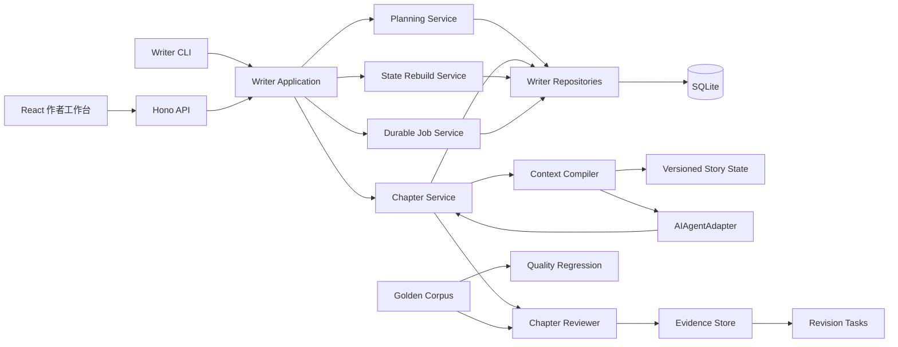
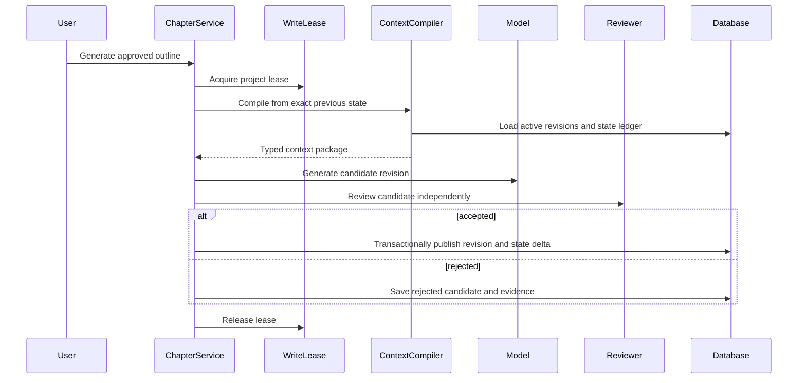

# 版本化故事状态重构设计

## 1. 目标

把项目从“顺序执行时通常可用的生成流水线”重构为“任何正文都能追溯、修改、失效和重建的小说创作系统”。

本次设计优先解决四个问题：

1. 正文、蓝图和叙事状态必须保持一致。
2. 修改历史章节后，系统必须准确识别并重建所有受影响数据。
3. 生成任务必须可恢复、可审计、可防止同项目并发写入。
4. 质量评估必须有独立证据、覆盖率和可校准的回归基准。

“高质量”不由某个模型分数直接定义。系统要先保证作品状态可信，再通过人工标注基准集验证评估结果与编辑判断的关系。

## 2. 明确不做

- 不兼容现有 SQLite schema、旧任务记录和旧 HTTP 响应结构。
- 不提供自动迁移旧数据库的复杂兼容层。开发阶段通过重建数据库切换。
- 不引入多租户、云队列或微服务。
- 不用多 Agent 数量代替质量验证。
- 不在第一阶段自动重写整本小说。全书评估先产出可审阅的修订任务。

## 3. 设计原则

### 3.1 正文是版本，不是可覆盖字段

保存编辑或生成结果时创建新的 `chapter_revision`。已发布修订保持不可变。章节通过 `active_revision_id` 指向当前版本。

### 3.2 故事状态是按章推导的账本

每个已发布章节都对应一份 `story_state_revision`，记录：

- 处理该章之前的状态版本；
- 章节修订版本；
- 从正文提取的状态变化；
- 应用变化后的完整状态；
- 生成状态所用模型、prompt 版本和时间。

系统不再维护一份无法追溯的“最新可变快照”。

### 3.3 修改旧章必须显式失效下游

第 N 章发布新修订后：

- 第 N 章旧状态和 N 之后所有状态标记为 `stale`；
- N 之后的正文不自动删除；
- UI 明确展示“正文存在，但基于旧状态生成”；
- 用户可以重建状态、逐章修订，或创建故事分支。

### 3.4 一个项目同时只有一个写任务

数据库通过项目级租约保证写入互斥。Web、CLI 和未来 worker 都必须经过同一个 `ProjectWriteLease`。

### 3.5 外部数据在边界验证

HTTP body、YAML、模型 JSON 和数据库 JSON 都使用运行时 schema。内部领域对象不使用未经校验的类型断言。

### 3.6 方案选择

审查过三种状态架构：

1. 继续维护单一快照，并在编辑后补跑 finalizer。实现成本最低，但无法证明状态来自哪个正文版本，也无法可靠处理分支、回滚和部分失败，因此拒绝。
2. 对所有用户和模型操作实施完整事件溯源。可追溯性最强，但需要事件 schema 演进、投影重放和跨版本解释，复杂度超过当前单机产品的实际需要，因此暂不采用。
3. 不可变章节修订加按章状态版本，并同时保存显式 delta 和完整快照。它可以追溯、重建和分支，又不要求每次读取都回放全部历史。

采用第三种方案。完整快照服务于稳定读取，delta 服务于审计、验证和重建。

## 4. 目标架构



包依赖保持单向：

```text
shared <- eval
shared <- writer
eval   <- writer
shared/eval/writer <- web
```

`web` 不允许直接执行 Writer 表 SQL。所有写作数据通过 Writer application service 和 repository 接口访问。

## 5. 领域模型

### 5.1 Project

`project`

- `id`
- `title`
- `genre_profile`
- `target_audience`
- `premise`
- `status`
- `created_at`
- `updated_at`

`genre_profile` 决定 prompt 规则组合。不存在全局“番茄小说”或“美食悬疑”默认指令。

### 5.2 Story plan

`story_bible_revision`

- 不可变 Bible 版本；
- 包含规范化 JSON 和供模型读取的编译文本；
- 项目指向一个 active 版本。

`chapter_outline`

- 保存稳定的章节身份，不把章号当主键；
- `position` 表示当前顺序；
- `status` 为 `draft | approved | writing | written | stale`；
- 生成正文前必须处于 `approved`。

`chapter_outline_revision`

- 保存蓝图版本；
- 用户可以编辑和批准；
- 发布新版本会使对应正文及其下游状态失效。

Beats 必须持久化，不再只存在于一次函数调用内。

### 5.3 Chapter revision

`chapter`

- `id`
- `project_id`
- `outline_id`
- `active_revision_id`
- `created_at`

`chapter_revision`

- `id`
- `chapter_id`
- `revision_number`
- `source`: `generated | manual | correction | import`
- `parent_revision_id`
- `title`
- `content`
- `word_count`
- `status`: `draft | published | rejected`
- `generation_run_id`
- `created_at`

生成失败只会拒绝候选修订，不得删除当前 active revision。

### 5.4 Story state ledger

`story_state_revision`

- `id`
- `project_id`
- `chapter_id`
- `chapter_revision_id`
- `previous_state_revision_id`
- `sequence`
- `status`: `current | stale | failed`
- `state_json`
- `delta_json`
- `summary`
- `model`
- `prompt_version`
- `created_at`

`state_json` 至少包含：

- 角色身份、目标、关系、能力、物品、位置和最近事件；
- 已发生的重要事实；
- 时间线；
- 开放伏笔及其来源章节；
- 世界规则和被确认的例外；
- 情节主线摘要；
- 按卷分层的长期摘要。

角色不能因为模型一次遗漏就从状态中消失。状态更新采用显式 delta，再由纯函数应用到前一版本。删除、死亡、关系解除等操作必须是明确事件。

### 5.5 Job and lease

`job`

- 保存完整输入快照：任务类型、范围、engine、model、word count、质量 profile、预算、prompt 版本；
- 保存 `queued | running | paused | completed | failed | cancelled`；
- 保存阶段 checkpoint、usage、错误类型和重试时间；
- 任务恢复必须继续原始范围和配置。

`project_write_lease`

- `project_id` 唯一；
- `job_id`
- `owner_id`
- `expires_at`
- 通过事务 compare-and-set 获取和续租。

CLI 与 Web 不再有独立的并发判断。

## 6. 核心流程

### 6.1 创建和规划

1. 创建项目和题材 profile。
2. 生成 Bible draft。
3. 用户编辑并批准 Bible。
4. 生成持久化 beats 和章节蓝图 draft。
5. 用户调整顺序、伏笔和人物安排。
6. 批准蓝图后才允许批量生成正文。

### 6.2 生成章节



发布事务同时完成：

- 发布 `chapter_revision`；
- 更新 `chapter.active_revision_id`；
- 将 outline 标记为 `written`；
- 保存该章状态 delta 和完整状态；
- 更新 job checkpoint 和 usage。

任何一步失败，整个发布事务回滚。

模型调用不能放在数据库事务中。先生成候选和状态 delta，再用短事务提交。

### 6.3 编辑历史章节

1. 用户保存 draft，不影响 active revision。
2. 用户发布 draft。
3. 系统创建新 active revision。
4. 以新正文重新提取本章 state delta。
5. 将该章之后的状态和评估标记为 stale。
6. UI 提供：
   - 只重建状态；
   - 按新状态逐章生成修订候选；
   - 保留现有后文并人工处理；
   - 创建故事分支。

系统绝不静默重写或删除后文。

### 6.4 恢复

- 任务只能从持久 checkpoint 恢复；
- 恢复继续原任务的 `toChapter`、模型、预算和 prompt 版本；
- 恢复前重新获取项目 lease；
- checkpoint 与当前 active revision 不匹配时任务进入 `blocked`，要求用户决定，不自动猜测。

## 7. 上下文编译器

`ContextCompiler` 是唯一组装模型上下文的组件。输入必须指定：

- Bible revision；
- outline revision；
- previous story state revision；
- 最近章节 active revision IDs；
- genre profile version；
- prompt template version。

输出是可序列化的 `CompiledChapterContext`，保存 hash。生成记录保存该 hash，便于复现和质量回归。

上下文采用分层记忆：

1. 当前场景和最近章节原文；
2. 当前角色与开放伏笔；
3. 当前卷摘要；
4. 全书稳定事实和长期主线。

卷摘要必须参与编译，不能只写不读。静态 Bible 不再包含会过期的角色当前状态。

## 8. 质量系统

### 8.1 生成器和评审器分离

评审器使用独立配置。它可以使用不同模型，也可以在开发回归中使用固定录制结果。生产记录必须保存 evaluator model，禁止 `null`。

单章门禁只检查单章能可靠判断的指标：

- 与蓝图目标一致；
- 事实和角色状态一致；
- 重复与表达退化；
- 章节内部节奏；
- 明确的格式和安全问题。

人物弧光、主题深度、整书结构和市场定位只在卷级或全书评估中使用。

### 8.2 证据完整性

Map 阶段从原文提取证据并立即回链。每条证据保存：

- `chapter_revision_id`
- 原文 offset
- 原文片段
- 内容 hash
- 维度

Reduce 只能引用已有 evidence ID。后端验证引用存在且 hash 匹配。

最终报告必须公开：

- 实际覆盖章节数；
- 跳过章节；
- 有效证据比例；
- 评估模型；
- profile 和 prompt 版本；
- 置信度或 incomplete 状态。

覆盖不足时不得生成看似完整的总分。

### 8.3 Golden corpus

建立跨题材真实长篇基准集：

- 至少覆盖项目正式支持的每种 genre profile；
- 每本由至少两名编辑独立标注；
- 标注事实冲突、人物行为异常、节奏问题、结构问题和可执行修订建议；
- 保存盲评结果，不把作品来源暴露给评审模型；
- 模型、prompt、阈值变化必须跑回归。

门禁阈值先以基准数据校准，再进入默认配置。不能继续使用没有来源的固定分数。

## 9. API 与 Web 设计

HTTP API 以明确 DTO 返回，不直接暴露数据库行。

关键资源：

- `/api/projects`
- `/api/projects/:id/bible-revisions`
- `/api/projects/:id/outlines`
- `/api/chapters/:id/revisions`
- `/api/projects/:id/story-state`
- `/api/projects/:id/rebuilds`
- `/api/jobs`
- `/api/evaluations`
- `/api/revision-tasks`

统一端口来自一项配置。CLI 读取同一配置或显式 `WRITER_API_URL`，禁止硬编码。

Web 必须提供：

- Bible 和蓝图 draft、diff、批准；
- 正文版本历史和恢复；
- stale 影响范围；
- 任务成本预估和预算确认；
- 持久任务历史、恢复和取消；
- 八维报告、原文证据跳转和修订任务；
- 错误后的重试、返回和诊断信息。

暂停和取消只在 runner 已实现对应语义时展示。

## 10. 错误处理和可观测性

定义领域错误：

- `ValidationError`
- `ProjectLeaseConflictError`
- `StaleDependencyError`
- `BudgetExceededError`
- `RetryableProviderError`
- `PermanentProviderError`
- `StateExtractionError`
- `EvaluationIncompleteError`

HTTP 层统一映射状态码和稳定错误 code。内部不通过 EventEmitter 的特殊 `error` 事件传递业务失败。

Provider 重试规则：

- 401、403、无效参数不重试；
- 429 尊重 `Retry-After`；
- 超时和 5xx 使用指数退避加 jitter；
- 每次调用受 job 预算和最大尝试数限制。

日志使用结构化字段：

- `requestId`
- `projectId`
- `jobId`
- `chapterId`
- `revisionId`
- `provider`
- `model`
- `attempt`
- `usage`

提供存活检查、数据库 readiness 和任务指标。

## 11. 数据库与部署

- 新 schema 从零建立，不读取旧表。
- 开启 `foreign_keys`、`busy_timeout` 和 WAL。
- 使用版本化 migration 文件和 schema version 表。
- 数据路径必须显式配置，禁止依赖 `process.cwd()`。
- 后端提供正式构建产物，不在生产环境用 `tsx` 直接执行源码。
- 本地模式默认只监听 loopback。
- 若允许局域网或公网访问，必须先增加认证、CSRF 防护、速率限制、上传限制和密钥管理。

## 12. 测试策略

### 12.1 领域单元测试

- 状态 delta 应用；
- 历史章节发布后的下游失效；
- 章节顺序和前驱状态约束；
- 候选失败不影响 active revision；
- 评估 evidence 引用完整性；
- provider 错误分类和退避。

### 12.2 数据库集成测试

- 发布章节事务原子性；
- project lease 竞争；
- 进程崩溃后的 job 恢复；
- migration 从空数据库构建；
- foreign key 和状态约束；
- 数据库锁超时。

### 12.3 HTTP 契约测试

- 所有 request/response 运行时验证；
- eval result DTO 与页面类型一致；
- SSE 重连后从持久事件序号续传；
- 暂停、取消和恢复状态机；
- 上传大小和内容限制。

### 12.4 浏览器端到端测试

覆盖创建项目、批准规划、生成章节、编辑旧章、查看 stale 状态、重建、评估、证据跳转、失败恢复和导出。

### 12.5 质量回归

- 真实长篇 golden corpus；
- 固定模型与 prompt 版本；
- 编辑标注对比；
- 事实冲突召回、错误告警率、证据命中率、覆盖率和成本；
- 生成模型或 prompt 变更必须产生对比报告。

## 13. 交付顺序

### 阶段 A：可信写作内核

- 新 schema 和 migrations；
- repository 与 application service；
- chapter revision；
- story state ledger；
- project lease；
- 顺序生成、失效和重建；
- 删除旧 mutable snapshot 路径。

### 阶段 B：可靠任务和 Web 契约

- 持久 Job 输入、事件、checkpoint 和预算；
- 统一 API DTO 和运行时校验；
- 修复端口、SSE、评估结果契约；
- 版本历史、stale 状态和规划审批 UI。

### 阶段 C：可验证质量系统

- 独立单章 reviewer；
- evidence store 和覆盖率门槛；
- 卷级及全书修订任务；
- golden corpus 和质量回归命令。

### 阶段 D：生产运行能力

- 结构化日志和健康检查；
- 服务端构建；
- 备份与恢复；
- 按部署边界增加认证和资源限制。

每个阶段必须交付可运行、可测试的软件。阶段 A 不保留旧 schema 和旧 API 的兼容适配层。

## 14. 验收条件

阶段 A 完成时：

1. 修改任意历史章节不会静默覆盖或删除其他正文。
2. 系统准确列出受影响的下游状态和章节。
3. 可以从任意有效章节版本顺序重建故事状态。
4. 两个并发写任务只有一个能获得项目 lease。
5. 任一发布步骤失败时，active revision、outline 和状态账本保持原状。
6. 恢复任务严格沿用原范围和配置。

全部阶段完成时：

1. Web 关键创作旅程有端到端覆盖。
2. 评估报告的每条原文证据可以回链到准确修订版本。
3. 覆盖不足的评估明确失败或标记 incomplete。
4. 每次模型、prompt 或阈值变化都能生成 golden corpus 回归报告。
5. 用户能在批量生成前批准规划，在生成后安全编辑、比较、撤销和重建。
