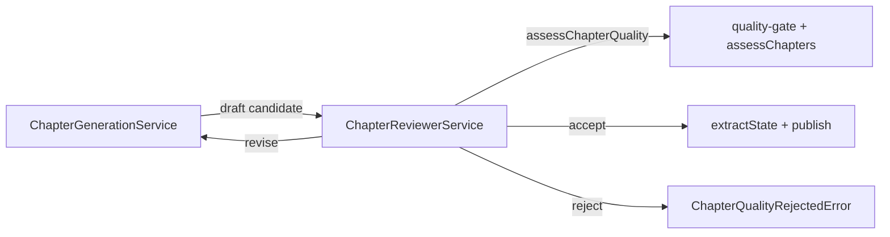

# Independent Chapter Reviewer 设计（Stage C3）

## 1. 目标

提供独立于生成内核的单章质量评审边界：对一篇候选正文给出 `accept` / `revise` / `reject`，附结构化 reasons 与可选证据；生成路径可在发布前可选启用写-评-改循环。

## 2. 明确不做

- 不做卷级 / 全书修订任务编排。
- 不改 Reduce「仅引用 evidence ID」契约。
- 不强制默认开启质量门槛（默认关闭，与现网行为兼容）。

## 3. 边界



- **ChapterReviewerService**：唯一评审门面（verdict 映射 + evidence 整理）。
- **quality-gate.ts**：保留判定与 eval_history 写入；结果字段补齐 `reasons` / `evidence`。
- **legacy generator.ts**：仍拒绝旧式直连 `qualityGate`；新路径走 Application。

## 4. 契约

```ts
verdict: 'accept' | 'revise' | 'reject'  // pass→accept, revise→revise, block→reject
reasons: string[]
evidence: { chapterId, excerptIndex?, text, dimension, reason, matchedBy? }[]
feedback?: string  // 注入重写 prompt
```

## 5. 生成接入

`GenerateNextInput.qualityReview?: { enabled, maxRevise, metadata, profile?, onProgress? }`

- 关闭：现有行为。
- 开启：draft → review → accept 则 extract/publish；revise 且未超 `maxRevise` 则拒绝旧候选并带 feedback 重写；否则 `ChapterQualityRejectedError`。

`WriterApplication` 从 job `budget.qualityGate` / `budget.maxRevise` 读取并下发。Web/CLI 可重新传 `qualityGate: true`。

## 6. 验收

1. Reviewer 单测：accept / revise / reject + evidence 映射（可注入 assess）。
2. generateNext：mock 先 revise 再 accept，最终发布；reject 抛错且不发布。
3. Web 允许 `qualityGate: true`；映射 `ChapterQualityRejectedError` → 422。
