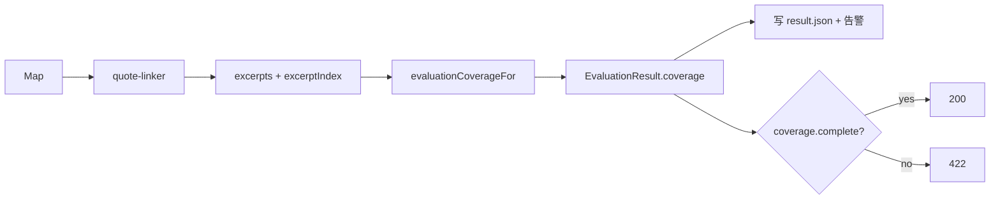

# Evidence Coverage Gate 设计（Stage C2）

## 1. 目标

评估报告在覆盖不足时不得伪装成完整可信结果：除八维齐全外，还要求证据可回链、Map 跳章受控。不完整时 Web API 返回 422，报告 DTO 带上可诊断的 `coverage` 字段。

## 2. 明确不做

- 不做独立 evidence store / DB、证据内容 hash、`chapter_revision_id` 绑定。
- 不做 Reduce「只允许引用 evidence ID」强制改造。
- 不做独立单章 reviewer、卷级修订任务（C3+）。

## 3. 覆盖判定

`evaluationCoverageFor` 汇总：

| 字段 | 含义 |
|------|------|
| `missingDimensions` | 缺的八维（已有） |
| `skippedChapterIds` / `skippedChapterCount` / `chapterSkipRate` | Map 失败跳过的章 |
| `evidenceLinkedCount` / `evidenceUnlinkedCount` / `evidenceLinkRate` | `matchedBy !== 'none'` 占比 |
| `incompleteReasons` | 人类可读原因列表 |
| `complete` | 全部门槛通过 |

默认门槛（可配置，放 shared 常量，后续可进 profile）：

- `minEvidenceLinkRate = 0.5`（有摘录时）
- `maxChapterSkipRate = 0.3`
- `excerptCount === 0` 且 `chapterCount > 0` → incomplete（无证据）

## 4. 数据流

- `evaluate()` 持久化 `skippedChapters`，扁平化 excerpts 时写入 `excerptIndex`。
- Web upload **始终落盘** flat report（含 incomplete）；GET `/result` 仍门禁。

## 5. UI

`EvaluationReport` 展示 coverage 条：完整/不完整、回链率、跳章数。若 API 422，列表/详情已有错误码路径则补充文案。

## 6. 验收

1. 缺维 → incomplete（回归现有测试）。
2. 全维但 linkRate &lt; 0.5 → incomplete + reason。
3. 跳章率 &gt; 0.3 → incomplete。
4. 健康样本 complete=true。
5. unit：shared coverage + web eval-contract。
