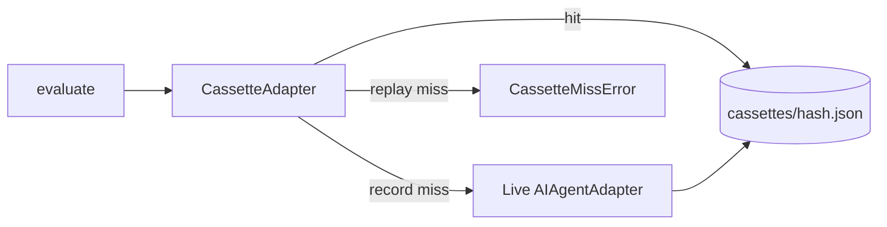

# Golden Active Promotion + Prompt-Hash VCR（Stage C 收尾）

## 1. 目标

1. 将已有 `seeded_baseline` 分数带晋升为正式 `active` 回归期望。
2. 提供按 prompt-hash 索引的 cassette 录制/回放，使 CI/本地可在不打真实 LLM 的情况下跑通评估管线。

## 2. 明确不做

- 不把全书 cassette 默认提交进 git（体积大、含模型输出）；目录 gitignore，单测用临时目录。
- 不把 `--dry-run` 改成 VCR（dry-run 仍只做 check+slice）。
- 不做盲评 UI / 双人标注一致性（后续项）。

## 3. Active 晋升

- `expect.status`: `seeded_baseline` → `active`
- 保留原 `seededFrom`；新增 `promotedFrom` 元数据
- `seeded_baseline` 与 `active` 仍同样执行分数带断言（兼容未晋升 case）

## 4. VCR

- Hash = sha256(systemPrompt + userPrompt + model + temperature)
- 并发 Map/Reduce 安全（不按调用序号）
- CLI：`golden run --vcr-replay` / `--vcr-record`
- `EvaluateOptions.engine` 可注入，便于测试与 VCR

## 5. 验收

1. 全部现有 case `status=active` 且 bands 完整。
2. Cassette 单测：record → replay hit；replay miss 抛错。
3. `evaluate({ engine: cassette })` 在回放模式下可跑完（单测用迷你 fixture 或 map/reduce 注入）。
4. `--dry-run` 行为不变。
