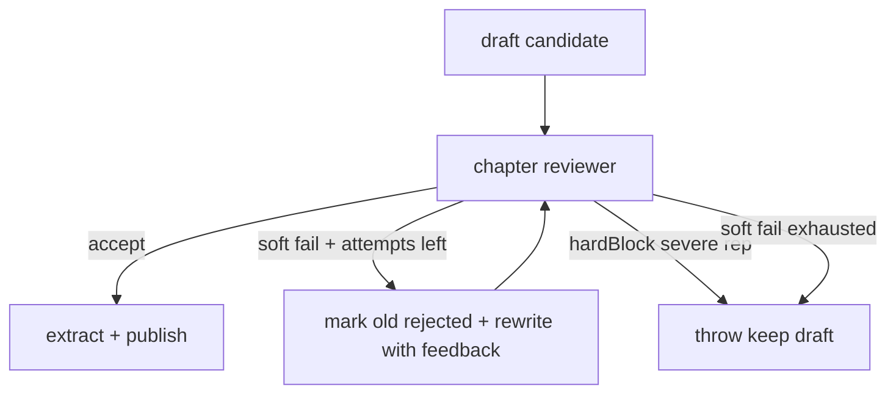

# Quality Gate 稳性（E2E P1）

## 1. 目标

开质量门槛写章时：低分噪声不再立刻白扔章；最终仍失败则保留 draft；审阅原始结果可回查。

## 2. 明确不做

- 不改默认「关门槛」路径。
- 不把严重复读（`severe`）改成可重写。
- 不改全书 eval / revision-task 流程。

## 3. 行为

| 判定 | 含义 | `maxRevise` 未耗尽 | 耗尽 / 无次数 |
|------|------|-------------------|---------------|
| accept | 通过 | — | — |
| revise / soft reject（等级过低等，有 feedback） | 可重写 | 拒绝旧稿并重写 | 保留最后 draft，抛错带 `draftRevisionId` |
| hardBlock（严重复读） | 不可重写 | 保留 draft，抛错 | 同左 |

## 4. 契约增量

- `QualityGateResult.hardBlock?: boolean` — 仅严重复读为 `true`
- `ChapterReviewResult.hardBlock?: boolean` — 透传
- `ChapterQualityRejectedError.draftRevisionId?: string`
- `eval_history.assess_raw` — assessChapters 结果 JSON（排障用）

## 5. 验收

1. `reject` + `maxRevise≥1` + 非 hardBlock → 至少再写一轮。
2. 最终失败 → revision 仍为 `draft`，错误带 `draftRevisionId`。
3. 严重复读 → 即使有 maxRevise 也不重写，draft 保留。
4. assess 后 `eval_history.assess_raw` 非空（有评估结果时）。
