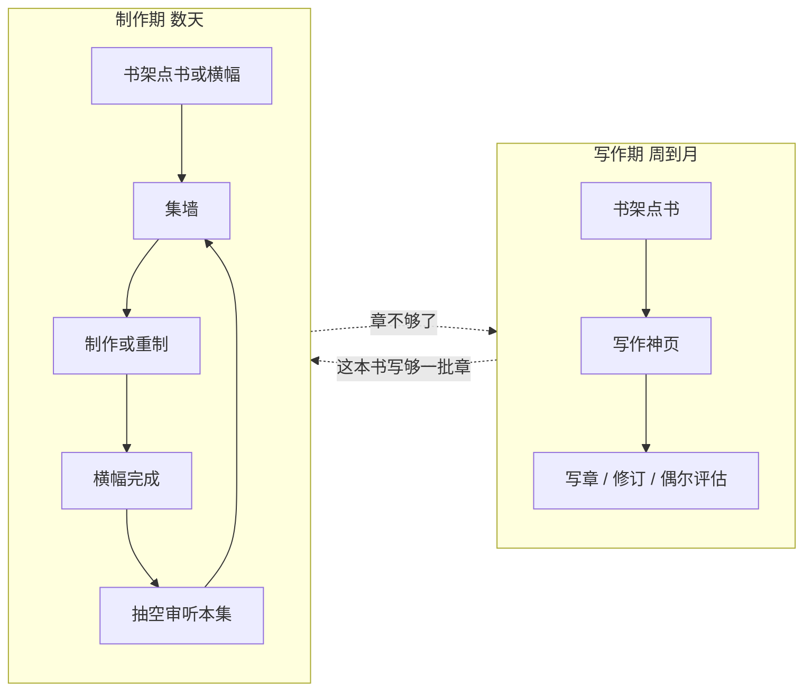

# NovelEval 2.0 红队评审（Cursor 新模型）

> 2026-08-30。攻击对象：`PLAN-2.0.md`（合成拍板版）。对照输入：`zcode.md`、`cursor-grok.md`、`brief.md`，以及 Layout / main / Audiobook / audiobook.ts / ProjectDetail 的实码，外加 CLI、project-config、listen、jobs、eval/audit 路由。
> 本文只输出评审，不改业务代码。允许推翻上一轮 cursor-grok 的结论。

---

## 0. 一句话判决

**PLAN-2.0 把对象认对了，把规模、节奏、工期和 M0 切口认错了。**

「书是宇宙中心」成立。把五个平级工具钉回书下，成立。杀 v3/v4 药丸，成立。七字段表单该死，成立。

然后方案用 **Descript/StudioBinder 的容器宗教** 给一个「独立作者 + 本机 + 现在实质只有一本书在产」的工具，叠了四层 drilling、一个还不存在的 Work 类型系统、一个没有持久化的集状态机、一个空置 95% 时间的顶栏「任务」，再用「复用页面所以 3–5 天」把 ZCode 的 1–2 天幻觉和上一轮 Cursor 的 2–3 周诚实对冲掉。

这不是合成，是和稀泥。拍板如果按原文开工，M0 结束时你会得到：**导航换了皮、森铁还能点、第二本书从 Web 仍然做不出来、第 10 集 CLI 直接抛错、自动审听把前几集 QA 报告写丢。**

下面按「错在哪 / 漏了什么 / 改成什么」写。不客气。

---

## 1. 评审范围与方法

### 1.1 读过的文档

| 文件 | 我怎么用它 |
|------|------------|
| `PLAN-2.0.md` | 主攻击面。逐条拆决策，不只喷文风 |
| `zcode.md` | 对照「八个病」是否被合成吃进去、工期是否被洗白 |
| `cursor-grok.md` | 对照上一轮自己。附录 G 边案被 PLAN 丢掉，这是合成事故；IA 深度也允许自我推翻 |
| `brief.md` | 用户原话六条。方案必须对原话负责，不能对标负责 |

### 1.2 读过的代码（只列对判决有贡献的）

| 路径 | 用来打哪条方案 |
|------|----------------|
| `packages/web/src/components/Layout.tsx` | 五入口平铺；任务横幅已存在 |
| `packages/web/src/main.tsx` | 写作深路由完整，有声书以 run 为键 |
| `packages/web/src/pages/Audiobook.tsx` | 七字段、硬编码书名、fix/srt 死开关、JobConsole 闭包、不恢复 active job |
| `packages/web/server/routes/audiobook.ts` | 模块加载期扫描 dist、`--out` 必须已存在、`epStart` 正则 1–9、缩略图全局命名空间 |
| `packages/web/src/pages/ProjectDetail.tsx` | 写作神页已含质检/修订/预算；再套三 Tab 是叠床 |
| `packages/web/src/components/ActiveJobsBanner.tsx` | writer+eval 已有全局任务面；缺 audiobook/audit |
| `packages/web/src/pages/Evaluation.tsx` / `Audit.tsx` | 质检仍是上传管线；审计根本不传 `projectId` |
| `packages/audiobook/src/cli.ts` | **`ep-start` 硬顶 1–9**；默认 `--out dist/audiobook` |
| `packages/audiobook/src/project-config.ts` | JSON 是发音表+音色，**不是**引擎/并章/视频预设 |
| `packages/audiobook/src/listen.ts` | 单集审听 **整文件覆盖** `listen-report.json` |
| `packages/audiobook/extract-scenes.ts` / `gen-scenes-ark.ts` | 场景图是一次性脚本，钉死森铁和 v3 |
| `packages/audiobook/src/db.ts` | `--project` 按 title LIKE 解析，重名即歧义 |
| `packages/writer/src/migrations/001_initial.sql` | 写作侧已有 job 表+状态机；有声书侧是内存 Map |
| `packages/web/server/jobs.ts` | 写作 job 可断点/重连；有声书 job 刷新即失联 |

### 1.3 红队规则（本文自己遵守）

- 只攻击**会让用户做不出下一集、或做出假产品**的决策。审美和组件库排后面。
- 每个攻击给：现状代码事实 → PLAN 怎么说 → 为什么错 → 替代。
- 「盲区」定义为：ZCode、上一轮 Cursor、PLAN 三份里都没写成可执行风险的条目。
- 修正案必须能直接改 PLAN 的页级结构和 M0 清单，不是再写一份愿景。

---

## 2. 先补代码事实：三份会诊都写浅了或写错了

上一轮 Cursor 尸检大体对，但把几件**会让 M0 方案当场破产**的事实当成细节跳过。PLAN 又把「路由重挂即可成立」盖在上面。先把事实钉死。

### 2.1 身份不是「缺一个 Book 壳」，是四套键互不认亲

```
writer.db project.id          UUID
writer.db project.title       「最后一班森铁」
CLI --project                 标题或 id；title LIKE，命中 >1 抛「项目名歧义」
dist/<run>/youtube-upload.json  playlist 字段抠 bookTitle
data/audiobook/projects/<safeName(title)>.json
Audiobook.tsx BuildForm       默认字符串 '最后一班森铁'
```

PLAN 说 M0「按 bookTitle 聚合 / Active Work」。这是在用**最脆的那根弦**做主键。书改名、两本同名、playlist 没写、试产没 youtube-upload.json，聚合直接 orphan 或串台。

CLI 其实已经能吃 UUID（`resolveProjectId`），Web 表单却在喂中文名。M0 不写一张显式映射，所谓「无需手打书名」只对森铁这一本成立。

### 2.2 `data/audiobook/projects/*.json` 不是 Work.settings

PLAN 原文：

> 引擎/并章/场景图/视频开关 = 作品设置……`data/audiobook/projects/*.json` 升级为其真相源

打开 `data/audiobook/projects/最后一班森铁.json`：`pron` / `cast` / `voiceBySpeaker`。类型定义在 `project-config.ts` 的 `ProjectAudiobookConfig`：发音表、角色音色、旁白覆盖。**没有 engine、没有 group、没有 video、没有 CER。**

把这份文件「升级成作品设置」是把三种寿命完全不同的东西塞进一个 JSON：

| 数据 | 真正归属 | 改的频率 |
|------|----------|----------|
| 发音表 | 书（所有衍生共享） | 随正文扫描，低频补 |
| 角色音色 | 有声书这条线 | 冷启动一次，偶发换角 |
| 引擎/并章/是否视频 | 制作预设 | 一条线定一次 |
| CER/whisper 模型 | 审听预设 | 更低频 |

上一轮 Cursor 把「升级为 Work.settings」写得太顺，PLAN 照抄。这不是升级，是概念污染。发音表进 Work，漫剧/短篇将来还要再抄一份。

### 2.3 CLI 和 API 把集号焊死在 1–9

`packages/audiobook/src/cli.ts`：

```
ep-start 需在 1-9
```

`packages/web/server/routes/audiobook.ts`：

```
epStart = checked(body.epStart, /^[1-9]$/, '--ep-start')
```

`ep` 目录扫描是 `ep(\d{1,2})`，本来能到 99。集号上限被 **parse 层**砍成 9。

PLAN 的核心算法是 `下一集号 = max+1`。`ProjectDetail` 蓝图默认 **60 章**。`group=3` 时第 10 集就是第 28–30 章——CLI 直接拒绝。

PLAN 反模式第 7 条 + 附录「M0 不动 `packages/audiobook/**`」。按原文执行，「制作下一集」在任何超过 9 集的书上是死的。森铁 15 章/3 并章=5 集，所以你们现在感觉不到。这是**被森铁样本量藏住的产品雷**。

### 2.4 产物根在模块加载时冻住，且 `--out` 必须是已有目录

`audiobook.ts` 顶层：

```
const AUDIOBOOK_ROOTS = readdirSync(dist).filter(/^audiobook/)
const RUN_ROOTS_BY_ID = ...
```

`POST /jobs`：`assertOutAllowed(out)` → 不在这张表里就 422。

后果：

1. 服务器启动后新建的 `dist/audiobook-*` 对 API 隐身，直到重启。
2. Web **不能创建第一条有声书线**，只能往已经存在的 run 里堆集。
3. PLAN 的 M1「建有声书三步向导」在现 API 下根本没有「建」这个动词。M0 若只做聚合、不做「登记一个新 root」，第二本书的 Web 路径是空的。

这不是「内部实现细节」。这是 **Work 的创建权被文件系统历史锁死**。

### 2.5 审听报告是 run 级整文件覆盖，不是按集合并

`listen.ts`：`discoverChapters(outRoot, opts.ep)` 之后 `writeFile(listen-report.json, report)`。`report.chapters` 只含本次扫到的章。

对单集 `--ep 6` 跑审听（PLAN：「制作完成自动跑审听」的自然写法）= **把 EP01–EP05 的 QA 芯片从集墙上抹掉**。墙是读这份 JSON 汇总的。

whisper 单章超时上限是 30 分钟。全版本审听会把全局串行锁（`currentJobId`）占住极长时间。两条路都坏：

- 带 `--ep`：快，但毁历史 QA
- 不带 `--ep`：QA 完整，但作者在生产周无法连续做下一集

三份方案都把「自动审听」写成流水线美德。代码里它是一把覆盖写的锤子。

### 2.6 有声书 job 刷新即失联；横幅看不见它

写作 job：`writer.db` 的 `job` 表 + `ActiveJobsBanner` + 进书页 `getActiveJob` 重连。

有声书 job：内存 `Map`，SSE 在 `Audiobook.tsx` 的 `JobConsole`。页面 **不调用** 已有的 `GET /api/audiobook/jobs/active`。刷新 = 控制台消失，ffmpeg/TTS 仍在跑，作者以为死了，再点一次吃 409。

`JobConsole` 的 `onDone?.(status !== 'failed')` 用的是 effect 闭包里的初始 `status`（`'running'`），完成回调几乎总是当成功。这是第二个死开关，上一轮只抓了 fix/srt。

审计 job 同样是内存 Map，横幅也不列。全局「任务」今天已经是残的，不是缺一个顶栏入口。

### 2.7 场景图不是「跨 run 借一下」，是一次性剧本

- `extract-scenes.ts`：钉死 `最后一班森铁`、`1-15`、输出 `dist/audiobook-v3/scenes.json`
- `gen-scenes-ark.ts`：钉死同一路径，Seedream 批量
- Web 的 `coverRun`：从已有 `scenes/` 里挑一个 run

「v3 的 scenes 自动并归」对**森铁已经生过的图**成立。对新书，UI 没有任何「抽场景 / 生图」动作。视频有声书的主路径在第二本书上是断的。PLAN 把视频开关放进「作品设置一次生效」，前提是图已经在磁盘上。

### 2.8 缩略图命名空间是森铁私货

`listEpisodes` 在 `dist/media-thumbs` 里用 `^EP0*{n}` 匹配。软链指向 `~/Downloads/sentie-thumbnails`。`finalize-v3.py` 同样按 `EP{idx:02d}-缩略图.jpg`。

两本书的 EP01 抢同一张封面。PLAN 的「十个小说一百个 item」连缩略图都串台，却在讨论四层导航怎么找。

### 2.9 写作神页已经是「书工作台」，质检不是从零开始

`ProjectDetail.tsx` 现有：Bible/蓝图/写章、预算上限、PlanningApproval、StaleImpact、修订收件箱、章网格、导出、QualityPanel、Dashboard 深链、Eval 深链。

PLAN 的「书工作台三 Tab：写作/质检/衍生」听起来像新 IA，对写作侧其实是 **给已经超载的神页再套一层壳**。质检 Tab 若只是把上述卡片搬过去，用户感知是「多点一次」；若是 iframe 旧 `/eval` `/audit`，就是戏服。

### 2.10 审计上传不写 projectId

Eval 至少会 `formData.append('projectId', …)`。Audit 只传 `title`。`audit-tasks.ts` 的 upload 处理器没有 projectId 字段。PLAN「评估/审计绑定书」在审计这条线上是 **API 都没字段**，不是「入口改书内」能解决的。

---

## 3. 攻击 PLAN-2.0

### 3.1 合成方法：把分歧平均掉，而不是做决策

工期原文：

> 分歧点：ZCode 估 1–2 天 / Cursor 估 2–3 周——取决于是否复用现有页面重挂路由（推荐：复用，取偏 ZCode 估计，含缓冲 3–5 天）

这是假依赖。工期差的不是「重挂还是重写」，是 **要不要处理身份、创建权、集号上限、job 重连、审听合并、冷启动**。复用 `Audiobook.tsx` 并不能让 `ep-start>9`  magically 好，也不能让模块加载期的 `AUDIOBOOK_ROOTS` 变成按书创建。

ZCode 的 1–2 天 = 改 Layout 文案 + 藏药丸 + 表单折叠。那是皮肤。Cursor 2–3 周把 DB 大迁徙排除之后，仍然偏长，但量级诚实。PLAN 选「皮肤工期、产品验收」——五条 M0 验收里至少 2、4 依赖身份和推断，3 依赖文案，5 是修 bug。用皮肤工期去承诺产品验收，开工第一周就会爆。

路线图分期也被平均坏了：

| 主题 | ZCode | Cursor 上一轮 | PLAN | 问题 |
|------|-------|---------------|------|------|
| 质检进书 | M2 | M0 深链 / M1 绑定 | M0 三 Tab + M1 回流 | M0 做壳、M1 做真，用户分不清哪期「质检好了」 |
| 作品预设 | M1 配置中心 | M1 | M1，但 M0 CTA 已依赖预设 | M0 的「智能 CTA」在预设存在之前用表单默认值撒谎 |
| 衍生壳/灰卡 | M3 框架 | M0 就要 Works 壳 | M2 灰卡 | 对象模型从第一天有 Work，UI 又说 M2 才出现 |
| 组件 | M0 不提，M? Radix | M1 | M1 | 用户原话第 1 条被排到 IA 之后，需预期管理，不是错，但 PLAN 没写 |

**合成该做的事：选一边并写清代价。PLAN 两边都要，再写「复用所以快」。**

### 3.2 「书→衍生→集」四层 drilling 对 1–10 本书是过度设计

ZCode：

> 书架分组→书→衍生→集，四层 drilling，每层不超过一屏

这是资源管理器心智。作者不是在浏览 IP 宇宙，是在 **当前焦点那一本书上连续工作**。独立作者的同时活跃集通常是：

- 写作期：1 本书，0 条衍生
- 制作期：1 本书，1 条有声书，N 集

10 本书是书架问题，不是四层问题。书架用卡片墙（已有 ProjectList）就够。真正的「找不到」发生在：**有声书页不认得书**（现状），以及 **制作期还要从写作神页点三次才能到集墙**（PLAN 制造的新问题）。

点击账（制作下一集，一天内重复 5–15 次）：

```
PLAN：
  顶栏「我的书」→ 书卡 → 衍生 Tab → 有声书卡 → 集墙 CTA
  = 4–5 次到达，之后还好（深链可缓存）

现状（森铁）：
  顶栏「有声书」→ 已经在集墙
  = 1 次。难的是表单，不是找不到墙。

修正（见第 6 节）：
  顶栏「我的书」→ 书卡（制作期默认落有声）→ 集墙
  = 2 次。Work 层从路径里消失，直到第二种形态真能点进去。
```

用户原话第 4 条是「小说多了，一个小说十几集，十个小说一百个 item 平铺」。正解是 **按书分组**，不是再发明「衍生作品」这一层让他多点一次。第二种形态不存在时，Work 层是空文件夹。空文件夹不是架构前瞻，是每次制作多一次点击。

上一轮 Cursor 自己写过互相打架的两句：

1. 「M0 只做 audiobook，但 Works 列表 UI 要先把壳搭好」
2. 「不要在 M0 用导航假装这些已存在」

PLAN 把 1 推迟到 M2 灰卡，但对象模型和路由树（`/works/:workId`）从第一天按 1 设计。**路由按未来长，入口按现在短**——这才是正确张力。PLAN 选了「模型按未来长，入口也按未来长，再用灰卡安慰」。

### 3.3 Work 类型枚举过早，会逼出假框架

`audiobook | digest | screenplay | comic_drama | ai_short` 五枚举写进词汇表，M2 就要「WorkType 框架抽象」。此时能跑的管线仍是一条 CLI。

抽象的正确触发条件是：**第二条管线已经有输入输出和页面，复制粘贴开始发臭**。精简短篇在那之前可以是书上一个按钮「生一版短篇 TXT」，甚至先是导出+提示词，不必是 Work。

过早的 WorkType 会把有声书硬塞进「类型/配置/管线/产物」四件套，而有声书真正缺的是 **登记表 + 预设 + 集推断**，不是多态接口。

被过早排除的替代（上一轮和 ZCode 都倾向容器派，没认真写）：

**书的两种工作模式，而不是书下的作品族。**

```
《最后一班森铁》
  [ 写作 ] [ 有声书 ]
```

有声书不是「衍生作品之一」，在 2.0 的前两个季度里它就是 **这本书的第二种工作台**。等短篇或剧本真的能打开，再升级成：

```
[ 写作 ] [ 制作 ▾ 有声书 / 短篇 ]
```

成本是：以后加一次 IA。收益是：M0 不造空壳、不养灰卡、不解释「衍生」这个词。独立作者听得懂「有声书」，「衍生 Works」是制片软件词汇。

### 3.4 顶栏三格里的「任务」是死房地产

PLAN：`我的书 · 任务 · 设置`

现状：`ActiveJobsBanner` 已经占用主内容上方一条，覆盖写作 job + eval job。空闲时它不渲染（`total === 0 return null`）。这是正确的单人工具模式：**有任务才出现，不占导航。**

把「任务」升成三格之一：

- 空闲时点进去是空态页。三格导航 1/3 是空的，比现在五格更假。
- 忙碌时横幅已经够用。再做一个 `/jobs` 页是把横幅复制成路由。
- 真正缺的是把 **audiobook job / audit job 并进横幅**，以及刷新后重连控制台。

这是 SaaS「全局 Jobs 中心」的肌肉记忆。一人本机、同时最多 1 个重渲染（有声书还全局串行），不需要任务中心。需要的是 **正在跑的那条东西不要丢**。

上一轮 Cursor 写「可选：全局任务抽屉」，PLAN 升级成顶栏一等公民。方向反了。应降级回横幅，并补上缺失的两类 job。

### 3.5 质检 Tab 在 M0 是戏服，在概念上也是错的合并

质检在代码里至少五张脸，节奏不同：

| 表面 | 何时用 | 数据 |
|------|--------|------|
| 写章质量门槛 + QualityPanel | 正在写 | 章分、lesson |
| Dashboard | 写了一段落后看宏观 | 雷达、伏笔、人物 |
| `/eval` 全书评估 | 成稿或大段完成后 | 独立 task 文件，可绑定 projectId |
| `/audit` 逻辑洞 | 成稿后 | 独立 task 文件，**不绑定 projectId** |
| RevisionTaskInbox | 评估导入修订 | 已挂在 ProjectDetail |

PLAN 把 eval+audit 说成「都是质量门禁动作」塞进一个 Tab。门禁这个词是对的，**页面合并是错的**：

- 写章中的门槛是生产反馈，不是门禁。
- 全书评估是贵、慢、要选类型/平台的批次作业。
- 审计是另一种批次作业，现在连外键都没有。

用户在写作期几乎不住在「质检 Tab」。把 QualityPanel 从写作页抽走，是把正在用的东西藏进他不点的门。M0 正确做法：**质检区块留在写作页（已经在），顶栏评估/审计可以先留着或改成「选书后进入」，不做第三 Tab。** 绑定 projectId、审计落库，那是真 M1，不要用 Tab 假装做完。

### 3.6 集状态机没有真相源，写了就是假状态

PLAN：`制作中 → 审听中 → 需人工复核 → 就绪 → 已发布`，卡片按状态着色。

磁盘上实际能推导的：

| 你想要的状态 | 真实信号 |
|--------------|----------|
| 制作中 | 内存 job.action=build，刷新丢失 |
| 审听中 | 内存 job.action=listen，同上 |
| 需人工复核 | `listen-report` 的 bad/missing/silent；且单集听会覆盖全文件 |
| 就绪 | 有 mp3/mp4/srt？未定义「缺视频是否算就绪」 |
| 已发布 | `youtube-upload.json` 是**上传计划**不是回执；没有「已发」字段 |

「状态即行动指引」用现有芯片改文案就能做：`缺视频` `未审听` `P0 n` `试产`。不必五段状态机。

真要「已发布」，需要作者勾一次「这集发出去了」或读平台回执。没有这个动作就画已发布，是撒谎。

上一轮 Cursor 附录 C 的 `work_unit.status` 草图至少承认要表。PLAN 把状态机提前到 M0 交互规格，同时禁止 writer.db 大重构，也没给 JSON 登记处。结果只能是 **前端根据文件猜，猜错了还不能改**。

### 3.7 「制作下一集」把冷启动藏进了快乐路径

交互规格默认：

> 下一集号=max+1、章节=未制作章节顺延、引擎/并章/开关=作品设置

这只在下列前提全真时成立：

1. 这本书已经有 Work 登记（产物根存在）——见 2.4，Web 不能创建
2. 已经有发音表和音色——第二本没有
3. 已经有场景图——第二本没有，除非纯音频
4. 已有集的章节覆盖是连续的、不是试产残章
5. `ep-start` 还能加——到 10 就炸
6. 作品设置存在——JSON 里其实没有这两项，会回落到表单默认 **edge + 手填章节**

对森铁，1–3 碰巧为真，所以方案作者觉得 CTA 是产品。对「十个小说」，1–3 对 9 本为假。

用户原话第 5 条「想构建新集，不懂怎么触发」。根因有两半：

- **半 A（有线之后）**：没有主 CTA，只有参数墙。PLAN 的确认条对。
- **半 B（没线之前）**：没有「为这本书建有声书」。PLAN 把向导丢到 M1，M0 验收却写「进入任一本书三步内到达制作下一集」。任一本书包含还没有 dist 根的书。验收 2 对空书是假的。

被过早排除的替代：**M0 的主路径是两条，不是一条。**

```
若这本书已有 mapping → 「制作下一集」确认条
若没有 → 「开始做有声书」极短向导（引擎、并章、是否视频）→ 写 mapping、mkdir、成为第一条
```

向导不是 M1 的锦上添花，是让验收 2 对第二本书不为假的最小物。三步可以压成一步半：默认继承上次成功构建（森铁的 volcengine/group=3），只确认。

### 3.8 自动审听是流水线原教旨，违反作者节奏

PLAN / ZCode / 上一轮 Cursor 都同意：做完自动审听。

独立作者的真实两段节奏（三份里都当背景，没当约束）：

```
写作期（周到月）：住在 ProjectDetail。有声书是噪音。
制作期（几天到两周）：连续出集。TTS+视频已经很慢。
审听期（穿插或事后）：戴耳机修坏段，和「再出一集」不是同一动作。
```

制作期想要的是：**EP06 还在渲染时就能规划 EP07**。现状全局串行已经限制了并行；自动审听再把 whisper 接在 build 后面，EP07 的等待时间 = 渲染 + 整集 ASR。生产周被 QA 卡死。

更糟的是 2.5：自动单集审听还会写丢历史 QA。

正确默认：

- 构建结束 → 横幅「第 6 集做好了」+ 按钮「审听本集」（默认不自动跑）
- 提供「连续制作时自动审听」开关，默认关
- 若要自动，必须先改 listen 为 **按集 merge 报告**，否则禁止自动

这不是品味。这是现有串行锁 + 覆盖写报告 + whisper 成本的推论。

### 3.9 「M0 不动 CLI」是教条，会卡死产品

反模式 7 的原意是对的：别把 writer.db 大迁徙当 IA 前置。PLAN 扩成「管线都别动」。

M0 必须动的 CLI/API 点（都是小改，不是重构）：

| 改动 | 不做的后果 |
|------|------------|
| `ep-start` 上限从 9 放到至少 99（与目录正则对齐） | 60 章蓝图做不完 |
| `AUDIOBOOK_ROOTS` 改为请求时扫描，或允许 mkdir 登记新 root | 不能建第二条线 |
| listen 报告按集 merge | 不能自动审听，手动单集听也会毁墙 |
| Web 启动 job 传 **projectId** 而非中文书名 | 改名/重名崩溃 |

这些不是「大重构 audiobook」。拒绝碰 CLI 的人会在 Web 层用更脏的方式绕（假 ep 号、永远写进 ep09、title 聚合），那才是屎山。PLAN 标榜零妥协架构，这里已经在妥协。

### 3.10 Active Work「最新完整产物根」会选错权威

v3 ≈ 图；v4 ≈ 成片。它们不是同一 Work 的两个 generation，是 **两类工件被目录名污染成版本**。

「取最新有完整 ep 的目录」+「scenes 回退」对当前双根碰巧对。一旦出现：

- 试产写进一个新 `dist/audiobook-v5`（CLI 默认其实是 `dist/audiobook`，无后缀）
- 只跑了 `--chars 600` 的残集，mtime 最新
- 权威根被试产目录抢走，正式 5 集从 UI 消失

PLAN 杀药丸的同时没有 **pinned assetRoot**。mtime 不是权威。必须写死：这本书的有声书根 = mapping 里那一个路径。旧目录进归档是对的，但归档键是 mapping，不是「最新」。

上一轮 Cursor 其实写了「或显式配置」，PLAN 摘要里收成「最新完整产物根」，把显式丢掉了。丢掉的是唯一能工作的那半句。

### 3.11 品质感段落说得对，然后 M0 交付清单又走回表单折叠

「每屏一个主 CTA、空态说人话、CLI 日志降级、杀药丸」——同意，这比 Radix 重要。

但 M0 关键交付仍写着「表单 L1/L2 分层」。分层是把七字段藏进「改范围」。作者第一次仍会点开，看到 chapters/chars。快乐路径如果真智能，**主路径零表单**；改范围可以是「章节从–到」两个数字，不是 L2 里塞回 CLI。

「表单分层」是工程师改 UI 的任务描述，不是产品交付。验收 4 写「人话确认条」才是。PLAN 两处都写，执行者会先做分层（熟），确认条推断做一半（难），然后说 M0 完成了。

### 3.12 对标用对了模式、用错了深度

Descript 的 Project/Composition、音剪的书→集、ElevenLabs 的预设后 Override——模式对。

错在把 **多人 SaaS 的对象深度** 搬到单人工具：

- Descript 需要 Composition 因为一个 Project 里真有很多成品页。你一本小说在 2.0 前两年大概率 **一条有声书**。
- StudioBinder 的阶段是给制片团队的工具箱。你的阶段是日历上的写作月/制作周，不是 Tab。
- 喜马拉雅音剪要类型入口因为冷启动从「我有一段文本」开始。你从 writer.db 开始，**类型入口是负资产**。

「不做时间线、不做 call sheet」这些否决是对的。该否决而没否决的是：**为未来五种 WorkType 先把四层树栽上。**

### 3.13 护城河那句有一半是 aspirational

> 市面推文工具从「贴文本」开始，我们从「生成小说」开始

写作管线确实是差异。有声书管线消费的是 `active_revision` 正文，**并没有**把角色库/画本/场景图做成可在 UI 里维护的结构化资产。场景是脚本吐的 JSON+jpg，音色是手写 JSON，attribute 是另一条 CLI。

定位可以写「我们有母本」。不要写成「角色库/画本/发音表/场景图全程结构化所以衍生极低成本」——后半句今天只对森铁的手工资产成立。产品 2.0 若把护城河当已交付，M2/M3 会低估「每一种衍生都要一套冷启动资产」的成本。

---

## 4. 被过早排除或从未被当成正案的替代

上一轮和 ZCode 几乎都站在「容器派 + 灰卡派 + 流水线自动衔接派」。下面这些才应该进决策桌，而不是当附录否决。

### 4.1 替代 A：双模式书，而不是 Book/Work/Unit

见 3.3。这是对「四层是否过度」的主替代。**应采纳为 2.0 M0–M1 的 IA。** Work 层推迟到第二种形态可点。

### 4.2 替代 B：任务永不进顶栏

见 3.4。**应采纳。** 横幅并集四类 job；有声书控制台按 `GET .../jobs/active` 重连。

### 4.3 替代 C：登记文件，而不是「聚合 API 假戏真做」

上一轮说 M0 可用路由+文件系统仿真 Work，不必建表。同意不必建 SQL。不同意 **title 聚合** 算仿真。

最小仿真是一个显式文件，例如 `data/audiobook/works.json`：

```
{
  "works": [
    {
      "projectId": "<uuid>",
      "assetRoot": "dist/audiobook-v4",
      "scenesRoot": "dist/audiobook-v3/scenes",
      "engine": "volcengine",
      "group": 3,
      "video": true
    }
  ]
}
```

二十行，不是「大重构 writer.db」。PLAN 用反模式 7 把这个也吓没了。**应采纳，且列为 M0 第 0 项。** 没有它，验收 2 和 3 都是森铁演示。

### 4.4 替代 D：状态从文件派生，禁止独立状态机

见 3.6。**应采纳。** 文案可以拟人（「还没听」「有坏段」「缺成片」），存储层不要五段枚举。

### 4.5 替代 E：制作完成不自动审听

见 3.8、2.5。**应采纳。** 先 merge 报告，再谈自动。

### 4.6 替代 F：允许、且必须，动几处 CLI 小补丁

见 3.9。**应采纳。** 「不动 audiobook 包」从 M0 禁令里删掉，改成「不动管线算法；允许改校验上限、报告合并、项目标识」。

### 4.7 替代 G：阶段感知落地，而不是默认写作 Tab

上一轮：`/books/:id` 默认写作。制作周每次打开书都要再点衍生。

**应采纳：** 书级 `lastSurface: writing | audiobook`（localStorage 即可）。从书架点进去回到上次。书卡上两个门（写作进度 / 有声进度）也可，比 Tab 更符合「两种工作」。

### 4.8 替代 H：顶栏评估/审计可以暂时留着

IA 原教旨会说必须砍掉。单人工具里，评估常常是「我刚导出一本外站文也想测」——`Evaluation.tsx` 的上传任意 TXT 不是只有错误，它是 **非本系统母本的入口**。PLAN 反模式 5 禁止它当主路径，对；禁止它存在，过。

**应采纳：** 书内一键是主路径；顶栏评估改为「工具」放进设置或保留但文案改成「评估任意文稿」。M0 不必为了验收 1 把这个能力藏到找不到。验收 1 可改为：「新用户不会以为评估/有声书是和书平级的另一个宇宙」——实现可以是：有声书入口从顶栏消失（进书内）；评估可留，但选书优先。

### 4.9 替代 I：重制本集 / 补洞，不是只有 +1

上一轮附录 G 写过缺 EP02、试产角标、正文已更新。PLAN 交互规格只留了 max+1。制作期一半点击会是 **重跑 EP03**，不是做 EP06。

**应采纳为 M0 CTA 的兄弟动作：** 集卡菜单「重制本集」（章节范围锁死、ep-start 锁死）。缺号卡片「补做第 2 集」。没有这两条，「智能下一集」在真实制作周不够用。

### 4.10 替代 J：成本可见性进确认条，比 Radix 优先

写作页已经有 `maxCostRmb`。有声书 volcengine / Seedream / LLM attribute 在确认条上零估计。本地工具最容易在制作周把豆包账单打爆。

不必做完整计费系统。M0 最低：**确认条写引擎名 +「豆包按字计费，本集约 N 字；edge 免费但音色差」**；作品预设里默认引擎不要用表单的 `edge` 覆盖森铁已经在用的 volcengine。

---

## 5. 补盲区（三份会诊都没写成可执行项的）

下列每条都要求：上一轮 Cursor、ZCode、PLAN 没有给出「这会在第几期、以什么失败形态爆」。

### 盲区 1 — 集号硬顶 9，与 60 章默认蓝图冲突

已在 2.3 展开。三份都在讨论「下一集 = max+1」，无人打开 `cleanArgs`。这是红队最硬的一条：它不取决于品味，一跑就炸。

失败形态：作者按 PLAN 做完 M0，森铁 5 集没事，第二本 30 章书做到第 10 集，CTA 调 API 422 或 CLI 抛错。他会认为 2.0 是玩具。

### 盲区 2 — 单集审听覆盖写，自动衔接会毁掉集墙 QA

已在 2.5 展开。三份都把自动审听当美德。无人读 `writeFile(reportFile)`。

失败形态：M0 验收「流水线衔接」一开，作者听完第 6 集，前 5 集卡片全部变成「未审听」。他以为审听功能坏了，其实是报告被截断。

### 盲区 3 — Web 没有「创建产物根」权，第二条有声书线无法从产品里诞生

已在 2.4 展开。三份都假设 dist 里已经有 audiobook* 可聚合。对仓库当前的森铁资产成立，对产品 2.0 不成立。

失败形态：验收 2「任一本书三步到达制作下一集」——打开一本刚写完的书，衍生空态只有「该版本还没有集」，点制作后 `--out` 非法。

### 盲区 4 — 有声书任务不能重连，制作期刷新等于事故

三份都批评 JobConsole 太 CLI，建议降级为百分比。没人提 **刷新/切书/进程还在**。写作侧已经解决过这个问题（所以你们知道它痛），有声书侧原样复发。

失败形态：18 分钟视频渲染中作者点了另一本书，回来墙还是旧的，再点制作吃 409，只好去终端 `ps`。这比原生 select 更「没有品质感」。

### 盲区 5 — 场景图与缩略图都是森铁一次性管道，多书会串台或没图

三份把 coverRun 当成「版本泄漏」。真正的产品洞是：**生图不是产品能力，缩略图不是按书隔离的。**

失败形态：第二本书开视频开关，成片无图或跳过视频；集墙封面出现森铁的 EP01。

### 盲区 6 — 作品设置指错文件；音色/发音才是冷启动资产，且没有 UI

三份都说「设置一次只点下一集」。没人清点冷启动清单：

```
新书要做有声书，今天必须手工完成：
  1. 全文扫描做发音表 JSON
  2. 角色名单 + voiceBySpeaker（还是 edge 音色名，volcengine 靠 VOICE_MAP 翻译）
  3. 跑 attribute（CLI，Web 无入口）
  4. 跑 extract-scenes + 生图脚本（钉死路径）
  5. mkdir dist 根，重启 Web 服务器（否则扫描不到）
  6. 表单里敲对书名
```

M0 CTA 只替换了第 6 步和第 6 步附近的七字段。1–5 才是「不敢点」的原因。用户原话第 2+5 条被误诊为「表单 UX」。表单丑是真的，但不是主因。

### 盲区 7 — 写作期 / 制作期分离，三 Tab 枢纽违反日历

三份用影视阶段映射 journey，画成一条永远在线的 Hub。独立作者不是每天从立意走到分发。他要么写，要么做。

失败形态：写作三个月，每次打开书看到「衍生 0/0 + 质检请上传」，噪音；制作两周，每次默认落到写作神页再往下钻。PLAN 的 IA 在两种时期都微扰。

### 盲区 8 — 成本可见性只存在于写章，衍生是计费黑洞

写作有预算确认框。TTS/生图/LLM 归因没有。三份讨论组件库比讨论钱多。本机工具的用户就是付 API 账单的那个人。确认条不写钱，不是极简，是把 `confirmBudget` 已经证明过的需求忘了。

### 盲区 9 — 试产集污染「下一集」推断，PLAN 丢掉了上一轮附录 G

`--chars 600` 的 EP01 仍是一个 `ep01` 目录，有 script、可能有音频。`max(ep)+1` 会跳到 EP02，章节顺延若按「已有集覆盖的 max chapter」可能把第 1 章当已消费（试产切了 600 字也算章目录）。

失败形态：样品集变成正式进度，全书进度条说谎；或 CTA 以为第 1 章做完了，从第 2 章起跳。上一轮写了「试产角标、不计入分母」，PLAN 正文删了。这叫合成丢失，不是细节。

### 盲区 10 — 正文修订后集变脏，写作侧有 StaleImpact，有声侧没有

`StaleImpactPanel` 知道章改了要重建叙事状态。有声书仍会用旧 `script.json`/TTS 缓存。CTA 没有「这集正文已改，建议重制」。

失败形态：作者按质检改了第 16 章，有声 EP06 还在播旧词，审听 CER 对旧稿还全绿。质量门禁和衍生脱钩——而这正是「书是宇宙中心」本该防止的。

### 盲区 11 — 四套 job 执行器，统一「任务」会变成假统一

| 执行器 | 持久化 | 横幅 | 暂停 |
|--------|--------|------|------|
| writer `jobs.ts` | DB | 有 | 有 |
| eval tasks | 文件+内存 | 有 | ? |
| audit tasks | 内存 | **无** | 无 |
| audiobook Map | 内存 | **无** | 杀进程 |

PLAN M0 顶栏「任务」若只做列表壳，点进去四种对象四种死法。真正的 M1 也只应 **并横幅 + 统一外观**，不要假装一个 job 表。上一轮附录 F 提过「后端可仍分治」，但没把审计缺横幅、有声书缺重连写成 M0 缺陷。

### 盲区 12 — `JobConsole` 完成回调闭包 + listenFix 死开关，品质是「半残控件」不是「原生丑」

用户原话第 1 条被全体翻译成「换 Radix」。半残（勾了没传、完成当成功、刷新丢任务）比原生 select 更毁品质感。修死开关和重连，Radix 可以继续排 M1 以后。PLAN 把 bug 修进 M0 是对的，但只写了 fix/srt 一条，漏了同文件里的闭包和 active job。

---

## 6. 修正案：对 PLAN 的页级修改

下面是「打开 PLAN-2.0 该改哪些段」。不另起炉灶做第三份愿景。

### 6.1 改「一句话判决」——定位收窄一号

保留：缺产品对象、书是中心、不做协作 SaaS/时间线。

删掉或降级：

- 「IP 衍生创作台」作为 M0–M1 对外文案（对内可以）。对外这两季叫 **「带有声书工作台的小说本机」**。
- 「角色库/画本/发音表/场景图全程结构化」——改成目标，不当现状。

### 6.2 改核心对象模型——Work 降级为可选层

```
书架
 └─ 书 Book
     ├─ 写作  （现 ProjectDetail，M0 不拆神页）
     ├─ 有声书 （现 Audiobook 挂到书下）     ← 2.0 真正要救的面
     └─ （质检动作留在写作里；全书评估/审计可从写作区块发起）

到第二种形态可点之前，不出现「衍生 Works」列表页。
```

词汇表里的 Job/Asset 保留为工程概念，**不要当用户必须钻的层**。用户只说：书、集、正在做。

顶栏改为 **两格：我的书 · 设置**。任务不是格，是横幅。

### 6.3 改导航与路由（页级）

```
保留（M0 不重命名 URL 也可，可加别名）：
  /                         我的书（ProjectList，文案改「我的书」）
  /projects/new             新书
  /projects/:id             写作工作台（默认或 lastSurface）
  /projects/:id/audiobook   有声书集墙     ← 新挂载，组件复用 Audiobook.tsx
  /projects/:id/audiobook/:ep  集详情      ← 不再用 :run
  /settings                 模型与引擎
  /eval  /audit             可留；入口改为写作区块主路径，顶栏可移入设置「实验室」

删除作为一级：
  /audiobook                301 到最近有 mapping 的书的有声书页，或选书
  顶栏「有声书」「任务」

明确不做（M0）：
  /books/:id/works
  /jobs
  质检 Tab
  Works 灰卡
```

书页（`ProjectDetail`）M0 只加一条明显入口，不是三 Tab：

```
┌─────────────────────────────────────────────┐
│ 《最后一班森铁》  writing 82% · 有声 5 集      │
│ [ 继续写作 ]              [ 去做有声书 → ]    │
└─────────────────────────────────────────────┘
```

制作期 `lastSurface=audiobook` 时，从书架点击直接进集墙，页顶有「回写作」。

### 6.4 改「制作下一集」规格

主 CTA 仍在集墙尾部。但分成三种卡片，不要一种智能装所有情况：

```
A. 已有 mapping 且下一集合法
   制作第 6 集
   第 16–18 章 · 豆包 · 含视频 · 约 xx 字（计费提示）
   [ 开始制作 ]     [ 改章节范围 ]

B. 无 mapping
   还没有有声书
   [ 开始做有声书 ] → 选引擎/并章/是否视频，写 works.json，mkdir
   不要出现七字段，不要让用户选 dist 名

C. 被挡住
   正文只写到第 16 章，做一集还缺 2 章
   [ 去写作台 ]
```

集卡上始终有：

- 重制本集
- 审听本集（fix/srt 进本集高级，默认关，**真传参**）
- 缺号补做

「改范围」只留：章节起止、是否试产、是否跳过视频。引擎/并章在 mapping 里。禁止 coverRun 选择器；用 mapping.scenesRoot。

**禁止** 制作完成后无条件自动审听。

### 6.5 改 v3/v4 策略

UI 零「制作版本」。内部 **pinned** `assetRoot` + `scenesRoot`。不是 mtime 选权威。

开发者选项（设置里，默认关）可显示产物路径。那是给你自己，不是产品。

M0 **不要** 迁 `dist/books/{slug}/`。那是搬家日，单独排，且必须改 CLI 默认 `--out`。与 IA 无关。

### 6.6 改状态展示

```
芯片（派生，不存状态机）：
  制作中     ← 若 active job 指向此 ep（横幅+卡）
  试产       ← 目录里有截断标记或 mapping 记了 chars
  未审听     ← 报告里没有这集的 chapter 段
  有问题     ← 这集 counts.bad+missing+silent>0
  缺音频/视频/字幕
  正文已改   ← 章 active_revision mtime > 集 script mtime（M0 可先做粗比较）
  已登记发布 ← 仅当作者勾选（M1 再做）；M0 不要「已发布」
```

### 6.7 改品质与组件

同意：主 CTA、人话空态、日志折叠、杀药丸。M0 做这些。

Radix 从 M0/M1 关键路径拿掉。原生 select 只出现在向导的引擎选择——整站就那一两次。用户原话第 1 条用 **死开关修掉 + 确认条** 回应；若仍嫌丑，M1 再换 2 个控件，不要「薄封装设计系统」当一期主题。

### 6.8 改质检

M0：ProjectDetail 已有区块不动。评估按钮继续带 `?projectId=`。审计按钮同样带，**同时补后端 projectId**（否则别宣称绑定）。

M1：书内「跑全书评估/跑审计」不经文件选择；结果列表按书过滤。修订回流已经有 Inbox，补审计洞到章的深链。

不做质检 Tab，直到你真的觉得写作神页要拆（那是重构 ProjectDetail，单独排期，不要绑有声书 IA）。

### 6.9 改路线图

```
M0  有声书挂书下可用（含第二条书能建线）     见下一节清单，按日历 8–12 个工作日
M1  预设 CRUD 小 UI + 审听报告 merge 后的
    可选自动审听 + 坏段重制 + 评估/审计真绑定
    + 正文变脏提示                            约 1 周
M2  发音表/音色的最低编辑面（冷启动资产）
    + 场景图从脚本变成可再跑的书内动作         约 1–2 周；这才是第二条书的护城河
M3  精简短篇（可以先不是 Work）
M4  剧本/漫剧 PoC——仍先证明冷启动资产可复用
```

ZCode 把漫剧放很早、质检放很晚；Cursor 把 IA 做很重。修正后：**M0 只救有声书可用性（含创建），M2 才碰护城河资产。** 灰卡和 WorkType 框架从 2.0 前半段删除。

工期不要写 3–5 天。那是改皮。下面 M0 清单按「一个人熟仓库」估 **8–12 工作日**。生疏或要顺手重构神页就会滑向上一轮的 2–3 周——那是加了范围，不是估计失败。

### 6.10 改反模式清单

保留 1,2,3,4,6。修改：

| 原 | 改 |
|----|----|
| 5 评估不以上传 TXT 为主路径 | 主路径书内一键；上传作为「评估任意文稿」保留 |
| 7 大重构 writer.db 非 M0 前置 | 仍禁止迁表。**允许** works.json、允许 CLI 校验/报告合并/项目 id。禁止用这条吓退登记文件 |
| （新）8 | 禁止用 mtime 选 Active Work |
| （新）9 | 禁止单集审听覆盖整份 listen-report |
| （新）10 | 禁止顶栏为了「看起来像产品」放空的任务页 |
| （新）11 | 禁止 M0 验收包含还没有管线的书的「三步到达下一集」而不给建线向导 |

### 6.11 改 M0 验收标准

原五条里，1 过严且伤评估任意文稿；2 对空书为假；3 对；4 对但依赖推断；5 对但不全。

替换为：

1. 顶栏不再出现「有声书」平级入口；从一本书能进它的集墙，无需手打书名或选 v3/v4。
2. **已有 mapping 的书**：三步内到确认条，文案为「第 N 集 · 第 A–B 章 · 引擎 X」，不含 `--chars`/`--ep-start` 主路径。
3. **没有 mapping 的书**：同一入口是「开始做有声书」，完成后产生 mapping 与可写产物根，无需重启服务器。
4. 全站作者面零「制作版本 / v3 / v4 / audiobook-v」字样（开发者选项除外）。
5. 审听 fix/srt 勾选后 CLI 参数变化；单集审听 **不删除** 其他集在报告里的章节。
6. 刷新页面或切书再回来，仍能看到正在跑的有声书任务并取消。
7. `ep-start=10` 的构建不被校验拒绝（用测试或手工测第 10 集号，不必真做 10 集音频）。

原验收 1 关于评估/审计：降为「书内有入口且带 projectId」；不要求顶栏物理消失。

---

## 7. 独立 M0 任务清单（与 PLAN 不同处都注明为什么）

按依赖排序。每一项可单独验收。不包含 Radix、不包含三 Tab、不包含 `/jobs`、不包含 dist 搬家、不包含状态机表。

### 第 0 项 — 登记，不是聚合

**做：** `data/audiobook/works.json`（或同构的小 API `GET/PUT /api/audiobook/works`）。字段：`projectId, assetRoot, scenesRoot?, engine, group, video`。森铁预填一条（v4 成片 + v3 scenes）。

**不做：** 按 `bookTitle` 字符串聚合当真相。

**为什么和 PLAN 不同：** PLAN 的聚合对一本书是 demo，对十本是事故。这不是 writer.db 迁徙。

### 第 1 项 — 解开三个硬限制（允许动 CLI/校验）

1. `ep-start` 与 API 正则放到 1–99，与 `ep\d{1,2}` 对齐。
2. 产物根改为请求时扫描；`POST /jobs` 允许 mapping 里的 root，若目录不存在则 mkdir。
3. `listen-report.json` 按 `epXX/` 合并写入，禁止整文件只含本次集。

**为什么：** PLAN 写不动 CLI，这三项不动则验收 2/5/7 无法同时真。

### 第 2 项 — 路由挂载，杀药丸

- `Layout`：去掉有声书；文案「项目列表」→「我的书」。评估/审计可留或塞设置，不作为本项成败。
- `main.tsx`：`/projects/:id/audiobook`、`/projects/:id/audiobook/:ep`。旧 `/audiobook/:run/:ep` 重定向时 **丢弃 run**，改用该书 mapping。
- `Audiobook.tsx`：不再渲染 run pills；标题 `《书名》· 有声书`；`out` 来自 mapping。
- `ProjectDetail`：加「去做有声书」；不要拆 Tab。
- `ProjectList`：卡上显示有声集数（读 works.json，没有则不显示）。

**为什么比 PLAN 小：** 不造书工作台三 Tab，不造 Works 列表。IA 目标「有声书挂书下」用一个入口达成。

### 第 3 项 — 两条主路径 CTA

- 有 mapping：推断下一集（max ep+1，章节从已覆盖 max+1，group 来自 mapping）。正文不够则挡板。确认条人话 + 字数/引擎提示。
- 无 mapping：迷你向导（引擎、并章、视频开关）→ 写登记 → 进空集墙。
- 幽灵卡 = 同一 CTA，禁止打开七字段。
- 「改范围」三个字段封顶。
- 集卡：重制、补洞。

**为什么：** PLAN 只有快乐路径；验收必须覆盖第二本书和重制。

### 第 4 项 — 修半残（品质的真正 M0）

- `listenFix` / `listenSrt` 传入 `startJob`。
- `JobConsole` 用 event 里的 status，不用闭包旧值。
- 进有声书页拉 `GET /jobs/active`，有则挂控制台。
- `ActiveJobsBanner` 并入 audiobook + audit。
- 构建表单从主路径删除（代码可留开发者开关）。

**为什么：** PLAN 只写了 fix/srt。横幅已存在，不要新建任务页。

### 第 5 项 — 自动审听不要做

横幅「做好了 · 审听本集」。本项成功标准是 **没有** 把 listen 串在 build 成功回调里。

**为什么与 PLAN 相反：** 见盲区 2 与节奏。第 1 项的 merge 做完后，M1 再把自动当开关。

### 第 6 项 — 身份一律 projectId

Web → CLI 传 UUID。表单消灭书名输入。`resolveProjectId` 的 LIKE 只留给人类 CLI。

**为什么：** PLAN 以为路由注入书名就够；CLI LIKE 重名会炸，审计也还在用 title。

### 明确从 PLAN M0 拿掉的

| PLAN 原交付 | 去向 | 原因 |
|-------------|------|------|
| 顶栏「任务」 | 不做 | 横幅并集即可 |
| 书工作台三 Tab | 不做 | 神页再套壳；质检戏服 |
| 质检深链当 M0 主题 | 最多顺手改文案 | 不解决审计无 projectId |
| 表单 L1/L2 分层 | 主路径删表单 | 分层会变成执行者的完成定义 |
| Works 壳 / 灰卡 | M3+ | 空文件夹 |
| 统一 `dist/books/{slug}/` | 单独搬家日 | 与可用性无关 |
| 集状态机着色 | 芯片文案即可 | 无真相源 |
| 制作完自动审听 | M1 开关 | 覆盖写 + 锁 |
| Radix | 以后 | 半残优先 |

### M0 不包含但必须写在风险栏、避免下期假装惊讶的

- 发音表/音色编辑器
- 场景抽取与生图产品化
- 缩略图按书分目录
- 计费精确到元（M0 只做引擎+字数警告）
- 脏集（正文修订）检测可试做，做不完不挡 M0，但 M1 第一项

---

## 8. 对上一轮 cursor-grok.md 的自我推翻

上一轮的尸检（工具平铺、run 泄漏、七字段、数据孤岛）仍然成立。下列结论作废或降级。

### 8.1 作废：Works 列表 M0 就要搭壳

当时怕「永远长不成衍生台」。假壳不会催生第二条管线，只会让 M0 多两个路由参数。衍生台的真实门槛是冷启动资产（盲区 6），不是灰卡。

### 8.2 降级：顶栏三格含「任务」

当时写「可选抽屉」，摘要表却写成三格，PLAN 照收。单人工具里可选 = 不要。应并横幅。

### 8.3 降级：默认落写作 Tab 的书枢纽

当时用 StudioBinder 阶段命名强行三维。作者日历是两态。枢纽是给「每天什么都干一点」的团队软件准备的。

### 8.4 作废：M0 完全不动 audiobook 包

当时为了防止管线重构。副作用是把校验 bug 和报告覆盖写锁死。红队现在主张 **白名单式小补丁**。

### 8.5 部分作废：按 bookTitle 聚合就算 Work 仿真

当时想避免建表。仿真的最小物是 mapping 文件。title 聚合是假仿真。

### 8.6 遗漏：附录 G 不该能被合成版丢掉

缺集、试产、脏章、重名、串行占用，是 CTA 的真正规格。PLAN 只抄了快乐路径确认条。上一轮把边案放附录，合成者就会删附录。红队把它们升进 M0 CTA 三种卡片 + 重制/补洞。

### 8.7 遗漏：只报了 fix/srt，没报同页另外两个半残

责任在上一轮。JobConsole 闭包、不恢复 active job，与死开关同一文件。

### 8.8 过重：2–3 周体感把「IA 宗教」和「可用性」绑在一起

若按修正 M0（挂载+mapping+硬限制+CTA+半残），熟手 8–12 日。2–3 周是把三 Tab、Radix、质检壳、Works 壳、dist 约定全塞进去的结果。上一轮把范围开太大，ZCode 把范围缩成改皮，PLAN 平均。红队把范围收到 **有声书对第二本书也成立**。

### 8.9 仍坚持的

- 不做时间线、不做协作、不做全量 shadcn。
- 杀 v 药丸。
- 主 CTA 人话。
- 评估主路径不应是上传任意 TXT。
- 品质主要来自层级和空态，不是组件库。

---

## 9. 对 ZCode 的点名

ZCode 的八个病诊断准确，和代码对得上。问题几乎全在量级和顺序：

- **1–2 天** 只覆盖病 1、2、3 的皮肤。病 4 状态机、病 6 空态、病 8 作品族，一天做完只能是假的。
- 把「每层不超过一屏」当 IA 原则，推出四层 drilling——对 10 本书过设计。
- M0 含集状态机、构建向导三步、v3 归档，与 1–2 天互斥。
- 自动审听写进核心旅程，没验报告文件语义。
- 配置中心放 M1 却让 M0 向导依赖它——和 PLAN 同一时序错误，只是 ZCode 把向导放进了 M0（这点比 PLAN 更对：向导该早）。ZCode 的向导时机对，内容仍可能做成三步 CLI。应压成「无 mapping 时的建线」。

ZCode 对「不做制片协作」和「Radix 薄封装不上 shadcn」判断对。PLAN 在组件上听了 ZCode，在对象深度上听了 Cursor，在工期上听了幻想。

---

## 10. 作者节奏下的正确产品形状

用一张图代替 Tab 宗教。



产品规则：

- 写作期不强调有声书。书卡可以有「有声 0 集」，不要灰三张未来形态。
- 制作期落地集墙，不要落地写作。
- 两期切换靠书卡双门或 lastSurface，不靠永远平等的三个 Tab。
- 全局任务中心无意义：制作期横幅钉着一条串行渲染即可。

这才是「个人作者本地工具」的 IA。PLAN 的 Hub 是把两期同时摊开，看起来信息架构完整，用起来两期都烦。

---

## 11. 页级对照表（执行者可当 diff 看）

| PLAN 段落 | 红队处置 |
|-----------|----------|
| 一句话判决「IP 衍生创作台」 | 对内可留；M0 对外改「书 + 有声书工作台」 |
| 对象树 Book/Canon/Quality/Works/Unit/Job/Asset | 用户面压成 书 / 写作 / 有声书 / 集 |
| 顶栏三格 | 两格；任务回横幅 |
| 制作下一集单一 CTA | 三态 CTA + 重制/补洞 |
| 自动审听 | M0 禁止；M1 开关且依赖 merge |
| 集状态机五段 | 删除；芯片派生 |
| 路线图 M0 含三 Tab+聚合 API | 替换为第 7 节清单 |
| 工期 3–5 天 | 改为 8–12 工作日（修正范围） |
| 验收 5 条 | 改为第 6.11 节 7 条 |
| 反模式 7 | 收窄；新增 8–11 |
| M1 Radix + 质检回流 + 向导 | 向导一部分提前到 M0 建线；Radix 后移；质检绑定仍 M1 |
| M2 WorkType 框架 + 灰卡 | 删除框架；短篇可以先当按钮 |
| 附录「复用即可成立」 | 成立条件改成 works.json + 三处 CLI/API 补丁 |

---

## 12. 风险登记（拍板后仍存在、但不应塞进 M0）

| 风险 | 何时爆 | 建议 |
|------|--------|------|
| 第二本书没有发音表，TTS 念「QL-98-021」为垃圾 | 第一条非森铁有声 | M2 最低编辑面；M0 空态写明「建议先准备发音表 JSON」 |
| 音色 JSON 仍是 edge 名，换引擎靠 VOICE_MAP | 换 minimax/新音色 | 保持 map；UI 不要直接暴露 speaker id |
| 缩略图串台 | 第二本有 EP01 | M2 改 `media-thumbs/{projectId}/` |
| 脏集 | 边写边做 | M1 用 revision id 比较 |
| 豆包账单 | 制作周 | M0 文案警告；M1 把写作预算框复用到确认条 |
| whisper 本机抢 CPU | 审听与写章同时 | 横幅提示「审听时写章会卡」；不要在产品里做资源调度器 |
| 两本 title LIKE 歧义 | 书名相似 | M0 已改传 UUID；CLI 人类仍可能踩，帮助信息提示用 id |

---

## 13. 建议的拍板结论（可直接抄进 PLAN 修订）

1. **2.0 前半段不是衍生创作台，是把有声书变成书的第二工作台。** 衍生族等第二种形态能打开再升级对象模型。
2. **M0 成功定义：森铁更好用，且任意第二本书能从 Web 建线并做出第 1 集（纯音频允许；视频无图时明确降级而不是死）。**
3. **必须先有 works.json（或等价 API），禁止 title 聚合当真相，禁止 mtime 选根。**
4. **必须改 ep-start 上限、产物根热扫描/可创建、listen 报告按集合并。** 「不动 CLI」作废，改为「不动合成算法」。
5. **不要** 顶栏任务页、三 Tab、Works 灰卡、五段状态机、自动审听、dist 搬家、Radix、质检合并页。
6. **要** 双模式入口或 lastSurface、确认条 CTA、建线迷你向导、重制/补洞、横幅并集+重连、修三个半残。
7. **工期按 8–12 工作日排 M0。** 谁坚持 3–5 天，就把范围再砍到只做第 2+4 项（挂载+半残），并公开承认第二本书仍不能建线——不要既要验收 2 的「任一本书」又要皮肤工期。
8. **用户原话第 1 条（组件丑）用半残和 CTA 回应，不在 M0 引组件库。** 第 2/5 条（不会用）用挂载+确认条+建线回应。第 3 条（v3/v4）用藏药丸+pinned root 回应。第 4 条（多书找不到）用书卡分组+有声挂书下回应，不用四层。第 6 条（愿景）写进 M3+，灰卡不进 M0。

---

## 14. 如果只改 PLAN 一句话

把

> 推荐：复用，取偏 ZCode 估计，含缓冲 3–5 天

换成

> 复用页面，但 M0 的硬任务是登记、创建权、集号、报告合并和任务重连；工期 8–12 日。少做任何一项就把「任一本书」从验收里删掉。

这句话比整份对象树更能决定 2.0 是产品还是又一次工具抽屉贴皮。

---

## 附录 A — 快乐路径 vs 真实路径（制作周）

```
PLAN 想象：
  点下一集 → 确认 → 自动审听 → 卡片变就绪 → 发布

森铁真实（从代码能推断的用法）：
  试产 chars=600
  选 coverRun=v3
  引擎手改 volcengine
  构建
  另点审听本版本（全量，因为 UI 集号框经常空着）
  看 P0 芯片
  再构建下一档章节，ep-start 手填
  刷新丢控制台
  用 CLI attribute / 生图脚本补资产

2.0 修正后应变成：
  （仅第一次）开始做有声书：引擎=上次或 volcengine，并章=3
  制作第 N 集（确认条）
  去做第 N+1（可在 N 还在渲染时排队？现状串行，CTA 显示占用）
  晚上再审听本集
  坏了：本集高级 fix 后重制
  改了正文：芯片「正文已改」→ 重制
```

最后一条 M0 可以只有芯片没有自动检测，但文案和重制按钮必须在。

---

## 附录 B — 「智能下一集」伪算法（替换 PLAN/Cursor 附录 D）

```
function planNext(book, work):  # work 来自 mapping，禁止 title 猜
  if work is None:
    return NeedsCreate()

  if activeAudiobookJob():
    return Occupied(job)

  existing = listEpisodes(work.assetRoot)  # 磁盘
  holes = gaps(1, max(existing.ep) or 0)
  if holes:
    return OfferFill(holes[0])   # 优先补洞，不要盲目 +1

  nextEp = max(existing.ep or [0]) + 1
  if nextEp > 99:
    return Blocked("集号上限")

  consumed = max chapter covered by FULL episodes
             excluding those tagged trial/chars
  from = consumed + 1
  to = from + work.group - 1
  lastWritten = book.lastWrittenChapter
  if from > lastWritten:
    return BlockedNeedWriting(lastWritten)
  if to > lastWritten:
    return BlockedPartial(from, lastWritten)  # 不要偷偷缩小 group 除非用户同意

  return Confirm({
    ep: nextEp,
    chapters: [from, to],
    engine: work.engine,
    video: work.video && scenesExist(work, from, to),
    projectId: book.id,
    out: work.assetRoot,
    coverDir: work.scenesRoot
  })
```

PLAN 的附录 D 没有：NeedsCreate、Occupied、holes、trial 排除、scenesExist 导致的视频降级、projectId。那些不是边案，是主函数分支。

---

## 附录 C — 与用户原话逐条对账（修正后）

| 原话 | PLAN | 红队 |
|------|------|------|
| 表单组件简陋 | M1 Radix | M0 让主路径不再出现那些控件；丑的 select 只留在建线一次 |
| 没产品思维难猜 | 四层+三 Tab+智能 CTA | 双门+确认条；少一层少一个空 Tab |
| v3/v4 看不懂 | 藏药丸+Active Work | 藏药丸+**钉死 root**，不用最新 |
| 多书多集怎么找 | 四层 drilling | 书架找书，书内找集；禁止跨书平铺 |
| 不会触发构建 | 下一集 CTA | 下一集 **或** 建线，否则第二本仍不会 |
| 影视衍生愿景 | M2 灰卡 M3 管线 | 愿景保留在文档；产品前半不做空壳 |

---

## 附录 D — 代码债与产品债分列（避免 M0 变成扫雷）

产品债（M0 必须当产品做）：挂载、登记、CTA 三态、藏版本、横幅重连。

工程债（M0 必须当 bug 做，因为卡住产品）：ep-start、热扫描/mkdir、listen merge、fix/srt、JobConsole 闭包。

可声明的债（写进代码注释或本目录，不要假装 2.0 已解决）：生图管线产品化、缩略图隔离、发音表 UI、脏集、精确计费、审计 projectId 落库（若 M0 只改前端深链则仍欠）。

PLAN 把工程债里的后三项当「内部细节」，把产品债里的 Tab/状态机当 M0。账记反了。

---

## 附录 E — 红队自己的攻击面（防止本文也变成下一轮被合成丢掉的附录）

若采纳本文后仍失败，最可能是：

1. 执行者偷工：只做第 2 项挂载，第 0/1 项不做，森铁演示过关。
2. mapping 手写一次后没有 UI，第三本书又回到改 JSON——可接受，只要空态把路径写清楚。
3. lastSurface 没做，制作期仍先看到写作神页——体验损一半，但比三 Tab 轻。
4. 有人把 WorkType 接口「顺便」抽象了——拒绝合并。

本文若被合成进 PLAN 3.0，**不要再平均工期**。可以砍范围，不能砍范围同时保留「任一本书」验收。

---

**终局：**  
上一轮说「零件够做创作台，拼法像四个 CLI 钉在 header 上」——仍对。PLAN 的拼法是换成「一个影视制片对象树钉在 header 上」，对一人十本书同样错。正确拼法更土： **书下面挂写作和有声书两个工作台，用登记文件把磁盘和 UUID 钉在一起，让下一集和建线都是人话，别让刷新丢掉正在渲染的进程。** 其余是以后的事。
