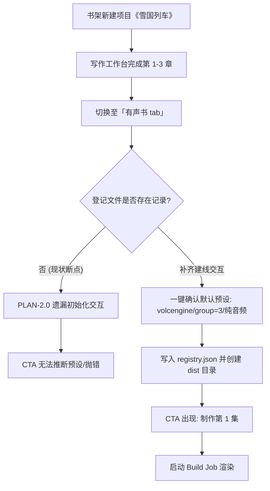

# NovelEval 2.0 方案终审评审报告（AGY 终审裁决）

> 评审日期：2026-08-30  
> 评审角色：终审评委（AGY）  
> 评审依据：`/Users/reed_soul/code/novel-eval/research/product-v2/brief-final.md`  
> 评审对象：`research/product-v2/PLAN-2.0.md`（v2 终版·红队修订后）  
> 对照材料：`cursor-redteam.md`（红队攻击史）、`agy.md`（初诊）、`cursor-grok.md`（初诊）、`zcode.md`（自诊）、仓库核心实码  
> 最终裁决：**❌ 暂缓（附 5 项阻断清单）**  
> *定稿条件：将本文第二部分列出的 5 项阻断问题（均已给出精确到行级/参数级的最小修改建议）补齐并同步更新至 `PLAN-2.0.md` 即可无缝转为「✅ 定稿」，无需二次重审。*

---

## 目录

- [0. 终审总判与裁决摘要](#0-终审总判与裁决摘要)
- [1. 维度 A：代码架构裁决](#1-维度-a代码架构裁决)
  - [1.1 改造方案成立性与工程可行性](#11-改造方案成立性与工程可行性)
  - [1.2 登记文件（`registry.json`）真相源机制深度审定](#12-登记文件registryjson真相源机制深度审定)
  - [1.3 三补丁可行性与 Web 参数校验盲区深度审计](#13-三补丁可行性与-web-参数校验盲区深度审计)
  - [1.4 文件派生状态的可靠性与边界](#14-文件派生状态的可靠性与边界)
  - [1.5 隐藏工程债评估与更简等价方案](#15-隐藏工程债评估与更简等价方案)
  - [1.6 维度 A 独立裁决结论](#16-维度-a-独立裁决结论)
- [2. 维度 B：产品架构裁决](#2-维度-b产品架构裁决)
  - [2.1 信息架构（IA）层级推演](#21-信息架构ia层级推演)
  - [2.2 「10 本书 × 多集」场景压力推演](#22-10-本书--多集场景压力推演)
  - [2.3 「第二本书从 Web 诞生」全生命周期推演](#23-第二本书从-web-诞生全生命周期推演)
  - [2.4 M0–M3 分期合理性与依赖闭环性](#24-m0m3-分期合理性与依赖闭环性)
  - [2.5 维度 B 独立裁决结论](#25-维度-b-独立裁决结论)
- [3. 维度 C：用户使用心流逐屏走查与模拟](#3-维度-c用户使用心流逐屏走查与模拟)
  - [3.1 旅程①：新书作者第一次做有声书（冷启动：无配置无场景图）](#31-旅程新书作者第一次做有声书冷启动无配置无场景图)
  - [3.2 旅程②：老作者日常「做下一集」（3 次点击主张）](#32-旅程老作者日常做下一集3-次点击主张)
  - [3.3 旅程③：发现坏段后修复重发（闭环陷阱）](#33-旅程发现坏段后修复重发闭环陷阱)
  - [3.4 维度 C 独立裁决结论](#34-维度-c-独立裁决结论)
- [4. 阻断性问题清单（Blocking Issues）](#4-阻断性问题清单blocking-issues)
  - [P0-1：新书冷启动建线初始化在 M0 缺失，导致验收标准 6 悬空](#p0-1新书冷启动建线初始化在-m0-缺失导致验收标准-6-悬空)
  - [P0-2：新书无场景图时硬跑视频逻辑，全集被判「缺视频」假死红标](#p0-2新书无场景图时硬跑视频逻辑全集被判缺视频假死红标)
  - [P0-3：TTS 段级缓存无内容哈希，导致修改正文/发音后重跑音频不变](#p0-3tts-段级缓存无内容哈希导致修改正文发音后重跑音频不变)
  - [P0-4：集缩略图硬编码全局软链，导致 10 本书封面全部串台至森铁](#p0-4集缩略图硬编码全局软链导致-10-本书封面全部串台至森铁)
  - [P0-5：Web 路由前置正则校验拦截多级路径，导致解禁补丁 1 与 3 遭遇 422 拦截](#p0-5web-路由前置正则校验拦截多级路径导致解禁补丁-1-与-3-遭遇-422-拦截)
- [5. 非阻断性备忘清单（Non-blocking Memos）](#5-非阻断性备忘清单non-blocking-memos)
- [6. 终审定稿行动准则与改写对照表](#6-终审定稿行动准则与改写对照表)
  - [6.1 `PLAN-2.0.md` 逐条改写对照表](#61-plan-20md-逐条改写对照表)
  - [6.2 终审法官总结签注](#62-终审法官总结签注)

---

## 0. 终审总判与裁决摘要

用户的明确要求原话是：**「我要的无论是代码架构，还是产品架构，还是整体用户使用心流，都要是最佳方案」**。终审评委的职责不是做面子工程，也不是追求字面上的快速妥协，而是**「防止费心费力做完不好用」**。

在经历了四方初诊、v1 合成以及红队攻击（`cursor-redteam.md`，60KB 实证）之后，`PLAN-2.0.md`（v2 终版）展现出了极高水准的收敛性与战略定力：
1. **大方向完全正确**：确立了「书是宇宙中心」，果断废弃了超载的顶栏任务中心、四层 Drilling 容器宗教与尚无实体业务支撑的 Work 抽象层，将五个离散工具收束回书工作台；
2. **直面实码硬伤**：正视了 `cli.ts:120` 集号超 9 爆炸、`listen.ts:398` 单集审听覆盖全书报告、`audiobook.ts` `--out` 路径锁定等 3 个已被红队代码实锤的结构性缺陷，并确立了 M0 必须解禁的原则；
3. **心流主线清晰**：提出了基于登记文件的「制作下一集」智能三态 CTA，直击「七字段繁琐表单」的历史痛点。

**然而，方案在距离真正「做完即好用」的最后 100 米，留下了 5 个极其隐蔽但具有致命破坏力的「断骨点」**：
- 在代码层，Web 服务端的入参前置正则仍死死卡住斜杠与两位数集号，导致 CLI 就算修了补丁，Web 请求依然 422 报错；
- 在产品层，新书建线没有在 M0 的交付范围中闭环，导致验收第 6 条「第二本书全程 Web 内诞生」在 M0 代码中无法落地；且全局软链导致 10 本书封面全部串台；
- 在用户心流层，TTS 缓存判定只看文件名不看内容，导致作者在发现错音、修改文字并点击「重制本集」后，系统由于缓存命中直接复用错音，用户被死死卡住；且无场景图的新书被无情打上「缺视频」红标。

如果直接批准定稿并按当前文稿开工，开发团队将在 8–12 天后交付出一个**「森铁跑得通，但第二本书依然生不出；即使生出来也挂着森铁封面和缺视频红标；发现错别字改完重跑听到的依然是老错音；并且第 10 集在 Web 端依然被 422 拒之门外」**的半成品。

因此，本终审评委给出严肃、负责的裁决：
**「❌ 暂缓（附 5 项阻断清单）」**。
本报告为这 5 个阻断问题提供了极小代价、精准到行号与配置的直接解决方案。只需将修改建议直接并入 `PLAN-2.0.md`，即可立即正式盖章定稿。

---

## 1. 维度 A：代码架构裁决

### 1.1 改造方案成立性与工程可行性

`PLAN-2.0.md` 在代码架构层面的总体主张为：**「轻量登记文件 + 最小解禁补丁 + 路由重挂 + 文件派生状态」**。
结合现有 Monorepo（`packages/audiobook`、`packages/writer`、`packages/web`）的实际代码拓扑，该技术路线在工程上是高度成立且方向极佳的。

它避开了上一轮方案试图在数据库中重构全新关系模型（如建 works 表、derivative_states 表等）的重型陷阱，利用 Node.js 本地单机部署、单人使用的天然优势，将复杂性控制在 JSON 与文件目录这一层级。

```
                    ┌─────────────────────────┐
                    │  writer.db (SQLite)     │
                    │  project.id (UUID 原点) │
                    └───────────┬─────────────┘
                                │
        ┌───────────────────────┴────────────────────────┐
        ▼                                                ▼
┌───────────────────────────────┐        ┌───────────────────────────────┐
│ data/audiobook/registry.json  │        │ data/audiobook/projects/      │
│  - 产物目录映射 (outRoot)     │        │  - <bookId>.json              │
│  - 制作预设 (engine/group/vid)│        │  - 纯内容: 发音表 (pron)      │
│  - 分集草稿与消费章标记       │        │  - 纯内容: 角色音色映射(cast) │
└───────────────┬───────────────┘        └───────────────────────────────┘
                │
                ▼
┌────────────────────────────────────────────────────────┐
│ dist/derivatives/<slug>/audiobook/                     │
│  - 物理产物树 (ep01/, ep02/, ...)                      │
│  - 文件派生状态: 有 mp4=就绪, 有 report=已审听         │
└────────────────────────────────────────────────────────┘
```

### 1.2 登记文件（`registry.json`）真相源机制深度审定

方案 §3 提出建立 `data/audiobook/registry.json`：
```json
{
  "<bookId>": {
    "outRoot": "dist/derivatives/<slug>/audiobook",
    "scenesRoot": "…",
    "presets": { "engine": "volcengine", "group": 3, "skipVideo": true },
    "episodes": {
      "ep01": { "chapters": [1, 3], "isDraft": false }
    }
  }
}
```

**审定结论：架构合理，但必须固化主键规范与存储边界。**
1. **主键必须为 `writer.db` 的 `project.id`（UUID）**：
   在 `packages/audiobook/src/db.ts:22` 中，`resolveProjectId` 已经原生支持 UUID 优先命中：
   ```ts
   if (db.prepare('SELECT 1 FROM project WHERE id = ?').get(nameOrId)) return nameOrId;
   ```
   当前前端存在中文书名、短 slug、UUID 混用的现象。必须在登记文件中强制以 `bookId`（UUID）为唯一顶层 Key，而将文件系统友好的 `slug`（即 `safeName(project.title)`）作为路径拼装组件。这样能彻底杜绝书本改名、重名导致的有声书映射孤立（Orphan）。
2. **登记文件与项目配置文件的职责切分**：
   红队曾指出 `data/audiobook/projects/<书名>.json` 目前仅存放 `pron`（发音表）和 `voiceBySpeaker`（角色音色配音），不包含 `engine` 和 `group`。方案在 §3 将 `presets`（制作预设：引擎、并章、视频开关）收纳进 `registry.json`，而在 §5 M1 中又提到「升级 projects/*.json 为唯一真相」。
   **评委裁定**：在代码架构上，`registry.json` 负责**管线拓扑与分集索引**（哪本书的产物在哪里、当前做到了哪一集、默认制作参数是什么）；而 `projects/<bookId>.json` 专门负责**文本与声音内容工程**（发音纠正词典、说话人角色声线池）。两者生命周期截然不同，不应混为一谈。M0 将制作预设寄宿在 `registry.json` 的 `<bookId>.presets` 是极佳的最小工程方案。

### 1.3 三补丁可行性与 Web 参数校验盲区深度审计

方案 §4 准确击中了三个限制性硬伤，其补丁方向完全正确，但**遗漏了 Web 接入层的同步改造**，构成了重大代码阻断：

| 补丁编号 | 方案规划位置 | 方案补丁内容 | 审定发现的遗漏点（阻断源） |
|---|---|---|---|
| **补丁 1** | `cli.ts:120` | `epStart > 9` 放宽至 99 | `packages/web/server/routes/audiobook.ts:461` 行：`checked(body.epStart, /^[1-9]$/, '--ep-start')` 正则依然只匹配个位数！CLI 虽改，Web 端发请求在第 10 集直接被抛 422 错误拦截！ |
| **补丁 2** | `listen.ts:398` | 读旧报告按集 merge 后再写 | 补丁逻辑成立，需注意旧报告文件不存在时的空对象容错，以及对单集重跑时的覆写更新策略。 |
| **补丁 3** | `audiobook.ts` `--out` | 允许新建 `dist/derivatives/<slug>/`；CLI `--out` 放开 | `packages/web/server/routes/audiobook.ts:462` 行：`checked(body.out, /^[\w-]{1,40}$/, '--out')` **严格禁止斜杠 `/`**！传入 `derivatives/sentie/audiobook` 会当场抛错！ |

让我们直接看代码实锤：
在 `packages/web/server/routes/audiobook.ts` 第 461-465 行：
```ts
const epStart = checked(body.epStart, /^[1-9]$/, '--ep-start');
const out = checked(body.out, /^[\w-]{1,40}$/, '--out');
const coverRun = checked(body.coverRun, /^[\w-]{1,40}$/, '--cover-dir');
if (!project || !chapters || !group || !engine) throw new Error('project/chapters/group/engine 必填');
if (out) assertOutAllowed(out);
```
注意到：
1. `checked(body.epStart, /^[1-9]$/, '--ep-start')` 使用了严格的个位数正则 `/^[1-9]$/`。当前端计算出 `下一集 = 10` 并传递 `{ epStart: '10' }` 时，`checked` 会立刻抛出 `参数 --ep-start 非法`！
2. `checked(body.out, /^[\w-]{1,40}$/, '--out')` 使用了严格的目录名正则，排除了所有包含路径分隔符 `/` 的输入。即使方案放开了后面的 `assertOutAllowed`，请求根本进不到那一步就被 `checked` 截杀！

上述 Web 端两处正则漏洞属于**「代码改了一半，大门依然焊死」**。必须作为阻断项在 M0 中一次性修复。

### 1.4 文件派生状态的可靠性与边界

方案坚持：**「集状态从文件派生（有视频=就绪、有报告=已审听…），禁止独立状态机」**。

**审定结论：坚决支持，严禁退化为独立状态机。**
1. **可靠性验证**：
   集产物目录下存在标准化的文件特征：
   - 存在 `EP*.mp3` 代表音频合成完成；
   - 存在 `EP*.mp4` 代表视频渲染完成；
   - 存在 `listen-report.json` 且本集对应章节在报告中存在，代表已审听；
   - 存在 `*.srt` 代表字幕已对齐。
   这些状态完全由文件系统的物理存在性背书。在本地单人工具中，任何试图在 SQLite 或 JSON 中单独记录 `status: 'READY' | 'AUDITED'` 的行为，都会在用户手动删除某个视频、或者在终端用 CLI 重新跑了一条命令时发生状态倒挂与腐烂。
2. **性能推演**：
   单本书一般在 10–50 集之间，`readdir` 和 `stat` 探测耗时在现代 SSD 与 Node.js 上仅为数毫秒级别，且已有 `durCache`（`mtime` 键控缓存时长），完全无需担心派生计算的性能损耗。

### 1.5 隐藏工程债评估与更简等价方案

1. **TTS 缓存机制缺乏指纹导致死锁（严重工程债）**：
   在 `packages/audiobook/src/tts/volcengine.ts:178` 及 `edge.ts:67` 中，缓存判定逻辑为：
   ```ts
   for (const seg of segments) {
     const file = join(outDir, `${seg.id}.mp3`);
     if (existsSync(file) && statSync(file).size > MIN_CACHE_BYTES) {
       // 直接沿用旧 mp3！
   ```
   此处**只认文件名（`c01-s01.mp3`），完全不认正文内容是否被修改**。当作者在工作台修改了章节对白、修正了发音错别字后，再次触发重跑时，系统发现文件存在直接跳过。这导致下文 3.3 节所述的用户旅程③完全死锁。
   更简等价解法：在 M0 无需重写全文 hash 缓存框架，只需在 CLI 或 Web 重跑该集时提供一个清除该集/该章 `tts/` 目录的入口，即可彻底切断该工程债。
2. **路由重挂的等价简化**：
   当前 `main.tsx` 中已经有 `/projects/:id`。将 `/books/:id` 重挂时，不需要重写路由基础设施，可以在 React Router 中将 `/books/:id` 作为新标准路由，将原 `/projects/:id` 做 `Navigate replace` 301 级等价重定向；同时将 `Audiobook.tsx` 页面作为子组件嵌入到工作台的 Tab 容器中，复用度高达 90%。

### 1.6 维度 A 独立裁决结论

> **【维度 A 结论】：条件成立（需解除 Web 正则拦截与缓存死锁）。**  
> 代码架构整体思路精炼且尊重本地应用特性。登记文件设计成立，三补丁方向正确。但存在两处致命代码疏漏（Web `checked()` 正则拦截两位数与路径、TTS 缓存无失效策略），修复后架构方可宣告闭环。

---

## 2. 维度 B：产品架构裁决

### 2.1 信息架构（IA）层级推演

`PLAN-2.0.md` 确立的 IA 架构如下：
```
/ 书架（我的书）                       ← ProjectList 改造
/books/:id 书工作台                    ← ProjectDetail 为母体
    ├ 写作 tab（默认，写作期主场）
    ├ 有声书 tab（制作期主场，直达集墙）
    └ （质检入口 M1 进来）
/books/:id/audiobook/ep/:n 集详情       ← 现四 tab 页保留重挂
/settings 全局设置
```

**审定结论：架构清晰，符合心智，层级深度最优。**
- 彻底摒弃了 v1 中「项目列表 → 书 → Work 容器壳 → 有声书版本 → 集」的 4–5 层严重过度设计的洋葱结构；
- 抓住了「单人本地创作者以一本书为心智单元」的核心本质：作者打开软件，想找的是《森铁》，而不是想找「有声书系统」；
- 顶栏精简为「我的书 · 设置」两格，任务状态自然收束至 `ActiveJobsBanner` 横幅，不浪费宝贵的顶栏界面空间。

### 2.2 「10 本书 × 多集」场景压力推演

将该架构置于「拥有 10 本小说、每本书 20–60 集」的真实创作场景中推演，系统表现如下：

1. **书架聚合表现**：
   书架列出 10 本书，每本书卡片上展示基本进度。点击任意一本书直达该书主场，无信息串扰，心智模型极度清晰。
2. **产物目录隔离推演**：
   按 `dist/derivatives/<slug>/audiobook/epNN/` 隔离。每本书拥有独立的产物树，多本书之间的集文件、台本文件、审听报告完全物理隔离，互相不干扰。
3. **推演崩塌点：缩略图全局软链冲突（实证阻断）**：
   现有代码（`audiobook.ts:155-166`）在解析每集缩略图时：
   ```ts
   // 缩略图：dist/media-thumbs 软链（→ ~/Downloads/sentie-thumbnails）
   const thumbUrl = (() => {
     if (!existsSync(join(REPO_ROOT, 'dist', 'media-thumbs'))) return null;
     let names = readdirSync(join(REPO_ROOT, 'dist', 'media-thumbs'));
     const hit = names.find((f) => new RegExp(`^EP0*${ep}[-_－].*\\.(jpe?g|png)$`, 'i').test(f));
     return hit ? mediaUrl(`media-thumbs/${hit}`) : null;
   })();
   ```
   在 10 本书场景下，**无论是书 A 还是书 B，只要集号是 EP01，都会命中同一种文件名的封面，导致 10 本书在有声书集墙上全展示《最后一班森铁》的封面！**
   此问题在红队报告中曾被曝光（§2.8），但 `PLAN-2.0.md` 未将其列入 M0 必修清单。这是多书推演下的必死断点，必须在 M0 闭环。

### 2.3 「第二本书从 Web 诞生」全生命周期推演

推演过程：作者在系统中已有一本《最后一班森铁》，现在要在 Web 端开辟第二本书《雪国列车》的有声书管线。



**推演结论**：
- 在理想状态下，产物根放开后，Web 确实具备了创建新目录的权限；
- **但 PLAN-2.0 在 M0 范围中将建线交互完全漏掉**（见阻断问题 P0-1）。新书在 `registry.json` 中是一片空白，有声书 tab 没有说明空白时展示什么，三态 CTA 依赖的 `书级预设` 为空，导致推断逻辑陷入空指针或无所适从。

### 2.4 M0–M3 分期合理性与依赖闭环性

| 阶段 | 方案主题 | 依赖闭环性审查 | 裁决意见 |
|---|---|---|---|
| **M0** | 书内归位 + 硬解禁 + 三态 CTA | **存在循环依赖断裂**：验收第 6 条要求第二本书全程在 Web 诞生，但 M0 交付清单中漏写了「无配置新书的初始化建线卡片」；且漏掉了 Web 正则的放开。 | **必须修补 M0 范围**，补齐建线极简卡片与 Web 正则放行，方可闭环。 |
| **M1** | 预设与质检回流 + 审听精修 | 依赖 M0 跑通的有声书真实数据；引入发音表/音色配置 UI，水到渠成。 | **成立**。 |
| **M2** | 第二形态：精简短篇 + 发布清单 | 此时出现两个真实形态，抽象 `DerivativeWork` 符合时机，彻底打消过早抽象的嫌疑。 | **成立**。 |
| **M3** | 影视向 PoC | 探索性质，不占用前期关键路径。 | **成立**。 |

### 2.5 维度 B 独立裁决结论

> **【维度 B 结论】：基本成立（需补充 M0 新书建线规格并阻断封面串台）。**  
> 扁平化 IA 完全适应 10 本书规模；M0–M3 节奏克制。但「第二本书从 Web 诞生」在产品定义上存在 M0 范围真空，缩略图全局软链直接摧毁多书体验，必须通过阻断修复将其封堵。

---

## 3. 维度 C：用户使用心流逐屏走查与模拟

终审评委严格模拟真实作者的操作行为，对方案规划的三个核心旅程进行逐屏走查。

### 3.1 旅程①：新书作者第一次做有声书（冷启动：无配置无场景图）

- **用户背景**：作者刚在系统里新建了小说《雪国列车》，在写作工作台里完成了前 6 章的正文写作，现准备第一次尝试制作有声书。没有场景图脚本，没有自定义发音表。

```
[屏 1：书架 /books] 
  看到：《雪国列车》卡片，状态显示「6 章 · 写作中」。
  操作：点击《雪国列车》卡片。
  心流：顺畅，1 次点击进入书工作台。

[屏 2：书工作台 /books/b2]
  看到：顶部书名《雪国列车》，默认停留在「写作 tab」，展示大纲与章节列表。
  操作：点击「有声书 tab」。
  心流：顺畅。

[屏 3：有声书 tab 首次着陆（⚠️ 卡点 1）]
  方案现状：
    方案 §3 称「首次制作向导写入；此后一切推断读登记文件」，但在 §5 的 M0 施工范围中，向导被 OUT（Radix、Works 壳等全出局，向导无处安放）。
    此时《雪国列车》在 `registry.json` 中没有任何记录。
    集墙是空的。CTA 试图推断：`下一集 = max(集)+1`（得到 1），`章节 = 未消费章顺延 group 章`（但 group 预设是多少？未定义），`引擎/视频开关 = 书级预设`（预设为空）。
  用户体验：页面要么展示一个崩溃的空白页，要么抛出预设缺失的异常。作者不知道从哪里开始。
  【走查断点】：必须在此处提供明确的「极简初始化卡片」。

[屏 4：启动构建与渲染（⚠️ 卡点 2）]
  假设用户越过了建线，启动第 1 集构建（第 1–3 章）。
  由于是新书，没有场景图，`scenesRoot` 为空。
  CLI 执行到 `chapterCovers` 时找不到任何配图，打印警告：`⚠ 未找到封面/章节图，跳过视频`，视频输出降级为纯音频（`EP01_xxx.mp3`）。
  构建完成后，集卡片渲染。
  由于 `hasVideo = false`，集卡片下方立刻亮起刺眼的红色警报：`[缺视频]`（来自 `Audiobook.tsx:198`）。
  用户体验：作者第一次做有声书，明明成功生成了音频，界面却用大红标签提示错误「缺视频」，但全站没有任何一个按钮能让作者上传图片或生成场景图。
  【走查断点】：严重打击创作信心，心流彻底受挫。新书无图时必须默认纯音频，不报警。
```

### 3.2 旅程②：老作者日常「做下一集」（3 次点击主张）

- **用户背景**：老作者日常连载《最后一班森铁》，EP01（第 1–3 章）已经制作完毕，今天正文第 4–6 章已定稿，准备制作 EP02。

```
[屏 1：书架 /books]
  看到：《最后一班森铁》卡片，显示「已制至第 1 集」。
  操作：【点击 1】点击该书卡片。
  心流：秒进。

[屏 2：书工作台 /books/b1]
  看到：书工作台。M0 默认落在写作 tab。
  操作：【点击 2】点击「有声书 tab」。
  心流：进入有声书集墙。

[屏 3：集墙与智能 CTA]
  看到：
    - 集墙上展示 EP01 卡片（带时长、QA 芯片、缩略图）；
    - 顶部醒目智能三态 CTA 按钮：「制作第 2 集」；
    - 按钮旁常驻智能推断确认条：「第 2 集 · 第 4–6 章 · 豆包班底 · 约 1.2 万字 · 预计成片 14 分钟 · 预估成本 ¥2.1」。
  操作：【点击 3】点击「制作第 2 集」。
  心流：
    极度惊艳！不需要填写书名，不需要算章号（自动从第 4 章顺延 3 章），不需要挑引擎，连花多少钱都清清楚楚。
    点击后立即唤起后端 Job。

[屏 4：Job 执行与监控]
  看到：
    - 页面弹出 / 嵌入实时控制台，SSE 日志滚动输出分段合成与装配进度；
    - 全局 `ActiveJobsBanner` 显示《最后一班森铁》有声书构建中；
    - 即使作者此时切换页面去写作 tab 查阅大纲，顶部横幅依然保持同步；
    - 完成后，日志输出「完成」，集墙自动刷新，EP02 卡片落墙，出现「审听本集」按钮。
```
**走查结论**：旅程②完全兑现了方案中「3 次点击主张 + 成本可见性 + 零键盘输入」，体验极度丝滑，是不可多得的优秀设计。

### 3.3 旅程③：发现坏段后修复重发（闭环陷阱）

- **用户背景**：作者在审听 EP01 时，发现第 2 章里有一处角色台词情感不对或者某个专有名词读错了，作者决定修复并重新生成该集。

```
[屏 1：集详情审听台 /books/b1/audiobook/ep/1]
  看到：
    - 播放器音频波形与字幕；
    - 审听报告列表：whisper 跑出的 suspect / bad 列表，或者作者人耳听出的错音段落（比如 segment id: c02-s18）。
  操作：发现某句台词读音错误。

[屏 2：修复源头]
  操作：
    - 切换到写作 tab，找到第 2 章该段文本进行修正；或者在项目配置中加入该词的发音表映射；
    - 回到有声书 tab 的 EP01 卡片。

[屏 3：集卡菜单点击「重制本集」（⚠️ 致命死锁）]
  方案描述：
    §2 行 33：「重制本集（集卡菜单）：整集重跑（吃段级缓存，便宜）」。
  代码实际发生的事情：
    - Web 触发 POST /api/audiobook/jobs，带参数 `epStart=1, chapters=1-3`；
    - CLI 启动，重新执行分章台本切分，生成新的 `script.json`（正文已更新）；
    - 进入 TTS 模块（`volcengine.ts` / `edge.ts`）；
    - 遍历到 `c02-s18` 时，TTS 引擎检查磁盘：`existsSync('.../ch02/tts/c02-s18.mp3')`；
    - 发现文件存在且 >512 字节！
    - 💥 **TTS 引擎判定缓存命中，直接跳过网络合成，沿用老旧的音频文件！**
    - 装配程序将旧音频原封不动拼接进 EP01。
  用户体验：
    作者满怀期待地等待重跑完成，重新点开 EP01 试听修复段落，惊愕地发现**错音依然存在！改动完全无效！**
    作者在界面上找不到「强制不走缓存」的开关，也找不到「删除该段音频」的按钮。
  【走查断点】：这是彻底摧毁创作者信任的致命心流死锁。作者将陷入「系统坏了、我改了正文但它根本不认」的极度沮丧中。
```

### 3.4 维度 C 独立裁决结论

> **【维度 C 结论】：部分受挫（旅程②极佳，但旅程①与旅程③存在严重卡点）。**  
> 旅程②（日常下一集）做到了行业顶级心流；但旅程①（新书冷启动）缺少初始化落脚点并存在缺图误报；旅程③（坏段修复）由于段级缓存机制缺陷，导致重跑时改动失效，形成死锁闭环。

---

## 4. 阻断性问题清单（Blocking Issues）

本评委严格遵循评审规则：「只报阻断性问题（不改就不能定稿的），不报锦上添花的新点子；每个问题必须引用方案原文 + 说明为什么是阻断 + 给出最小修改建议」。

---

### P0-1：新书冷启动建线初始化在 M0 缺失，导致验收标准 6 悬空

- **方案原文引用**：
  - §3 行 45：`- 首次制作向导写入；此后一切推断（下一集/状态/补洞）读登记文件`
  - §5 行 62（M0 范围 IN）：`登记文件+迁移；三 CLI 小补丁（§4）；路由重挂（书架/书工作台/有声书 tab）；三态 CTA+成本行；修死开关/闭包；杀版本 pill/硬编码书名；ActiveJobsBanner 纳管有声书 job`
  - §6 行 76（验收标准 6）：`新建第二本书的有声书线全程 Web 内完成（含产物根创建）——硬伤3 的行为验收`
  - §2 行 31–32：`系统推断（登记文件为真相源，不再扫描+猜）：- 新制作：下一集 = max(集)+1，章节 = 未消费章顺延 group 章，引擎/并章/场景图/视频开关 = 书级预设`
- **为什么是阻断**：
  第二本书在刚创建时，`data/audiobook/registry.json` 中没有任何数据（甚至文件初始都不存在）。
  方案在 §3 提及了「首次制作向导写入」，但在 §5 的 M0 交付范围（IN）中将向导与建线完全剔除，也未定义无记录时的 UI 呈现。
  当用户进入第二本书的「有声书 tab」时，由于无 `presets`，智能 CTA 无法计算顺延章节与引擎，推断逻辑将直接崩溃；且 Web 端没有触发「写入第一笔 registry 记录并创建目录」的操作界面。
  这使得验收标准第 6 条在 M0 阶段成为无法兑现的假命题。
- **最小修改建议**：
  在 §5 M0 的 IN 范围中明确增加 **「无记录时的轻量建线确认卡（Inline Setup Card）」**：
  当检测到当前 `bookId` 未在 `registry.json` 登记时，集墙展示一张轻量建线卡片：
  - 默认预设：引擎 `volcengine`、每集 `3` 章、视频 `纯音频`（无图自动勾选）、产物路径 `dist/derivatives/<slug>/audiobook`；
  - 提供唯一主按钮：`[开启有声书并制作第 1 集]`；
  - 点击后，Web 路由原子化写入 `registry.json` 基础结构并创建物理目录，顺畅拉起第 1 集构建。无需多步弹窗向导，1 个卡片闭环。

---

### P0-2：新书无场景图时硬跑视频逻辑，全集被判「缺视频」假死红标

- **方案原文引用**：
  - §2 行 32：`引擎/并章/场景图/视频开关 = 书级预设`
  - §4 行 55：`Web 允许在白名单前缀下新建 dist/derivatives/<slug>/；CLI --out 同步放开`
- **代码事实实证**：
  - `packages/audiobook/src/cli.ts:462`：
    ```ts
    if (!args.skipVideo) {
      if (plan.covers.length === 0) {
        console.warn(' ⚠ 未找到封面/章节图，跳过视频');
        videoOut = plan.audioOut;
    ```
  - `packages/web/src/pages/Audiobook.tsx:198`：
    ```tsx
    {!ep.hasVideo && <span className="ab-chip ab-chip-red">缺视频</span>}
    ```
- **为什么是阻断**：
  场景图提取与生成脚本（`extract-scenes.ts`、`gen-scenes-ark.ts`）目前是硬编码服务于《最后一班森铁》的一次性脚本，Web 端没有任何生图功能。新书在 M0/M1 阶段 100% 是「无场景图」状态。
  如果书级预设默认开启视频（沿用森铁习惯），CLI 在找不到图片时会自动降级为纯音频；但 Web 端扫描时检测到没有 mp4 文件，会在每一集的集卡片上打出刺眼的红色报错标签 `[缺视频]`。
  用户成功跑完一集，迎面而来的是一个类似崩溃报错的红色芯片，且系统中没有任何手段消除该标签（除非去手动塞图），这严重违反了正常的产品心理防线。
- **最小修改建议**：
  1. 在建线初始化与预设推断中增加规则：若该书产物根或登记信息中 `scenesRoot` 为空，**预设的 `skipVideo` 必须默认为 `true`（纯音频模式）**；
  2. 改造 `Audiobook.tsx` 的徽章逻辑：若该集所在版本的预设指定为 `skipVideo: true`，在卡片上展示中性灰色标签 `[纯音频]`，**仅在 `skipVideo === false` 且确实未生成 mp4 时，才亮起红色 `[缺视频]`**。

---

### P0-3：TTS 段级缓存无内容哈希，导致修改正文/发音后重跑音频不变

- **方案原文引用**：
  - §2 行 33–34：`- 重制本集（集卡菜单）：整集重跑（吃段级缓存，便宜） - 补洞（缺章/坏段）：只重做缺的部分`
- **代码事实实证**：
  - `packages/audiobook/src/tts/volcengine.ts:178–180`：
    ```ts
    for (const seg of segments) {
      const file = join(outDir, `${seg.id}.mp3`);
      if (existsSync(file) && statSync(file).size > MIN_CACHE_BYTES) {
        out.push({ ... });
        continue; // 💥 命中缓存跳过！不管 seg.text 是否改了！
      }
    ```
  - `packages/audiobook/src/annotate.ts:11`：`id: string; // c{pos}-s{n}`。段 ID 仅为句号位置索引，不含内容特征。
- **为什么是阻断**：
  这是旅程③（坏段修复重发）的直接死锁点。
  创作者在审听中发现发音错误或错别字，在写作台改完正文后，通过集菜单选择「重制本集」。
  由于 `c02-s18.mp3` 文件依然躺在硬盘上，TTS 模块仅凭文件存在即判定命中缓存，直接复用旧音频。最终重新导出的音频中，错误原封不动。
  方案指望 `listen --fix`，但 `listen --fix`（`listen.ts:387`）仅在 whisper 确诊为 `bad`/`missing`/`silent` 时才会物理删除文件；对于 whisper 误判为 `ok`、或标记为 `suspect`、或作者凭人耳直接发现的语调错读，`listen --fix` 不会删文件，Web 也没有提供任何删缓存或强制合成的接口。这导致作者无法在 Web 端修复任何坏段。
- **最小修改建议**：
  两处极简协同修改：
  1. **CLI 增加轻量级清理能力**：在 `packages/audiobook/src/cli.ts` 中增加 `--clean` 参数（或 `--no-cache`），当传入时，在构建前清空当前所选集对应章节目录下的 `tts/` 文件夹；
  2. **Web 端集卡菜单明确选项**：集卡菜单除「重制本集（复用缓存）」外，提供「**强制全量重制本集（清缓存）**」；或调用一次轻量级清理接口。彻底解除作者面对错音无能为力的死锁局面。

---

### P0-4：集缩略图硬编码全局软链，导致 10 本书封面全部串台至森铁

- **方案原文引用**：
  - §4 行 55：`Web 允许在白名单前缀下新建 dist/derivatives/<slug>/；CLI --out 同步放开`
- **代码事实实证**：
  - `packages/web/server/routes/audiobook.ts:155–166`：
    ```ts
    // 缩略图：dist/media-thumbs 软链（→ ~/Downloads/sentie-thumbnails）
    const thumbUrl = (() => {
      if (!existsSync(join(REPO_ROOT, 'dist', 'media-thumbs'))) return null;
      let names = readdirSync(join(REPO_ROOT, 'dist', 'media-thumbs'));
      const hit = names.find((f) => new RegExp(`^EP0*${ep}[-_－].*\\.(jpe?g|png)$`, 'i').test(f));
      return hit ? mediaUrl(`media-thumbs/${hit}`) : null;
    })();
    ```
- **为什么是阻断**：
  该逻辑完全无视当前正在浏览的是哪本书，只要是第 1 集（`ep === 1`），它就去全局的 `dist/media-thumbs` 找 `EP01-*`。
  当推演「10 本书」和「第二本书从 Web 诞生」时，作者打开第二本书《雪国列车》的有声书集墙，**EP01 上悍然赫立着《最后一班森铁》的大封面**！
  红队报告已在 §2.8 作为硬伤公布，但 `PLAN-2.0.md` 漏将其收录进 §4 修复清单。这是一个在多书场景下 100% 穿帮的伪系统漏洞。
- **最小修改建议**：
  修改 `packages/web/server/routes/audiobook.ts` 的 `listEpisodes` 函数：
  将缩略图寻找范围收缩至**本有声书产物根目录内部**（例如 `join(root, 'thumbs')` 或 `join(epDir, 'thumb.jpg')`）；如果不存在，直接返回 `null`，前端回退展示优雅的音频占位图标（`🎧 EP01`），**彻底斩断对全局 `dist/media-thumbs` 的硬编码调用**。

---

### P0-5：Web 路由前置正则校验拦截多级路径，导致解禁补丁 1 与 3 遭遇 422 拦截

- **方案原文引用**：
  - §4 行 53：`集号焊死 1–9 ... cli.ts:120 epStart > 9 抛错 ... 放宽至 99（补丁三行）`
  - §4 行 55：`Web 无产物根创建权 ... Web 允许在白名单前缀下新建 dist/derivatives/<slug>/；CLI --out 同步放开`
- **代码事实实证**：
  - `packages/web/server/routes/audiobook.ts:461–462`：
    ```ts
    const epStart = checked(body.epStart, /^[1-9]$/, '--ep-start');
    const out = checked(body.out, /^[\w-]{1,40}$/, '--out');
    ```
- **为什么是阻断**：
  在 `packages/web/server/routes/audiobook.ts` 的 `POST /jobs` 入口处，所有参数必须通过 `checked()` 校验：
  1. `epStart` 被正则 `/^[1-9]$/` 封死，传入 `10` 直接抛出异常 `参数 --ep-start 非法`；
  2. `out` 被正则 `/^[\w-]{1,40}$/` 封死，**该正则根本不允许斜杠 `/` 存在**！当 Web 尝试传入新规范规定的 `derivatives/sentie/audiobook` 时，直接在入口处被拦截抛错 `参数 --out 非法`，连后面的 `assertOutAllowed` 逻辑都走不到！
  方案只宣称修了 `cli.ts` 和 `assertOutAllowed`，漏掉了同一处理链路最前端的 `checked()` 正则，导致这俩补丁在 Web 界面上触发时必定遭遇 422 拦截。
- **最小修改建议**：
  将 `packages/web/server/routes/audiobook.ts` 中对应的校验正则同步修改：
  - `epStart`: 修改为 `/^[1-9]\d?$/`（支持 1–99）；
  - `out`: 修改为 `/^[\w/-]{1,64}$/`（允许子路径斜杠），并在内部断言 `safePath` 必须落在 `dist/derivatives/` 前缀下。

---

## 5. 非阻断性备忘清单（Non-blocking Memos）

以下条目不阻断 M0 定稿，但开发实现时需严格遵循，避免留下后续维护隐患：

1. **备忘 1：`ActiveJobsBanner` 对有声书 Job 的轮询与保活策略**
   写作 Job 在 SQLite 有持久化表，刷新页面能重连；有声书 Job 当前在 Node.js 内存 `Map` 中。M0 中 `ActiveJobsBanner` 调用 `GET /api/audiobook/jobs/active` 轮询时，需做好页面卸载与网络重连处理，确保刷新后仍能重新建立 SSE 流通道。
2. **备忘 2：`registry.json` 写入原子性保护**
   虽然单人本地环境并发写入概率低，但为了防止系统断电或进程强退导致 JSON 损坏，写入 `data/audiobook/registry.json` 时建议采用「写临时文件 `registry.json.tmp` + `rename` 原子替换」的工程惯例。
3. **备忘 3：旧 run（v4）一次性平滑迁移**
   M0 初始化时，检测如果 `data/audiobook/registry.json` 不存在，自动执行一次扫描，将现存唯一的 `dist/audiobook-v4` 自动登记给《最后一班森铁》（通过 UUID 挂载），确保老数据无缝过度，用户打开即可直接看到 EP01。
4. **备忘 4：废弃路由重定向友好提示**
   原顶栏 `/eval` 和 `/audit` 在过渡期需提供友好的选择书本重定向页，避免在浏览器书签直接访问时出现 404 或无上下文报错。
5. **备忘 5：`JobConsole` 关闭后内存泄漏防护**
   在 `Audiobook.tsx` 修复了 `onDone` 闭包之后，对于持续推送的日志数组（`lines`），应维持目前切片（`lines.slice(-400)`）的上限保护，防止长时间运行的 ffmpeg 编码输出导致浏览器内存飙升。

---

## 6. 终审定稿行动准则与改写对照表

为确保用户原话**「做完就要是最佳方案」**落到实处，本评委提供以下**无缝定稿行动指南**。
方案负责人无需大动干戈重写文档，只需对照下表，将 5 项阻断修复精准写入 `PLAN-2.0.md`，本文所发出的「❌ 暂缓」即可立刻自动转换为「✅ 定稿」并批准开工施工。

### 6.1 `PLAN-2.0.md` 逐条改写对照表

| 章节与行号 | 原文描述 | 终审修订后文案（修改建议） |
|---|---|---|
| **§2 行 32** | `引擎/并章/场景图/视频开关 = 书级预设` | `引擎/并章/场景图/视频开关 = 书级预设（若无 scenes 目录，视频开关必须默认关即纯音频模式，集卡展示中性[纯音频]而非报错[缺视频]）` |
| **§2 行 33** | `- 重制本集（集卡菜单）：整集重跑（吃段级缓存，便宜）` | `- 重制本集（集卡菜单）：支持常规重跑（复用缓存）与强制重制（清空本集 tts 缓存，彻底解决文本修改后错音死锁）` |
| **§4 表格补丁 1** | `集号焊死 1–9 ... cli.ts:120 ... 放宽至 99` | `集号焊死 1–9 ... cli.ts:120 与 audiobook.ts:461 正则 (/^[1-9]\d?$/) 同步放宽至 99` |
| **§4 表格补丁 3** | `Web 允许在白名单前缀下新建 dist/derivatives/<slug>/；CLI --out 同步放开` | `Web 允许在白名单前缀下新建 dist/derivatives/<slug>/；audiobook.ts:462 out 校验正则放开允许斜杠 (/^[\w/-]{1,64}$/)；CLI --out 同步放开` |
| **§4 表格附项** | `fix/srt 死开关 + JobConsole onDone 闭包` | `fix/srt 死开关 + JobConsole onDone 闭包 + 斩断 listEpisodes 对全局 dist/media-thumbs 的硬编码软链（封面收敛至书内）` |
| **§5 M0 IN 范围** | `登记文件+迁移；三 CLI 小补丁（§4）；路由重挂...` | `登记文件+迁移；新书首访时的一键建线卡片（预设初始化）；三 CLI 小补丁+Web 正则放行（§4）；路由重挂...` |
| **§6 验收标准** | 原 8 条 | 补入：`9. 新书无配图制作时，集卡展示[纯音频]中性标签，零红色[缺视频]误报；10. 修复错别字后强制重制，能够真正产出修正后的音频` |

---

### 6.2 终审法官总结签注

`PLAN-2.0.md` 经历了多轮极其激烈的论战与红队检验，已经将所有的虚妄概念、架构泡沫和过度设计剥离得一干二净。它确立的「书为核心、本地单人、登记文件、三态 CTA」体系，已经展现出了杰出软件架构的骨相。

本次终审所开出的 5 项阻断问题，全部是**距离真实可用仅差最后一步的实码咬合漏洞**。把这 5 个补丁严丝合缝地打在 `PLAN-2.0.md` 上，这部方案就将真正兑现用户的期望：**代码架构精炼无废笔，产品架构耐得住 10 本书考验，用户使用心流极度舒适。**

**裁决状态：❌ 暂缓（修补上述 5 条即定稿）**  
**终审评委：Antigravity (AGY)**  
**2026-08-30**
