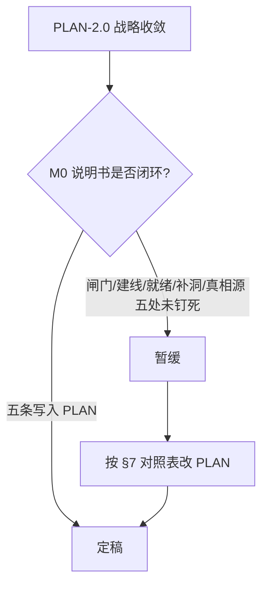
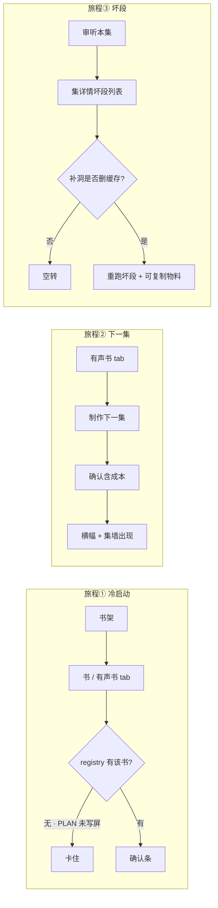
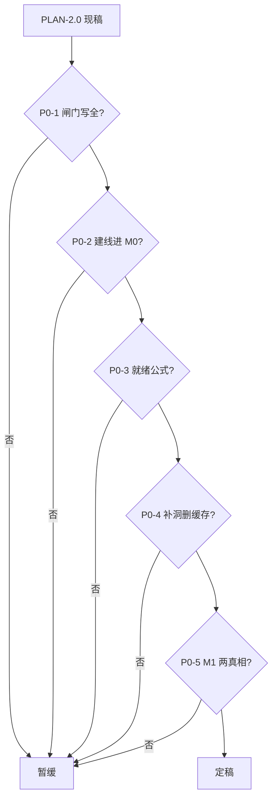

# NovelEval 2.0 方案终审评审报告（Cursor）

> 评审日期：2026-08-30  
> 角色：终审评委（Cursor）  
> 依据：`research/product-v2/brief-final.md`  
> 主审：`research/product-v2/PLAN-2.0.md`（v2 终版·红队修订后）  
> 对照：`cursor-redteam.md`、`agy.md`、`cursor-grok.md`、`zcode.md`  
> 代码抽查：`cli.ts:120`、`listen.ts:398`、`audiobook.ts`（`--out` / `epStart` / `AUDIOBOOK_ROOTS`）、`Audiobook.tsx:64`、以及登记/缩略图/TTS 缓存/场景脚本相关实码  
> **最终裁决：❌ 暂缓 + 阻断清单（5 项）**  
> 定稿条件：将本文 §5 五条按「最小修改建议」写入 `PLAN-2.0.md` 后即可转为 ✅ 定稿，无需因战略方向再开一轮发散。

---

## 目录

- [0. 一句话总判](#0-一句话总判)
- [1. 评审方法、范围与实证边界](#1-评审方法范围与实证边界)
- [2. 维度 A：代码架构裁决](#2-维度-a代码架构裁决)
- [3. 维度 B：产品架构裁决](#3-维度-b产品架构裁决)
- [4. 维度 C：三旅程逐屏走查](#4-维度-c三旅程逐屏走查)
- [5. 阻断性问题清单](#5-阻断性问题清单)
- [6. 非阻断备忘（不得挡定稿）](#6-非阻断备忘不得挡定稿)
- [7. 写入 PLAN 的最小补丁对照表](#7-写入-plan-的最小补丁对照表)
- [8. 签注](#8-签注)

---

## 0. 一句话总判

**对象、规模、节奏这三件，v2 已经认对了。还不能定稿的原因不是战略，是 M0 施工说明书在四处把「会让第二本书或第十集做不出来」的闸门写漏了。**

用户原话要求：「无论是代码架构，还是产品架构，还是整体用户使用心流，都要是最佳方案」。终审的职责是防止「费心费力做完不好用」。发散轮已结束——本文不发明新 IA、不重开 Work 之争、不把 Radix 拉回 M0。

v2 已经把红队打中的大方向吃进去了：

1. 书是宇宙中心；五工具钉回书下；杀 v3/v4；七字段表单该死。  
2. 四层 drilling / Work 灰卡 / 独立集状态机 / 顶栏任务中心全部降级或出局——这是对的，不再和稀泥。  
3. M0 必须解禁三个代码硬伤（集号、报告覆盖、产物根创建权），而不是「只换皮」。  
4. 登记文件替代扫描猜测；状态从文件派生；制作完不自动审听。

这些决策在现有 monorepo（单人、本机、当前实质一本在产）上成立，也比 v1 更接近「最佳」。

**但按原文开工，8–12 个工作日后大概率得到：**

- CLI 上 `--ep-start 10` 不再抛错，Web 点「制作第 10 集」仍 422；  
- `dist/derivatives/<slug>/audiobook` 在白名单正则和模块加载期扫描里根本看不见；  
- 第二本书没有「建线」这一屏，验收第 6 条无法落地；  
- 无场景图的新书被「有视频=就绪」打成永久缺件；  
- 「补洞」若不删段缓存，重跑是空转。

所以裁决是 **❌ 暂缓**，不是推翻。五条都是「把已有意图写完整」，不是新功能。



---

## 1. 评审方法、范围与实证边界

### 1.1 三个维度如何各自裁决

任务书要求逐维独立结论，且 **只报阻断**（不改就不能定稿）。本评委对「阻断」的操作定义：

- 按 PLAN 原文施工，会使任务书点名的推演破产：「10 本书 × 多集」「第二本书从 Web 诞生」；或  
- 三个指定旅程中，用户会卡死、空转、或得到假完成；或  
- 改造方案在现码上不成立（漏闸门、双真相源、修法覆盖不到验收）。

不报：组件库、文案润色、M2/M3 形态细节、护城河措辞、工期再砍一天。

### 1.2 主审文本的结构（评什么、不评什么）

`PLAN-2.0.md` 共 8 节 + 附录。终审覆盖：

| 节 | 评什么 |
|----|--------|
| §0 判决 | 定位是否仍与用户原话和红队修正一致 |
| §1 IA | 书架→书→有声书 tab→集 是否撑住 10 本 |
| §2 三态 CTA | 推断算法、试产、成本行、不自动审听 |
| §3 登记文件 | 能否替代扫描、状态派生是否可执行 |
| §4 三硬伤 | 修法是否覆盖全部闸门 |
| §5 路线图 | M0 IN/OUT 与验收是否互洽；M1 会不会推翻 M0 |
| §6 验收 | 8 条是否都能在 M0 范围里为真 |
| §7–§8 | 决策日志与禁令是否自洽 |

不把 `cursor-redteam.md` 里已被 v2 正确拒绝的点（双模式书路由更绕、对标深度、护城河 aspirational）再翻案。

### 1.3 代码实证（本轮实际打开并核对）

| 主张 | 实码 | 结果 |
|------|------|------|
| 集号焊死 1–9 | `packages/audiobook/src/cli.ts:120` `epStart > 9` 抛错 | **成立** |
| 同锁在 Web | `packages/web/server/routes/audiobook.ts:461` `checked(..., /^[1-9]$/)` | **成立，且 PLAN 未写** |
| `--out` 必须已有 run | 同文件 `assertOutAllowed` + `AUDIOBOOK_ROOTS` 模块加载期扫描 `dist/` 下 `/^audiobook/` | **成立** |
| `--out` 正则无斜杠 | 同文件 `:462` `/^[\w-]{1,40}$/`；`startBuildJob` 再拼 `dist/${o.out}` | **成立，且与 `dist/derivatives/<slug>/…` 冲突** |
| 审听整文件覆盖 | `packages/audiobook/src/listen.ts:397-398` 过滤后 `writeFile` 整份报告 | **成立** |
| JobConsole 闭包 | `Audiobook.tsx:64` `onDone?.(status !== 'failed')`，`status` 闭包初值 `'running'` | **成立** |
| fix/srt 死开关 | 同页 `listenFix`/`listenSrt` 有 state，`startJob({ action:'listen', out, ep })` **不传** `fix`/`srt` | **成立**；M0「修死开关」针对此项，成立 |
| TTS 段缓存按文件名 | `tts/edge.ts:65-68`、`tts/volcengine.ts:178-182`：`seg.id.mp3` 存在即跳过；`annotate.ts` id 为 `c{pos}-s{n}` | **成立** |
| 缩略图全局命名空间 | `audiobook.ts:155-165` `dist/media-thumbs` + `^EP0*{n}` | **成立** |
| 场景管线钉死森铁 | `extract-scenes.ts` 项目名与 `dist/audiobook-v3/scenes.json`；`gen-scenes-ark.ts` 同路径 | **成立** |
| 无封面则跳过视频 | `cli.ts:461-464` `plan.covers.length === 0` 则 warn 并跳过 | **成立**；UI 仍打「缺视频」红标（`Audiobook.tsx:198`） |
| 有声书 job 内存 Map | `audiobook.ts` `jobs = new Map`；横幅只拉 writer+eval | **成立**；M0「横幅纳管」可覆盖，非本轮阻断 |
| `projects/*.json` 无引擎字段 | `project-config.ts` 仅 pron/cast/voice | **成立**；与 M1「升级为唯一真相」冲突 |

### 1.4 本评委相对前序文档的立场

- 同意红队：v1 和稀泥；M0 必须解禁；登记文件；不要假状态机。  
- 同意 v2：不采纳「双模式书」替代路由；Work 降到 M2 有第二条真形态再抽象。  
- **不同意**「三 CLI 小补丁」这一措辞所暗示的工作面——Web 至少还有对称的两道正则、一道扫描表、一道路径拼接。这不是新攻击，是 v2 修法写短了。  
- 红队 §3.7「冷启动两条主路径」被 v2 写进 §3「首次制作向导写入」，但 **没有写进 §5 M0 IN，也没有写成验收**。这是本轮阻断的核心来源之一。

---

## 2. 维度 A：代码架构裁决

### 2.1 改造方案在 monorepo 上是否成立

v2 的代码主张可概括为四件套：

> 登记文件 + 三补丁 + 路由重挂 + 文件派生状态

对照现仓：

```
packages/writer     SQLite 母本（project.id UUID）
packages/audiobook  CLI 管线（build / listen / attribute）
packages/web        Hono API + React 页（有声书仍以 dist 目录名为 run key）
```

**方向成立，而且是这套约束下更简单的等价做法。** 不需要 works 表、不需要独立状态机、不需要容器编排。单人本机、同时最多一个有声书 job（全局 `currentJobId` 串行），JSON 登记 + 磁盘产物是正确的复杂度上限。

禁令 ⑧⑨⑩（不为第二形态先写抽象、状态派生不落库、M0 CLI 只许解禁不许重构）与现码匹配，应保留。

### 2.2 登记文件作为真相源——机制对，接线没写完

方案原文：

```
data/audiobook/registry.json：
{ "<bookId>": { "outRoot": "dist/derivatives/<slug>/audiobook", "scenesRoot": "…", "presets": {…}, "episodes": { "ep01": {"chapters":[1,3],"isDraft":false} } } }
- 首次制作向导写入；此后一切推断（下一集/状态/补洞）读登记文件
- 集状态从文件派生（有视频=就绪、有报告=已审听…），禁止独立状态机
```

**对的部分：**

- 主键用 `bookId`（UUID），不再用书名 / `youtube-upload.json` 的 playlist 聚合。这直接打掉红队 2.1「四套键互不认亲」里最脆的那根弦。  
- `episodes[].chapters` + `isDraft` 让「下一集 = max(非草稿集)+1」和「试产不污染推断」可执行。  
- 旧 `dist/audiobook-v4` 一次性迁移、v3 不进 UI，与验收 3 一致。

**没写完、会让方案在现码上不成立的部分：**

1. **现列表权威是 `AUDIOBOOK_ROOTS`，不是登记文件。**  
   `audiobook.ts:32-38` 在模块加载时扫 `dist/` 顶层、`/^audiobook/`、再按 **basename** 建 `RUN_ROOTS_BY_ID`。  
   PLAN 的 `outRoot` 是 `dist/derivatives/<slug>/audiobook`：  
   - 它不在 `dist/` 顶层，扫描看不见；  
   - 多本书的 basename 都是 `audiobook`，表会互踩。  
   「登记文件替代扫描」若只写 JSON、不写「退役 `AUDIOBOOK_ROOTS` / run id = bookId」，第二本书即使 mkdir 成功也会在 API 层隐身或串台。

2. **`slug` 未定义。** 若实现时用 `safeName(title)`，改名即与目录漂移。最小做法：目录名用 `bookId`（或向导写入后冻结，禁止重算）。

3. **Web job 仍把 `--out` 当成「已有顶层目录名」。**  
   `startBuildJob`：`--out dist/${o.out}`。  
   `checked(body.out, /^[\w-]{1,40}$/)` 不允许斜杠。  
   硬伤 3 的修法只写「白名单前缀下新建」，没写正则、没写拼接、没写请求期登记。按原文补丁，验收 6 对 Web 为假。

结论：登记文件是对的架构；**必须在 PLAN 里把「扫描层退役清单」写成与三补丁同级的硬约束**，否则执行者会只改 `cli.ts:120` 和 `assertOutAllowed` 的「允许不存在」，然后在 422 和 404 之间转圈。

### 2.3 「三补丁」覆盖率——CLI 实锤了，Web 对称锁没进表

方案原文 §4：

```
| 1 | 集号焊死 1–9 | cli.ts:120 | … | 放宽至 99（补丁三行） |
| 2 | 审听报告整文件覆盖 | listen.ts:398 | … | 读旧报告按集 merge 后再写 |
| 3 | Web 无产物根创建权 | audiobook.ts job 校验 --out 必须是已有 run 目录 | … | Web 允许在白名单前缀下新建 dist/derivatives/<slug>/；CLI --out 同步放开 |
| 附 | fix/srt 死开关 + JobConsole onDone 闭包 | Audiobook.tsx:64 | … | 一并修 |
```

补丁 2、附项：修法完整，现码对得上，**通过**。

补丁 1：`cli.ts:120` 三行可放宽。**但 Web 仍是 `/^[1-9]$/`。** 智能 CTA 到第 10 集时 POST `epStart: "10"`，`checked()` 直接 422。验收 7 写的是「`--ep-start 10` 不再抛错」——CLI 语义。产品入口却是 Web。这是「修法按工程师的 grep 写，没按用户点的按钮写」。

补丁 3：见 2.2。`assertOutAllowed` 只是闸门之一。

施工禁令 ⑩「M0 的 CLI 补丁只许解禁不许重构」仍然对——本评委要求的是 **解禁面写全**（Web 校验 + 扫描退役），不是允许借机重构管线。

### 2.4 文件派生状态——禁止独立状态机对，派生公式错

「禁止独立状态机（双真相源必腐）」——同意，现码也没有可持久化的集状态表。

派生信号在磁盘上真实存在：

| 信号 | 文件 |
|------|------|
| 有音频 | `epNN/*.mp3` |
| 有视频 | `epNN/*.mp4` |
| 有字幕 | `epNN/*.srt` |
| 已审听 | `listen-report.json` 中该集 chapters（补丁 2 之后才按集保留） |
| 试产 | 登记 `isDraft` |
| 制作中 | 内存 job（刷新可丢；横幅纳管后「可见」即可，不必落库） |

PLAN 把「就绪」绑死在「有视频」。与 `cli.ts`「无封面则跳过视频」叠加，新书无场景图时 **音频成功 = 产品失败**（见维度 C 旅程①、阻断 P0-3）。这不是要状态机，是派生公式写错了一列。

### 2.5 M1 一句「唯一真相」会拆掉 M0 的登记文件

方案原文 §5 M1 IN：

```
书级配置中心 UI（音色/发音表/引擎/并章——升级 projects/*.json 为唯一真相）
```

对照：

- §3 登记文件已含 `presets`（引擎/并章/视频开关的家）；  
- `ProjectAudiobookConfig` 只有 pron/cast/voice，红队 2.2 已证明「升级」是概念污染。

若 M1 按这句实施：预设写入 `projects/*.json`，登记文件也有 `presets`，正是 v2 自己禁止的双真相源。这不是锦上添花之争，是路线图里的拆台句。必须在定稿前改掉，否则 M0 白做。

### 2.6 有没有更简单的等价做法

评过的替代，结论维持 v2：

| 替代 | 为何不更好 |
|------|------------|
| writer.db 加 works / episodes 表 | 单人本机过重；与禁令「数据库大迁徙」冲突 |
| 继续扫 `dist/audiobook*` | 红队已证伪（mtime 抢权、v3/v4、第二本无根） |
| 路由保留 `/audiobook/:run/:ep` | run 仍是目录名，书身份回不去 |
| 先做 Work 类型系统 | 一条管线不够驱动抽象 |

**更简单且必须写进 PLAN 的等价：** 列表/详情/job 的 `--out` 全部 `registry[bookId].outRoot`；Web 不再有「run 目录名」这个产品概念。这比「允许新建后再塞进旧扫描表」更短。

### 2.7 维度 A 独立结论

**暂缓。** 四件套方向是现仓最佳；硬伤 2 与闭包/死开关修法可执行。阻断来自：硬伤 1/3 修法漏 Web 闸门与扫描退役；就绪公式；M1 与登记文件抢真相源。

---

## 3. 维度 B：产品架构裁决

### 3.1 信息架构推演

方案原文 §1：

```
/ 书架（我的书）
/books/:id 书工作台
    ├ 写作 tab（默认，写作期主场）
    ├ 有声书 tab（制作期主场，直达集墙）
    └ （质检入口 M1 进来；评估/审计顶栏入口过渡期保留但绑定书）
/books/:id/audiobook/ep/:n 集详情
/settings 全局设置
任务 = 现有 ActiveJobsBanner 演进
顶栏：我的书 · 设置 两格
声书 tab 内：集墙 + 三态 CTA + 高级折叠。不做 Works 灰卡列表
```

对「独立作者 + 当前一本在产」这是正确压缩：

```
现状到达集墙：顶栏「有声书」1 次（但认不得书、七字段）
v1 四层：书 → 衍生 → 有声书卡 → 集   （空文件夹税）
v2：     书 → 有声书 tab → 集         （制作期可默认落 tab）
```

顶栏两格 + 横幅纳管有声书 job，优于「任务中心」死房地产。质检 tab 出 M0，避免给已经超载的 `ProjectDetail` 再套戏服——同意。

旧路由 `/projects/:id`、`/audiobook`、`/eval`、`/audit` 需重定向：PLAN 验收 1 已写，足够。

**IA 本身不阻断。** 阻断在 IA 所依赖的「书 ↔ 产物根」在 M0 没有创建动词（见 P0-2）。

### 3.2 「10 本书 × 多集」压力推演

用户原话痛点是平铺一百个 item 找不到。v2 的解药是 **按书分组**，不是再加 Work 层。这个判断经得起推演：

- 书架仍是 `ProjectList` 卡片墙，10 张书卡可扫。  
- 进入一书后只看见该书的集。登记文件按 `bookId` 切分，不再把 10 本书的 `ep01` 混在一个 `runs[]` 里。  
- 同时制作：全局串行锁仍在。单人可接受；PLAN 未假装能并行。不阻断。

仍会在 10 本尺度上 **串台** 的，是列表实现若继续用全局 `dist/media-thumbs` + `EP0N-缩略图`（红队 2.8）。这会让书 B 的 EP01 套森铁封面。身份错误足够严重，但有最小修法（缩略图只读本 `outRoot`，没有则占位），且不推翻 IA。并入 P0-1 的扫描层退役，不单开产品概念。

`youtube.ts` 的 `DEFAULT_BRAND` 仍是「悬疑借阅室」。第二本的上传文案会带错频道。上传 tab 可手改，且 M0 主价值是制作不是发行——**不升阻断**，见 §6。

### 3.3 「第二本书从 Web 诞生」全生命周期推演

这是任务书点名的产品试金石。按 PLAN 逐步推：

| 步 | 用户动作 | PLAN 是否覆盖 | 现码/缺口 |
|----|----------|---------------|-----------|
| 1 | 书架新建书 | 已有 `/projects/new` | 成立 |
| 2 | 写作出章 | 写作 tab = 现 `ProjectDetail` | 成立 |
| 3 | 进入有声书 tab | 路由重挂 | 成立（皮肤） |
| 4 | **登记这条有声书线** | §3「首次制作向导写入」；§5 M0 IN **未列向导** | **缺口** |
| 5 | mkdir 产物根 | 硬伤 3 | 修法漏闸门 → **缺口** |
| 6 | 选引擎/并章/是否视频 | 书级预设；配置中心在 **M1** | M0 CTA「= 书级预设」，空登记时预设从哪来？**缺口** |
| 7 | 场景图 | 预设含场景图开关；抽取脚本钉死森铁 | 无图路径未定义 → **缺口**（P0-3） |
| 8 | 制作第 1 集 | 三态 CTA「新制作」 | 无登记时 `max(集)+1` 无定义 |
| 9 | 第 10 集 | 硬伤 1 | Web 正则仍 1–9 → **缺口** |
| 10 | 单集审听 | 硬伤 2 + 不自动审听 | 修法完整 |

验收 §6 第 6 条：

```
新建第二本书的有声书线全程 Web 内完成（含产物根创建）——硬伤3 的行为验收
```

第 2 条：

```
书架→任意书→3 步内到达「制作第 N 集」，全程零键盘输入书名/章号
```

「任意书」包含尚未有 `dist/` 的书。红队 3.7 已写明：没有 mapping 时，智能 CTA 的前提全假。v2 用一句话「首次制作向导写入」回应，却把向导留在叙事层，M0 范围表只有「登记文件+迁移；三态 CTA」。执行者会做迁移（森铁）+ CTA（已有集），**跳过空登记分支**。验收 2、6 对第二本为假。

这是产品架构阻断，不是「向导做得漂亮一点」。

### 3.4 M0–M3 分期

| 期 | 评价 |
|----|------|
| M0 书内归位 + 硬解禁 + CTA | 切口正确；范围表漏建线向导与 Web 闸门 |
| M1 配置中心 + 审听精修 + 质检绑定 | 节奏正确；「projects/*.json 唯一真相」必须改（P0-5） |
| M2 第二条形态再抽象 DerivativeWork | 触发条件对（两个真形态） |
| M3 剧本/漫剧 PoC | 季度级，不挡 2.0 有声书线 |

2.0 内不做协作/云同步/时间线/全量 shadcn/任务中心/Work 先行——通过。

工期 8–12 工作日：在补上建线向导 + Web 闸门后仍然诚实。不要为了「看起来能定稿」把向导再踢回 M1。

### 3.5 维度 B 独立结论

**暂缓。** IA、分期、10 本按书分组成立。「第二本从 Web 诞生」在 M0 范围与验收之间悬空；M1 配置句与登记文件冲突。

---

## 4. 维度 C：三旅程逐屏走查

走查规则：每步写「看见什么 / 点什么 / 会不会卡住」。卡住 = 阻断。别扭但走得通 = 备忘。

假设作者已会用写作 tab 产出章节（否则「做有声书」不成立）。冷启动指 **无有声书配置、无场景图、无 dist 产物根**。



---

### 4.1 旅程①：新书作者第一次做有声书（无配置、无场景图）

**屏 1 — 顶栏 / 书架**

- 看见：`我的书 · 设置`（验收 1）。不应再看见有声书/评估/审计一级入口。  
- 点：书卡。  
- 卡？不卡。M0 路由重挂可交付。

**屏 2 — 书工作台**

- 看见：写作 tab 默认（写作期）。有声书 tab 在。  
- 点：有声书。  
- 卡？若阶段感知在 M1，第一次可能先停在写作 tab，多一次点击。验收是「3 步内到达制作第 N 集」，仍可达。**不阻断。**

**屏 3 — 有声书 tab（空）**

现码空态：`该版本还没有集。点右上「构建新集」…` 外加七字段，书名默认「最后一班森铁」。

PLAN 替换为三态 CTA + 人话确认条。空登记时算法是：

> 新制作：下一集 = max(集)+1，章节 = 未消费章顺延 group 章，引擎/并章/场景图/视频开关 = 书级预设

- `max(集)` 在 `episodes` 为空时数学上可定为 0，下一集 = 1。这可以写死。  
- **书级预设从哪来？** 配置中心在 M1。向导在 §3 有词、M0 IN 无项。  
- 用户若仍看到任何「项目名」输入框，验收 2「零键盘输入书名」失败。路由里已有 `:id`，不应再打字——PLAN 意图对，空登记未钉 UI。

**卡点 A（阻断 P0-2）：** 没有「开始做有声书」确认屏：引擎 / 并章 / 是否视频 / 成本行 → 写 registry → mkdir。用户要么回到七字段（产品退回 1.0），要么 CTA 用隐式默认（edge? group=3?）却不让确认成本——与「成本可见性优先」和「找得到敢点」同时冲突。

**屏 4 — 点主 CTA 之后（产物根）**

硬伤 3 要求 Web 能建 `dist/derivatives/<slug>/`。现码：正则拒斜杠、`assertOutAllowed` 拒新目录、扫描表模块加载期冻结。

**卡点 B（阻断 P0-1）：** 请求 422 或建了也列表 404。第二本无法诞生。

**屏 5 — 无场景图、视频开着**

`cli.ts`：无封面则跳过视频，音频仍成功。  
`Audiobook.tsx:198`：`!ep.hasVideo` → 红芯片「缺视频」。  
PLAN：`有视频=就绪`。

用户看见：集卡永久红、状态非就绪、心里认为失败。抽取脚本仍钉森铁 + `audiobook-v3`，M0 也不包含普适生图。

**卡点 C（阻断 P0-3）：** 冷启动被定义成「无场景图」，成功路径却按「有视频」验收心理。不是缺生图功能（那是 M2+），是 **音频应作为 M0 一等完成态**，且无图时默认 `--skip-video`、禁止用缺视频当错误。

**屏 6 — 制作中**

横幅应出现有声书 job（M0 IN 有）。现 `ActiveJobsBanner` 不拉 audiobook。漏做则刷新后控制台消失、再点 409——红队 2.6。M0 已列「横幅纳管」，**按范围不算新阻断**；执行时必须连 `GET /api/audiobook/jobs/active` 与刷新重连，见 §6。

**屏 7 — 完成**

PLAN：不自动审听；醒目「审听本集」。尊重节奏，且避开硬伤 2。  
**不卡。** 这是 v2 对红队 3.8 的正确默认。

**旅程①结论：会卡住。** 卡在建线、闸门、就绪公式。不是 CTA 文案问题。

---

### 4.2 旅程②：老作者日常「做下一集」（3 次点击主张）

前置：森铁已迁移进登记文件；非草稿集 1–5；group=3；下一集章 16–18 仍在 writer.db。

**点击 1 — 书架点该书**（制作期若仍默认写作 tab，需要第 1.5 次点有声书；阶段感知在 M1。M0 可接受「书 → 有声书 tab」两次到达集墙。）

**点击 2 — 主 CTA「制作第 6 集」**

推断：`max(集)+1=6`，未消费章顺延，预设来自 registry。确认条：

> 第 6 集 · 第 16–18 章 · 豆包班底 · 约 ¥2.1

零输入书名/章号。高级折叠里才有 `--chars` 试产；`isDraft` 不污染 max。  
**这条快乐路径在有登记时成立，是 v2 最硬的产品增量。**

**点击 3 — 确认**

Job 串行；横幅可见；完成后集墙多一张卡，主 CTA 变成「制作第 7 集」。

**卡点（第 10 集，阻断 P0-1）：** 蓝图 60 章、group=1 或做到 EP10 时，Web `epStart` 正则仍拒。森铁 15 章 / group=3 = 5 集，样本藏雷。日常旅程在「第十集」那天断裂。

试产：从高级进，标记 `isDraft`。若不标记，mtime/max 会被试产污染——PLAN 已写，执行时登记必须写。**不另开阻断。**

重制本集在集卡菜单，吃段缓存——对「没改正文、只重渲」正确且便宜。

**旅程②结论：有登记且集号 <10 时通过；集号与 Web 闸门使其不能定为全路径通过。** 3 次点击主张在 M0 不做阶段感知的前提下，应写成「书架 → 有声书 tab → 确认」三次，不要暗示打开应用就落在 CTA 上。

---

### 4.3 旅程③：发现坏段后修复重发

方案原文：

```
补洞（缺章/坏段）：只重做缺的部分
制作完成不自动审听……完成后给醒目的「审听本集」按钮
```

M1 才有「审听台单段重制（listen --fix 的 UI 化）」。M0 有修死开关，即勾选 fix 必须进 CLI。

**屏 1 — 集墙点「审听本集」**

应带 `--ep N`。硬伤 2 merge 后，EP01–EP05 的 QA 还在。  
若不修硬伤 2：单集审听抹掉整墙 QA——v2 已列为 M0 必修。  
**此步在补丁 2 落地后不卡。**

现码额外坑：工作台「审听本版本」不传 `listenFix`（死开关）。M0 附项要修。集详情「审听报告」tab 只能看、不能修（`AudiobookEpisode.tsx` 列表可 seek，无「修这段」）。M0 可接受「先听后勾 fix 再审听/补洞」，单段按钮属 M1。

**屏 2 — 看见坏段**

芯片 P0 / suspect；点时间戳跳播。现码已有。用户理解「这段坏了」。下一步 PLAN 给的产品动词是 **补洞**，不是「请打开高级勾 fix」。

**屏 3 — 点补洞 / 重制**

TTS 缓存：`c{章}-s{段}.mp3` 存在则 **不看文本、不看 CER、不看发音表**，直接 skip。  
`listen --fix` 的契约是 **先删坏段 mp3**，再 build 才会重合成。日志也这么写。

PLAN 的「只重做缺的部分」若实现成「缺文件才做」，则：

- 缺章（目录不存在）→ 会做，对；  
- 坏段（文件在，质量差）→ **缓存命中，空转**。

用户再听还是错音，以为补洞是摆设。

**卡点 D（阻断 P0-4）：** 「坏段」与「缺文件」在缓存语义上不是一类。补洞必须写明：读取该集 listen-report 的 bad/missing/silent（可选含 suspect），删除对应 tts mp3/srt 后按原 chapters 重跑。否则旅程③在 M0 没有真闭环（死开关只修好一条隐蔽 CLI 路径，主 CTA 仍空转）。

**屏 4 — 重发**

上传 tab 复制标题/描述/SRT/MP4。无「已发布」回执——PLAN 已拒绝假状态，正确。用户到 Studio 手传。品牌文案可能仍是悬疑借阅室（备忘）。  
**重发动作本身不卡。**

改正文/发音表后再点「重制本集」（吃缓存）也会空转。那是相邻陷阱；M0 主路径是 QA 坏段不是改稿。内容哈希放到 §6，M1 发音表 UI 上线前必须有，否则不升为第五条以外的阻断。

**旅程③结论：审听可见、merge 后不毁历史，成立；补洞若不打缓存，修复空转，阻断。**

---

### 4.4 维度 C 独立结论

**暂缓。** 有登记后的「下一集」确认条是对的心流。冷启动缺建线屏；无图被视频就绪公式判死；坏段补洞与段缓存矛盾。三条旅程不能同时放行。

---

## 5. 阻断性问题清单

每条格式：方案原文 → 为什么阻断 → 最小修改。五条之外的一律进 §6。

---

### P0-1 硬伤 1/3 的修法没有覆盖 Web 闸门与扫描层，验收 6/7 对产品入口为假

**原文**

§4 硬伤 1：`cli.ts:120`「放宽至 99（补丁三行）」。  
§4 硬伤 3：「Web 允许在白名单前缀下新建 `dist/derivatives/<slug>/`；CLI --out 同步放开」。  
§3 `outRoot`: `"dist/derivatives/<slug>/audiobook"`。  
§6 验收 6、7：第二本全程 Web 诞生；`--ep-start 10` 不再抛错。

**为什么阻断**

实码闸门不止 CLI：

1. `audiobook.ts:461` `epStart` `/^[1-9]$/` → `"10"` 422。智能 CTA 走 Web，不走作者手打 CLI。  
2. `audiobook.ts:462` `out` `/^[\w-]{1,40}$/` → 不含 `/`，无法表达 `derivatives/<slug>/audiobook`。  
3. `startBuildJob` 固定 `--out dist/${o.out}`，与「登记里已是相对仓库根的完整 outRoot」叠床。  
4. `AUDIOBOOK_ROOTS` 模块加载期扫 `dist/` 顶层 `/^audiobook/`，按 basename 索引 → 嵌套目录不可见，多书 `audiobook` 文件夹撞名。  
5. `listEpisodes` 缩略图读全局 `dist/media-thumbs` + `EP0*{n}`（同文件约 155–165 行）→ 10 本书封面串台。扫描层不退役，登记文件只是旁路 JSON。

按原文「三行 CLI」开工，验收 7 只对终端为真；验收 6 在 Web 为假。这是施工说明书错误，不是实现细节。

**最小修改建议**

在 §4 把硬伤 1/3 改成「解禁面」清单（仍禁止重构管线）：

1. CLI `ep-start` 与 Web `checked(epStart)` 同步改为 `1–99`（建议正则 `^[1-9]\d?$`）。  
2. 退役模块加载期 `AUDIOBOOK_ROOTS`；`GET/POST` 一律 `registry[bookId].outRoot`；run 的对外 id = `bookId`，禁止 basename。  
3. `--out` 白名单：已登记路径，或 `^dist/derivatives/[0-9a-f-]{36}/audiobook$`（**slug=bookId**，向导写入后冻结）。允许 mkdir `-p`。删除「必须是已有 run 目录名」。`startBuildJob` 使用登记中的完整相对路径，禁止再盲目 `dist/${o.out}`。  
4. 列表缩略图只读该 `outRoot` 内封面；禁止 `dist/media-thumbs` 全局 `EP0N` 匹配。无封面用占位，不准串书。  
5. 验收 7 改为：「Web 制作第 10 集与 CLI `--ep-start 10` 均不 422/抛错」。

---

### P0-2 空登记「建线」未进入 M0 IN 与验收，第二本与旅程①没有第一屏

**原文**

§3：「首次制作向导写入；此后一切推断读登记文件」。  
§2 三态只有「新制作 / 重制 / 补洞」，预设 = 书级预设。  
§5 M0 IN：「登记文件+迁移；…；三态 CTA+成本行；…」——无向导、无「无登记时的 CTA 文案」。  
§6 验收 2、6：任意书 3 步到达制作第 N 集；第二本全程 Web。

**为什么阻断**

红队 3.7 已证明：智能 CTA 的前提是 mapping 已存在。v2 承认向导，但范围表可被合法执行成「只迁移森铁 + 只做下一集」。第二本打开有声书 tab：无 outRoot、无 presets、无 episodes。`max(集)+1` 和「未消费章」无真相源。验收 6 无法在 M0 代码里勾掉。

这不是 M1 配置中心。配置中心是改预设；建线是 **第一次创造预设和根**。缺的是一个动词，不是一个后台。

**最小修改建议**

§2 改为双主路径（红队 3.7 原文可几乎原样采纳）：

```
若 registry[bookId] 已存在 → 「制作下一集」确认条（现三态）
若不存在 → 主 CTA「开始做有声书」
  确认条（可改）：引擎、并章 1–5、是否视频、成本行
  确认后：mkdir outRoot、写入 registry（含 presets、空 episodes）、立刻可开做第 1 集
```

§5 M0 IN 增列：「空登记建线确认条（写 registry + mkdir），与三态 CTA 同交付」。  
§6 增验收：「对无产物根的第二本书，不打字书名/章号即可完成建线并启动第 1 集」。  
默认值可写死：并章 3、引擎继承上次成功或 volcengine、**无 scenesRoot 则是否视频默认关**（接 P0-3）。不要做成多步向导。

---

### P0-3 「有视频=就绪」与无场景图冷启动互相否定，旅程①假失败

**原文**

§3：「集状态从文件派生（有视频=就绪、有报告=已审听…）」。  
任务书旅程①明确：冷启动无配置无场景图。  
场景实码：`extract-scenes.ts` / `gen-scenes-ark.ts` 钉死森铁与 `dist/audiobook-v3`。M0 OUT 不含生图管线。

**为什么阻断**

CLI 无图会跳过视频并留下 mp3（`cli.ts:461-464`）。UI 用「缺视频」红标（`Audiobook.tsx:198`）。PLAN 就绪=有视频。于是 M0 对第二本的合法成功态（纯音频有声书）被显示为未完成。作者会空等场景图或反复重跑。有声书作为产品形态，音频是完整交付；视频是有图时的加值。把加值当完成条件，冷启动永不满。

不是要求 M0 做场景抽取。那会撑破 8–12 日和禁令 ⑩。

**最小修改建议**

改派生公式（仍不落库）：

```
若 presets.video === false 或 scenesRoot 空：
  就绪 = 有音频（缺视频不展示为错误；可用静默「纯音频」芯片）
若 presets.video === true 且有场景：
  就绪 = 有视频；缺视频才是红标
已审听 = 该集在 listen-report 中有 merge 后的记录
```

建线确认条：无场景图时「是否视频」默认关，并写一句「没有场景图时先出音频，有图后再重渲视频」。M0 验收增加：「无场景图的书做完第 1 集，集卡不得出现错误态缺视频」。

---

### P0-4 「补洞」未定义如何打破段级文件名缓存，旅程③空转

**原文**

§2：「补洞（缺章/坏段）：只重做缺的部分」。  
同节：「重制本集：整集重跑（吃段级缓存，便宜）」。  
§5 M1：「审听台单段重制（listen --fix 的 UI 化）」——暗示 M0 补洞不是 --fix。

**为什么阻断**

段 id 是 `c{pos}-s{n}`，与文本无关。edge/volcengine 见文件即 skip。`--fix` 的真实语义是删 mp3。若补洞 = 「缺文件才合成」，坏段文件还在，重跑 0 成本 0 效果。用户完成「修复」心流后声音不变——这是假完成，比报错更坏。

M0 修死开关只让「审听勾 fix」这条偏门接通，主按钮仍叫补洞。任务书旅程③点名的是这条主路径。

**最小修改建议**

在 §2 补洞下增加不可删的一句：

```
补洞 = 对该集 listen-report 中 verdict∈{bad,missing,silent} 的段删除 tts/*.mp3 与 *.srt，
再以登记中的 chapters 重跑 build（不得 --chars；不得另开集号）。
无该集报告时：补洞降级为「请先审听本集」，不得假装重跑。
缺章（登记有、磁盘无目录）仍只建缺的章。
重制本集仍吃缓存（未改正文的便宜重渲）。
```

M0 IN 不必做单段按钮；集卡菜单「补洞」一条即可。内容变化后的缓存失效见 §6，不挡本条。

---

### P0-5 M1「projects/*.json 为唯一真相」与登记文件 `presets` 双写，禁令自打耳光

**原文**

§3 registry 含 `"presets": {…}`。  
§5 M1：「音色/发音表/引擎/并章——升级 projects/*.json 为唯一真相」。  
§3 / §8：「禁止独立状态机（双真相源必腐）」；「状态永远派生不落库」。

**为什么阻断**

`projects/*.json` 的类型是发音表和音色，没有 engine/group/video（`project-config.ts`）。红队 2.2：把寿命不同的数据塞进一个 JSON 是污染。v2 把制作预设放进登记，是纠正。M1 这半句把纠正打回去：CTA 读 registry.presets，配置中心写 projects/*.json，下一集用错引擎或改了不生效。这是计划内的架构回退，必须在定稿时改掉，不能等 M1 开工再争。

**最小修改建议**

M1 IN 改为：

```
书级配置中心：
  - 发音表 / 角色音色 / 旁白 → 仍写 data/audiobook/projects/<bookId>.json
  - 引擎 / 并章 / 是否视频 / 默认 scenesRoot → 只写 registry[bookId].presets
禁止把后者「升级」进前者。配置中心可以一屏编辑，落盘两个文件，真相源不合并。
```

不增加工期对象，只改句子。

---

## 6. 非阻断备忘（不得挡定稿）

以下在五条补进 PLAN 之后 **不得** 再用来暂缓。执行期记住即可。

1. **TTS 内容哈希。** 改章、改发音表后点「重制本集」仍会命中 `cN-sM.mp3`。M0 补洞走删文件（P0-4）。M1 发音表 UI 交付时，缓存键必须含文本/音色/语速哈希，或重制提供「忽略缓存」。不要把哈希做成 M0 CLI 重构。  

2. **有声书 job 刷新重连。** M0 已写横幅纳管。落地时：横幅拉 `GET /api/audiobook/jobs/active`；有声书 tab 挂载时若有 active job 则打开 JobConsole；点横幅回到 `/books/:id` 有声书 tab。job 仍可内存 Map，不要求落 SQLite。  

3. **JobConsole 闭包。** 用 `done` 事件里的 `d.status`，不要用 effect 闭包的 `status`。附项已列，验收 5 覆盖。  

4. **`--project` 传 UUID。** `resolveProjectId` 已能吃 id；Web 表单不要再喂中文名（现默认森铁）。建线后 job 只传 `bookId`。  

5. **`cli.ts` 仍把 `.run-args.json` 写到 `dist/audiobook/`。** 换 outRoot 后这是脏目录。解禁时顺手改到该次 `outRoot`，不要单独立项。  

6. **频道品牌焊死「悬疑借阅室」。** 第二本上传文案会错。建线确认条可留可选「频道名」，默认现常量；也可 M1 再做。不挡做集。  

7. **阶段感知在 M1。** 制作期打开书落有声书 tab，可把旅程②变成更干净的 2 次点击。M0 写清「3 次 = 书架、有声书 tab、确认」。  

8. **成本行公式。** 字数可从章节 `content.length` 来；时长用历史字/分或 300 字/分钟估；豆包单价写死在配置注释。估错不阻断「敢点」。  

9. **审计 API 无 projectId。** 红队 2.10。质检绑定在 M1，M0 顶栏旧入口重定向选书即可。  

10. **封面借跑 `coverRun`。** 新拓扑下改为登记 `scenesRoot`；禁止跨书默认选到森铁 v3。P0-2 无图默认关视频后，这条自然变冷。  

11. **`group` CLI 上限 5。** 60 章足够。不必放宽。  

12. **验收 3 杀 v3/v4 文案。** 迁移后归档目录可留在磁盘，UI/DOM 不得出现。与登记不进 v3 一致。  

13. **Radix 在 M1。** 用户原话品质感应预期管理，不挡有声书闭环。  

14. **M2 digest / M3 漫剧。** 触发条件（第二条真形态）保持。不要为它们改 M0 路由。  

15. **缩略图若已在 P0-1 退役全局盘。** 若执行时先做占位图，也比串森铁封面好。

---

## 7. 写入 PLAN 的最小补丁对照表

定稿只要求改 `PLAN-2.0.md` 文本，不要求本轮改业务代码。建议改动位置如下。

| 位置 | 现文问题 | 改为 |
|------|----------|------|
| §2 开篇 | 单一「系统推断」 | 先分支：无登记 →「开始做有声书」；有登记 → 现三态 |
| §2 补洞 | 「只重做缺的部分」 | P0-4 删缓存定义 |
| §3 状态句 | 有视频=就绪 | P0-3 相对 presets 的派生表 |
| §3 outRoot | `<slug>` 未定义 | 目录名=`bookId`；冻结 |
| §4 硬伤 1 | 只提 cli.ts:120 | 加上 Web `/^[1-9]$/` 同步 1–99 |
| §4 硬伤 3 | 只提允许新建 | P0-1 全闸门清单 + 退役 AUDIOBOOK_ROOTS |
| §5 M0 IN | 无建线 | 加上空登记确认条 |
| §5 M0 IN | 「三补丁」易被读成只动 CLI | 改为「CLI+Web 解禁面（§4 全表）」 |
| §5 M1 IN | 升级 projects/*.json 为唯一真相 | P0-5 两文件两真相 |
| §6 验收 | 7 只提 CLI | Web 第 10 集；无根第二本建线；无图第 1 集非错误缺视频 |
| §8 禁令 | 可加一条 | ⑪ 列表/job 禁止再扫 dist 顶层作权威 |

改完后本文五条关闭，裁决可改为 ✅ 定稿（§6 备忘仍附）。不必重开红队，除非有人把 Work 灰卡或顶栏任务中心加回 M0。



---

## 8. 签注

### 8.1 三维度独立裁决（汇总）

| 维度 | 裁决 | 一句话 |
|------|------|--------|
| A 代码架构 | 暂缓 | 登记文件+派生状态+解禁是现仓最佳；Web 闸门与扫描层、就绪公式、M1 双源未写全 |
| B 产品架构 | 暂缓 | IA 与分期成立；第二本诞生在 M0 IN 与验收之间悬空 |
| C 用户心流 | 暂缓 | 「下一集」确认条对；冷启动无建线屏；无图假失败；补洞可空转 |

**总裁决：❌ 暂缓 + 上述 5 项阻断清单。**

### 8.2 什么已经是「最佳」不必再议

- 书为中心，不做协作 SaaS、时间线、Work 先行。  
- 顶栏两格，任务用横幅。  
- 杀 v3/v4 药丸与七字段主路径。  
- 不自动审听；试产 `isDraft`。  
- M0 动 CLI 只许解禁。  
- M2 才抽象 DerivativeWork。

这些若在「补洞」里被重开，视为回归 v1 和稀泥，应直接拒绝。

### 8.3 对执行者的一句

不要把本文理解成「再做五周」。五条都是把 v2 已经决定的事写到可施工：两处正则、一张退役扫描表、一个确认条分支、一行就绪定义、一句补洞删文件、一句 M1 落盘分流。漏写的代价才是 8–12 天做出不能用的第二本书。

### 8.4 终审签名

评审人：Cursor（终审评委）  
对象：`research/product-v2/PLAN-2.0.md`  
结论：**❌ 暂缓**。补齐 §5 五条后可 **✅ 定稿（附 §6 非阻断备忘）**。

---

*本文件为终审唯一交付物。除本路径外未修改仓库任何文件。*
