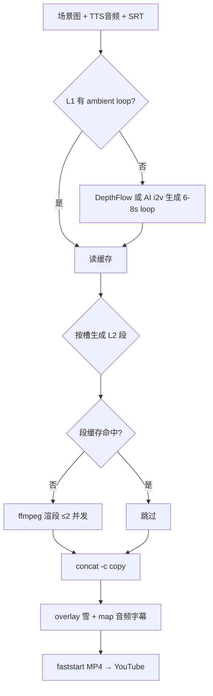

# 有声书视频渲染管线 · 深度调研报告

- **作者**：cursor
- **调研日期**：2026-08-30
- **对照源码**：`packages/audiobook/src/video.ts`
- **本机环境（已实测）**：Apple M4 / 16GB / ffmpeg 7.1（Homebrew，含 `libx264` / `libsvtav1` / `h264_videotoolbox` / `hevc_videotoolbox` / `scale_vt` / `libvmaf`；**无** `libplacebo` filter）

证据标记约定：
- **[事实]**：有可引用一手/二手来源
- **[社区]**：论坛、issue、博客实践共识，未做本机对照实验
- **[推断]**：基于上述证据的工程判断，需落地验证

---

## TL;DR 推荐架构

**不要推倒重来换 Remotion/AVFoundation**；在现有 TypeScript + ffmpeg CLI 上做「分段缓存 + 视觉升级两档」。

```
素材层 (immutable cache)
  ├─ scene stills (PNG/JPG, content-hash)
  ├─ ambient loops (可选 AI i2v / DepthFlow)  ← 效果跃迁
  └─ snow loop (预烘焙 alpha 或 luma 遮罩)

段层 (segment cache, key = hash(img|motion|dur_bucket|fps|snow_params))
  └─ 每槽 ≤25s 独立 MP4：closed GOP、同 codec/fps/size → 可 -c copy

成片层 (cheap assemble)
  └─ concat demuxer -c copy + AAC 音频 + mov_text 字幕 + faststart
```

**立刻可做（1–2 周，低风险）**
1. zoompan **4× supersample** 消抖动 + 升到 **24fps**（近静止场景够用）
2. 雪花改 **luma overlay / 预烘焙 alpha**，避免每帧 `gbrp` 往返
3. **分段渲染 + concat `-c copy`**，改一张图只重渲该段
4. 上传码率：1080p SDR 提到 **8–12 Mbps**（YouTube 官方地板 8 Mbps @≤30fps）

**中期（效果跃迁）**
- 每张场景图 → 5–8s **seamless ambient loop**（优先 Kling / Seedance first-last 同图；DepthFlow 作零成本备选）
- 段缓存按 `(image_hash, loop_id, duration_bucket)` 复用；长集只是 `stream_loop` + trim

**不推荐（对本场景）**
- 整集改 Remotion / Motion Canvas：15 分钟 × 24fps ≈ 2 万帧，本机 Chrome 截帧远慢于「静态图 + 硬编」
- 指望 `scale_vt` 零拷贝救 zoompan：zoompan/blend 仍在 CPU filter，链路会反复 download
- 上传 AV1/HEVC 当默认：YouTube 仍以 H.264 为官方推荐上传 codec；收益小、兼容与编码成本不划算

---

## 1. ffmpeg 原生优化天花板

### 1.1 分段渲染 + concat demuxer `-c copy`

**结论**：**可行且应做**。静态图 Ken Burns 段天然适合「按槽缓存 → 无损拼接」。

**设计要点**

| 约束 | 做法 | 依据 |
|------|------|------|
| 流参数一致 | 所有段：1920×1080、同 fps、同 pix_fmt、同 codec（建议 `h264_videotoolbox` 或 `libx264`）、同 timebase | **[事实]** FFmpeg concat demuxer 要求 same codecs / time base（[ffmpeg formats docs](https://fossies.org/linux/ffmpeg/doc/ffmpeg-formats.texi)，查阅日 2026-08-30） |
| 任意切点可拼 | 每段 **closed GOP**，首帧为 IDR；`-g` = fps（或 fps/2 对齐 YouTube「GOP = half frame rate」习惯的一半再保守取整段） | **[事实]** YouTube 推荐 Closed GOP、GOP of half the frame rate（[YouTube Help — Upload encoding settings](https://support.google.com/youtube/answer/1722171)，查阅 2026-08-30） |
| 时长桶 | 不要按精确到 ms 的 `slotDur` 各编一条；改为桶：`5 / 10 / 15 / 20 / 25s`，末段用 `trim` 或 `tpad` 对齐音频 | **[推断]** 桶化后缓存命中率从近 0 → 很高（同图多集复用） |
| 雪花跨切点连续 | **不要**把雪花 bake 进段若要求粒子相位连续；改为成片层统一 overlay，并用 **全局时间** `t` 取模循环雪花源：`setpts=PTS-STARTPTS+(SEG_START)`，或更简单：成片一次 loop 雪花再 overlay | **[推断]** + **[社区]** 分段 bake 雪会在切点重置粒子；全局时间偏移是标准做法 |

**完整可跑：单槽（supersample Ken Burns，无雪）**

```bash
# 输入：scene.png（建议 ≥2560×1440）
# 输出：seg_01.mp4，25s @24fps，closed GOP，硬编
ffmpeg -y -loop 1 -i scene.png -t 25 \
  -vf "scale=7680:-2,zoompan=z='min(1+0.00005*on,1.06)':d=1:x='iw/2-(iw/zoom/2)':y='ih/2-(ih/zoom/2)':s=1920x1080:fps=24,format=yuv420p" \
  -r 24 -c:v h264_videotoolbox -b:v 8M -profile:v high \
  -g 24 -bf 0 -pix_fmt yuv420p \
  seg_01.mp4
```

说明：
- `scale=7680:-2` ≈ 4×1080p 宽，把整数裁剪误差压到亚像素级（见 1.2）
- `-bf 0` + `-g 24`：每帧可独立切（硬编对 B 帧控制因实现而异；若 VT 忽略 `-bf`，仍保证较短 GOP）
- **[社区]** VideoToolbox 对部分 x264 风格 flag 支持不完全；落地时用 `ffprobe -show_frames` 抽查 IDR 间隔

**完整可跑：concat 组装 + 音频 + 字幕**

```bash
# list.txt
# file 'seg_01.mp4'
# file 'seg_02.mp4'
# ...

ffmpeg -y -f concat -safe 0 -i list.txt \
  -i chapter.mp3 -i chapter.srt \
  -map 0:v -map 1:a -map 2:s \
  -c:v copy -c:a aac -b:a 128k -c:s mov_text \
  -metadata:s:s:0 language=chi \
  -movflags +faststart \
  chapter_final.mp4
```

**zoompan 段按 (图, 时长桶) 缓存**：**[推断] 强烈推荐**。缓存键示例：

```
sha256(image_bytes) + motion_preset + dur_bucket + fps + encoder_profile
→ cache/segments/<key>.mp4
```

改雪透明度 / 换 TTS：若雪在成片层，**视频段全部命中**；只重做 assemble（秒级）。

---

### 1.2 zoompan 抖动权威修法 & 24fps 代价

**根因（已验证事实）**  
`zoompan` 每帧把 crop 窗口的位置/大小 **截断为整像素**，慢速推镜时出现「停一帧、跳一像素」的 wobble。权威讨论：
- FFmpeg trac #4298（历史 bug/限制）
- SuperUser「ffmpeg: smooth zoompan with no jiggle」（[superuser.com/q/1112617](https://superuser.com/questions/1112617/ffmpeg-smooth-zoompan-with-no-jiggle)）
- 2020s 实践综述：先放大再 zoompan（[ffmpeg-micro 博客](https://www.ffmpeg-micro.com/blog/ffmpeg-zoompan-filter-ken-burns-zoom-and-pan-without-the-jitter)，查阅 2026-08-30）

**权威修法排序**

1. **Supersample（首选，纯 ffmpeg）**  
   先 `scale≈4×输出宽`，再 `zoompan`，输出 `s=1920x1080`。约 4× 宽时，1 source px ≈ 0.25 output px，抖动不可见。  
   **[事实]** 同上来源；`still-motion` 项目默认 `temp_scale_factor=4`（[github.com/tomastimelock/still-motion](https://github.com/tomastimelock/still-motion)）。

2. **真·亚像素替代（可选）**  
   `glide-ffmpeg` 用 GPU bicubic `grid_sample`，声称比 4× supersample 再平滑 ~15×、且更便宜（[github.com/Loomos-hub/glide-ffmpeg](https://github.com/Loomos-hub/glide-ffmpeg)）。**[社区/作者自测]** 需引入 PyTorch/CUDA 或 MPS；对 TS monorepo 是额外运行时。

3. **crop+t 表达式**  
   对视频输入更干净；对静态图仍要用 scale 表达亚像素，**不能**从根上绕过 zoompan 整数裁剪。**[推断]** 对本管线不如 supersample 直接。

**完整可跑：对比命令（抖动 vs 修复）**

```bash
# A. 现状风格（易抖）
ffmpeg -y -loop 1 -i scene.png -t 10 \
  -vf "scale=1920:1080:force_original_aspect_ratio=increase,crop=1920:1080,zoompan=z='min(1+0.00004*on,1.06)':d=1:x='iw/2-(iw/zoom/2)':y='ih/2-(ih/zoom/2)':s=1920x1080,fps=12" \
  -c:v h264_videotoolbox -b:v 4M wobble.mp4

# B. 4× supersample + 24fps（推荐基线）
ffmpeg -y -loop 1 -i scene.png -t 10 \
  -vf "scale=7680:-2,zoompan=z='min(1+0.00005*on,1.06)':d=1:x='iw/2-(iw/zoom/2)':y='ih/2-(ih/zoom/2)':s=1920x1080:fps=24,format=yuv420p" \
  -c:v h264_videotoolbox -b:v 8M smooth.mp4
```

**24fps 代价（相对现状 12fps）**

| 项 | 12fps | 24fps | 说明 |
|----|-------|-------|------|
| 帧数 | 1× | **2×** | 编码/滤镜时间近似线性 |
| 上传码率建议 | YouTube 表按 ≤30 同档 | 同档 | **[事实]** 24 与 30 同属 standard frame rate 表（YouTube Help） |
| 观感 | 慢推易「幻灯感」 | 明显更顺 | **[推断]** 近静止+雪花，24 足够；60 性价比差 |
| 内存峰值 | supersample 中间帧大 | 更大 | 7680 宽 RGB 中间态沉重 → **必须分段**，禁止整集一条 filter graph |

**[推断]** 在 M4/16GB 上：单段 25s × supersample zoompan + VT 硬编，应远快于「整集 8 分钟」；整集若仍单 graph 开几十路 `-loop 1`，会继续吃内存——这是现状架构债，分段一并解决。

---

### 1.3 GPU 链路：`hwaccel` + `scale_vt` + 硬编；blend 与 gbrp

**本机事实（2026-08-30 实测）**
- 有 `scale_vt`、`h264_videotoolbox`、`hevc_videotoolbox`
- **无** `libplacebo`（Homebrew 7.1 未启用该 filter）
- 有 `hwupload`，无 Vulkan/libplacebo 合成路径

**零拷贝链可用性**

典型文档示例（decode → `scale_vt` → VT encode）对 **已编码视频转码** 有效：

```bash
ffmpeg -hwaccel videotoolbox -hwaccel_output_format videotoolbox_vld \
  -i input.mov \
  -vf "scale_vt=w=1920:h=1080" \
  -c:v h264_videotoolbox -b:v 8M out.mp4
```

**[事实]** `scale_vt` 补丁说明与用法见 [ffmpeg-devel 2023-07](https://ffmpeg.org/pipermail/ffmpeg-devel/2023-July/312189.html)。

**对本管线的残酷结论 [推断]**  
输入是 **静态图 + zoompan + blend**，全部是软件 filter。数据会：CPU 生成帧 →（若硬编）upload 到 VT encoder。`scale_vt` **救不了** zoompan。  
另：**[事实]** ffmpeg 7.1 多路 HW filter graph 曾出现帧池耗尽 stall（[ffmpeg-trac #11588, 2025-05](https://ffmpeg.org/pipermail/ffmpeg-trac/2025-May/073575.html)）——雪花+主视频双 HW 流更危险。

**雪花 purple / 发灰**

- **[事实]** `blend=screen` 在 YUV 上会动 chroma → 品红/粉雪；必须在 RGB（常用 `gbrp`）做（FFmpeg trac #8463；[SO gbrp+screen](https://stackoverflow.com/questions/74628494/...)）。
- 现状 `format=gbrp` → screen → `yuv420p` **正确但贵**（每帧全图色域往返）。
- `blend=c0_mode=screen` **只混 Y、不动 UV**：可避免紫雪，但 screen 的物理含义在 luma-only 下会 **发灰、少「亮斑」**，不是 Photoshop screen。**[推断]** 可作加速实验，不是画质正解。

**更好的雪花路径（推荐）**

1. **预烘焙**：雪花素材做成 **白点 + 透明 alpha**（`yuva420p` / `rgba`），成片用 `overlay`（或 `geq` 调 alpha），**不做 screen**：

```bash
# snow_alpha.mov：白点透明底（预先做好）
# 主视频 v0 + 雪花无限循环
ffmpeg -y -i base_nocopy.mp4 -stream_loop -1 -i snow_alpha.mov \
  -filter_complex "[1:v]fps=24,format=rgba,colorchannelmixer=aa=0.6[s];[0:v][s]overlay=shortest=1,format=yuv420p" \
  -c:v h264_videotoolbox -b:v 8M -c:a copy with_snow.mp4
```

2. 或保持 screen，但 **只在段缓存写入前做一次**，雪参数进缓存键——改透明度才失效。

**libplacebo**：**[事实]** 2025-07 起多输入 linear-light composite 合入（[ffmpeg-devel](https://ffmpeg.org/pipermail/ffmpeg-devel/2025-July/346947.html)），混合质量更好；但本机 7.1 brew **未编译**，启用需自建/等 brew 选项。短期不依赖。

---

### 1.4 编码器选型 & YouTube

| 方案 | 速度 | 同码率画质 | 对本项目 |
|------|------|------------|----------|
| `h264_videotoolbox` | 最快（现状 ~8min/集的关键） | 弱于 x264；无真 CRF | **段编码默认** |
| `libx264 -crf 18~20 -preset medium` | 慢 3–10× | 更好 | 仅质量门禁/抽样 |
| `hevc_videotoolbox` | 快 | 同码率通常优于 H.264 VT | 可选上传实验 |
| `libsvtav1` | M 系列 SW 可用，仍偏慢 | 压缩强 | **不适合**每集主路径 |

**画质差「有 VMAF 数据吗」**  
- **[事实]** 公开「VT vs x264 同码率精确 VMAF 表」稀缺；ffmpeg-cookbook 仅定性：达同等 VMAF 时 VT **通常需要更高码率**（[ffmpeg-cookbook VideoToolbox](https://ffmpeg-cookbook.com/en/articles/hardware-encode-videotoolbox/)，查阅 2026-08-30）。  
- **[社区]** Apple Developer Forums：slideshow/模糊类内容上 VT 伪影明显（[thread 678210](https://developer.apple.com/forums/thread/678210)）。  
- **[推断]** 你们是「静态图+轻运动」——正是 VT 不擅长的类型。应用 **抬码率** 补偿：4M → **8M**（对齐 YouTube 1080p 推荐下限）。

本机可跑 VMAF 对照（事实工具链）：

```bash
# 同一 raw 帧序列或同一中间 yuv，分别编码后对比
ffmpeg -i ref.mp4 -i vt_4m.mp4 -lavfi libvmaf=log_path=vmaf_vt.json -f null -
ffmpeg -i ref.mp4 -i x264_crf20.mp4 -lavfi libvmaf=log_path=vmaf_x264.json -f null -
```

**上传给 YouTube 什么**

- **[事实]** 官方推荐：**MP4 + H.264 High + AAC-LC + Fast Start**；1080p SDR @24/25/30：**8 Mbps**（[support.google.com/youtube/answer/1722171](https://support.google.com/youtube/answer/1722171)，查阅 2026-08-30）。
- **[社区 2026]** 部分创作者测 HEVC/AV1 高码率上传 VMAF 略好（如 Zeb Gardner 2026 笔记），但平台仍会重编码；对 1080p 有声书，**高码率 H.264 是主路径**。
- **SVT-AV1 on Apple Silicon**：**[事实]** SVT-AV1 4.0（2026-01-23）含 ARM Neon/SVE2 优化（[Phoronix](https://www.phoronix.com/news/SVT-AV1-4.0) / [GitLab release](https://gitlab.com/AOMediaCodec/SVT-AV1)）；HN 称 ARM64 性能近年大涨。**[推断]** 即便如此，15 分钟 1080p SW AV1 编码仍可能数十分钟级，且 YouTube 不要求 AV1 上传 → **否决作默认**。

**推荐上传命令（成片已拼好视频轨时）**

```bash
ffmpeg -y -i assembled_video.mp4 -i chapter.mp3 -i chapter.srt \
  -map 0:v -map 1:a -map 2:s \
  -c:v h264_videotoolbox -b:v 8M -maxrate 12M -bufsize 16M -profile:v high \
  -g 12 -pix_fmt yuv420p \
  -c:a aac -b:a 128k -ar 48000 \
  -c:s mov_text -metadata:s:s:0 language=chi \
  -movflags +faststart \
  youtube_ready.mp4
```

（若视频已是 8M H.264 且参数一致，用 `-c:v copy`。）

---

## 2. 替代渲染引擎（认真评估）

### 2.1 AVFoundation + Core Animation（CAEmitterCell 雪 + subpixel Ken Burns）

| 维 | 评估 |
|----|------|
| 画质 | **[事实]** CALayer 仿射变换是浮点，无 zoompan 整数裁剪病；CAEmitterCell 粒子雪观感远好于 screen 白点 |
| 速度 | Media Engine 硬编极快；但导出路径常是逐帧合成 |
| 工程成本 | **高**：Swift/ObjC 新二进制、与现有 TS monorepo 割裂；`AVVideoCompositionCoreAnimationTool` **不可靠捕获 CAEmitterLayer**（[SO / 社区](https://stackoverflow.com/questions/11926690/...)）；需 custom `AVVideoCompositing` + CIContext |
| 结论 | **不值得**作为主渲染器；若未来做 macOS 原生 App 再考虑 |

### 2.2 WebCodecs + OffscreenCanvas（headless Chrome / Node）

| 维 | 评估 |
|----|------|
| 能力 | **[事实]** 2025–2026 已有成熟讨论：Worker + OffscreenCanvas + VideoEncoder（如 DEV 教程）；VideoFlow 等用 Playwright 驱动 Chromium 内 WebCodecs（[videoflow.dev, 2026-08](https://videoflow.dev/blog/render-mp4-node-without-ffmpeg-webcodecs)） |
| 速度 | GPU 合成 Ken Burns/粒子可很漂亮；但 15min×24fps 仍是 ~21600 帧 encode；headless 无 GPU 时更惨 |
| 工程成本 | 中高；与「一键出片 Web」预览可共用，但 **成片渲染不必绑浏览器** |
| 结论 | 适合 **Web 预览/短模板**；长有声书成片仍回 ffmpeg 段缓存 |

### 2.3 Remotion / Motion Canvas

| | Remotion | Motion Canvas / Revideo |
|--|----------|-------------------------|
| 模型 | React 帧函数 → Chromium 截帧 → ffmpeg | Canvas 场景图；MC 偏手搓，Revideo 补 SSR |
| 1min 1080p 量级 | **[社区]** 本地常数分钟；Lambda 可并行到几十秒（[Remotion docs/performance](https://www.remotion.dev/docs/performance)；RenderComp 2026 文） | MC 本地可更快于 DOM，但 **长视频/批处理非一等公民** |
| 15min | ~2.16 万帧；Lambda 有时长/编排成本；自托管要多核猛堆 | 不匹配「小说批量出片」 |
| 许可 | Remotion 商业公司需注意 License | MC MIT |
| 结论 | **否决**替换现管线；仅当要做复杂 UI 动效包装时局部用 |

### 2.4 libplacebo / mpv 管线

- **[事实]** `vf_libplacebo` 可 GPU 缩放/多路合成，2025-07 起默认线性光混合。  
- **本机**无该 filter → 需换构建。  
- mpv 适合播放/调色预览，不适合当「队列化成片工厂」。  
- **结论**：中长期可评估自建 ffmpeg+vulkan+libplacebo 做雪花/缩放；**不是**2026 Q3 主路径。

**引擎对比一句话**  
现管线瓶颈是 **架构（无缓存）+ zoompan 数学 + 雪混合**，不是「缺一个新框架」。换引擎的机会成本 > 修 ffmpeg 管道。

---

## 3. AI 动态背景（效果跃迁）

### 3.1 图生视频 API 现状（查阅日 2026-08-30）

目标：每张场景图 → **5–10s 无缝循环 ambient**，替代 Ken Burns。

| 产品 | API 化 | 价（量级） | 时长/分辨率 | 循环友好 | 备注 |
|------|--------|------------|-------------|----------|------|
| **Kling 2.1**（fal.ai） | **是** | **[事实]** 5s = $0.28，其后 +$0.056/s（[fal.ai Kling 2.1 standard i2v](https://fal.ai/models/fal-ai/kling-video/v2.1/standard/image-to-video)）→ 约 **$0.056/s** | 5/10s | start/end frame（视型号） | 性价比优先候选 |
| **Veo 3 / 3.1** | Gemini API / Vertex **是** | **[事实]** 2025-09-08 官方降价：Veo 3 **$0.40/s**，Fast **$0.15/s**（[Google Developers Blog](https://developers.googleblog.com/en/veo-3-and-veo-3-fast-new-pricing-new-configurations-and-better-resolution/)）；支持 first/last frame | 典型 ≤8s，1080p | first+last 同图可做 loop | 贵；画质/可控性强 |
| **Seedance 2.x** | 官方偏产品侧；**第三方 API 多**（Kie/Apiframe/Renderful 等） | 聚合文称约 $0.10–0.80/min 不等；Renderful 标 1080p ~$0.51/s（转售溢价）→ **以官方/主渠道为准，第三方价差大** | 4–15s（2.5 可达更长） | **first=last 同图**是文档推荐 loop 法 | 适合中文生态/即梦工作流 |
| **Runway Gen-4 Turbo** | **是** | **[事实]** API 5 credits/s × $0.01 = **$0.05/s**（[Runway academy credits](https://academy.runwayml.com/models-pricing)；多家 2026 解读一致） | 5/10s | 同图 first/last | 贵过 Kling，工具链成熟 |

**批量成本粗算 [推断]**  
一集 10 张场景 × 8s loop × Kling ≈ 80s × $0.056 ≈ **$4.5/集**（一次生成，可跨集复用同图）。若图库 200 张常驻，一次性生成后 **边际成本≈0**。  
Veo Fast 同量 ≈ $12/集量级，仅质量不够时用。

**生成速度**：**[社区]** 主流 i2v 单条 5–10s 常见数十秒到数分钟（队列波动大）；可异步入队，不挡本地 ffmpeg 组装。

**API 化批量**：**[事实]** Kling(fal)、Veo(Gemini/Vertex)、Runway 均可 HTTP 任务队列；Seedance 建议走稳定聚合商并锁定价与 ToS。注意水印/SynthID（Veo）、商用授权、内容安全拒识。

### 3.2 2.5D 视差（低成本）

| 方案 | 成本 | 质量 | 工程 |
|------|------|------|------|
| **DepthFlow** | $0，本地 GPU/CPU | 真视差、可无缝 loop | Python/GLSL；[BrokenSource/DepthFlow](https://github.com/BrokenSource/DepthFlow) 2026 仍活跃 |
| rembg + 前后层 drift | $0 | 有主体时好 | **[社区]** DEV 2025/26「Zero to Autopilot」流水线 |
| parallax-maker / MiDaS cards | $0 | 可导出 glTF | 偏交互工具 |
| ffmpeg `displace` + 深度图 | $0 | 易撕裂 | 仅轻位移 |

**[推断]** 在 AI 预算紧时：**DepthFlow 作默认「动态背景」**，AI i2v 作精品封面/高潮图。

### 3.3 Seamless loop 技巧

1. **生成时**：first_frame = last_frame = 同一张图；prompt 写 clear ambient loop、避免光影单向漂移（Seedance/Kling/Runway/Veo 均支持或可近似）。**[社区]** [AI Tools Guidebook, 2026-06](https://aitoolsguidebook.com/en/articles/ai-video-loop-not-seamless/)  
2. **后期**：`xfade` 把尾 crossfade 到头：

```bash
# 假设 clip.mp4 长 8s，fade 0.5s
ffmpeg -y -i clip.mp4 -filter_complex \
  "[0:v]split[a][b];\
   [a]trim=0:7.5,setpts=PTS-STARTPTS[main];\
   [b]trim=7.5:8,setpts=PTS-STARTPTS[tail];\
   [0:v]trim=0:0.5,setpts=PTS-STARTPTS[head];\
   [tail][head]xfade=transition=fade:duration=0.5:offset=0[xf];\
   [main][xf]concat=n=2:v=1:a=0,format=yuv420p" \
  -an loop_seamless.mp4
```

3. **使用时**：`-stream_loop -1` + `-t slotDur` 铺满槽位；切段边界用 **同一 loop 文件 + 全局 offset** 保持相位（或接受微不可察的相位跳变）。

---

## 4. 工程架构

### 4.1 缓存粒度

```
L0 原始素材   covers/*.png, audio.mp3, snow.*, subs.srt
L1 运动底     ambient/<imgHash>.mp4 或 kb/<imgHash>_<preset>.mp4
L2 时间段     seg/<imgHash>_<durBucket>_<fps>_<snowKey?>.mp4
L3 成片       out/<chapterId>.mp4
```

- 改一张图 → 只废该 `imgHash` 的 L1/L2  
- 改雪透明度 → 若雪在 assemble：只废 L3；若 bake 进 L2：废 snowKey 相关  
- 改 TTS → 只重 L3（+ 可能按时长重切末段）

### 4.2 增量渲染 & 队列

- Worker 并发 **≤2–3**（硬约束，防 M4/16GB 再次被压死）  
- 队列：BullMQ / 文件系统目录队列即可；任务状态 `pending|running|done|failed`  
- 断点：L2 文件存在且 ffprobe 时长匹配 → skip；assemble 原子写 `*.tmp` 再 rename  
- Web 一键出片：API 只入队，SSE/轮询进度；渲染永不跟请求线程同步跑重活

### 4.3 分布式 Win11 / NVENC

| | 判断 |
|--|------|
| 值得吗？ | **短期不值得**。瓶颈将转为「段缓存命中」后，单集 assemble+少量未命中段在本机可接受 |
| 何时值得 | 日产几十集、或上 AI 后还要本地重编码大量 24fps 雪花合成 |
| 成本 | SMB/Tailscale 传素材、Windows 上 ffmpeg NVENC、版本漂移、字幕中文路径、双平台滤镜差异 |
| **[推断]** | 先吃完缓存红利；不够再把 **L2 编码**卸到 Win11，L3 仍在 Mac 拼 |

---

## 5. 最终方案（大胆但可论证）

### 阶段 A — 本周可落地（纯 ffmpeg，零外部 API）

1. **拆段**：按图×时长桶渲染；`concat -c copy`  
2. **zoompan**：`scale=7680:-2` + **24fps** + 缓动可用 `on` 余弦（可选）  
3. **雪**：预烘焙 alpha + `overlay`；雪统一在 L3 加，保证相位  
4. **码率**：VT **8M**，对齐 YouTube 1080p  
5. **缓存目录** + 内容哈希  

预期：**[推断]** 单集壁钟从 ~8min → 首次 3–6min（24fps+supersample 会吐帧，但段并行≤2）；**改字幕/TTS/雪透明度 → 数十秒**；改单图 → 只重 1 段。

### 阶段 B — 视觉跃迁（+DepthFlow 或 AI loop）

1. 每张封面生成 6–8s seamless loop 入库（DepthFlow 免费打底，Kling/Seedance 精品）  
2. 槽位逻辑改为：`[-stream_loop -1 -i loop.mp4 -t dur]`，可加极慢 `crop` 漂移，**删除 zoompan**  
3. 雪花透明度降到 0.25–0.4，避免「假 PPT 雪压过真动态」

预期：观感从「PPT+抖」→「氛围循环镜头」，仍保持可缓存、可增量。

### 阶段 C — Web 一键出片

- 控制面：Web UI + 任务队列  
- 数据面：对象存储式本地 cache（或 S3 兼容）  
- 渲染面：仍是阶段 B 的 ffmpeg worker（可容器化，但 Mac VT 需宿主机）

**明确不采用**：Remotion 整集、整集单 filter graph、默认 SVT-AV1、依赖 libplacebo（直到 brew 可开）。

---

## 6. 风险与不确定项

| 项 | 级别 | 说明 |
|----|------|------|
| VT 忽略 `-g/-bf` | 中 | 需本机 `ffprobe` 验证；不行则段用 `libx264 -x264-params keyint=24:min-keyint=24:scenecut=0`（慢但切点干净） |
| 4× supersample 内存 | 中 | 必须分段；整集 graph 可能再次 OOM |
| luma-only screen | 低 | 可能发灰，需 A/B |
| AI loop 商用授权/拒识 | 高 | 批量前先抽样 ToS；准备 DepthFlow 回退 |
| Seedance 第三方价 | 高 | 转售价混乱，锁报价单 |
| YouTube 重编码 | 低 | 再高码率也会被压；8–12M H.264 是务实点 |
| 并发 >3 | 高 | 硬件已证明会拖死；队列硬顶 |
| glide-ffmpeg / DepthFlow 依赖 | 中 | Python 生态与 monorepo 集成成本 |

---

## 7. 附录：建议的「黄金路径」伪流程



---

## 8. 主要来源清单（日期均为查阅/发布）

| 来源 | 日期 | 用途 |
|------|------|------|
| [YouTube Help — Upload encoding settings](https://support.google.com/youtube/answer/1722171) | 查阅 2026-08-30 | H.264/码率/GOP |
| [Google Developers Blog — Veo 3 pricing](https://developers.googleblog.com/en/veo-3-and-veo-3-fast-new-pricing-new-configurations-and-better-resolution/) | 2025-09-08 | Veo $/s |
| [fal.ai Kling 2.1 i2v pricing](https://fal.ai/models/fal-ai/kling-video/v2.1/standard/image-to-video) | 查阅 2026-08-30 | Kling API 价 |
| [Runway Credits & Models](https://academy.runwayml.com/models-pricing) | 查阅 2026-08-30 | Gen-4 credits/s |
| [FFmpeg Micro — zoompan jitter](https://www.ffmpeg-micro.com/blog/ffmpeg-zoompan-filter-ken-burns-zoom-and-pan-without-the-jitter) | 查阅 2026-08-30 | supersample 修法 |
| SuperUser 1112617 | 历史+持续引用 | zoompan 整像素 |
| [ffmpeg-cookbook VideoToolbox](https://ffmpeg-cookbook.com/en/articles/hardware-encode-videotoolbox/) | 查阅 2026-08-30 | VT vs x264 |
| [ffmpeg-devel scale_vt](https://ffmpeg.org/pipermail/ffmpeg-devel/2023-July/312189.html) | 2023-07 | GPU scale |
| [ffmpeg-trac #11588](https://ffmpeg.org/pipermail/ffmpeg-trac/2025-May/073575.html) | 2025-05 | 7.1 HW stall |
| [ffmpeg-devel libplacebo linear composite](https://ffmpeg.org/pipermail/ffmpeg-devel/2025-July/346947.html) | 2025-07 | 合成质量 |
| [Phoronix SVT-AV1 4.0](https://www.phoronix.com/news/SVT-AV1-4.0) | 2026-01-25 | ARM 优化 |
| [Remotion performance docs](https://www.remotion.dev/docs/performance) | 查阅 2026-08-30 | 长视频不适用 |
| DepthFlow / glide-ffmpeg / still-motion GitHub | 查阅 2026-08-30 | 替代运动方案 |
| 本机 `ffmpeg -filters/-encoders` | 2026-08-30 | 能力边界 |

---

*本报告区分了已验证事实、社区经验与工程推断。落地前应用 1 张图做 supersample A/B、1 段 closed-GOP concat 探针、以及可选的 libvmaf VT↔x264 对照。*
